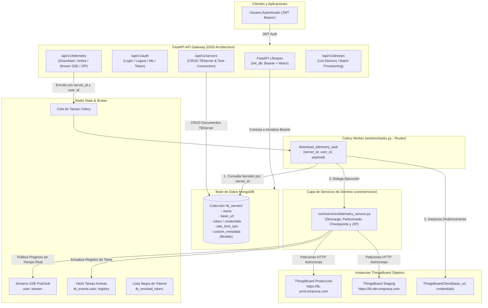

# ThingsBoard Super API Gateway - Documentación Técnica y Manual de Arquitectura

## 1. Visión General del Proyecto

**ThingsBoard Super API** es una plataforma backend de **API Gateway y Orquestador Multi-Servidor** construida con **FastAPI**, **MongoDB (Beanie ODM)**, **Celery** y **Redis**. Está diseñada para administrar, orquestar y ejecutar operaciones masivas (descarga histórica de telemetría, aprovisionamiento de dispositivos y ejecución de scripts) sobre múltiples servidores independientes de **ThingsBoard** (Cloud, On-Premise, Multi-Tenant).

### 🎯 Capacidades Principales
1. **API Gateway Multi-Servidor:** Registro dinámico y persistente de múltiples instancias ThingsBoard en MongoDB con credenciales, configuraciones y metadatos específicos.
2. **Autenticación JWT y Seguridad Multi-Tenant:** Control de acceso mediante tokens JWT seguros (`bcrypt` + `python-jose`), perfiles de usuario y revocación de sesión en tiempo real vía Redis blacklist.
3. **Aislamiento Estricto de Tareas y Streams:** Canales Pub/Sub SSE (`user:<user_id>:stream:<task_id>`) y registros de tareas activas (`tb_events:user:<user_id>:registry`) particionados por usuario.
4. **Enrutador Ligero de Celery & Capa de Servicios:** Tareas de Celery que resuelven dinámicamente la configuración del servidor en MongoDB y delegan la ejecución pesada a la capa de servicios (`core/services/`).
5. **Orquestador de Telemetría Masiva:** Particionado automático por meses, paginación continua por marcas de tiempo (`ts`), control de concurrencia con semáforos, *checkpoints* en Redis, renovación transparente de tokens y compresión ZIP.
6. **Esquema NoSQL Flexible:** Capacidad de almacenar metadatos variables específicos por servidor (rate limits, proxies, headers, puertos MQTT) sin migraciones de base de datos.

---

## 2. Arquitectura del Sistema



### Componentes Tecnológicos
- **Lenguaje:** Python 3.12+
- **Framework Web:** FastAPI + Uvicorn (Arquitectura asíncrona no bloqueante y modular DDD)
- **Persistencia NoSQL:** MongoDB + Motor + Beanie ODM (Documentos BSON con validación Pydantic v2)
- **Cola de Tareas & Enrutamiento:** Celery (Enrutador de tareas distribuido)
- **Broker & Estado en Tiempo Real:** Redis (Gestión de sesiones, lista negra de tokens, Pub/Sub SSE, checkpoints y broker de Celery)
- **Cliente HTTP Asíncrono:** HTTPX (Conexiones `keep-alive`, timeout configurable y reintentos)
- **Seguridad Criptográfica:** Passlib + Bcrypt + Python-Jose (JWT con claims inyectados)
- **Herramienta Standalone Legacy:** Node.js (CommonJS, Axios, Luxon, Winston) en `scripts/BackupManager`

---

## 3. Estructura de Directorios

```text
Thingsboard_Api/
├── api/                               # Capa de presentación y endpoints HTTP (FastAPI)
│   ├── __init__.py
│   ├── deps.py                        # Inyección de dependencias (get_current_user, JWT, Redis blacklist)
│   ├── main.py                        # Instancia de FastAPI, lifespan con init_db y routers DDD
│   └── endpoints/                     # Endpoints organizados por dominio (DDD)
│       ├── __init__.py                # Exportación centralizada de routers de dominio
│       ├── auth/                      # Dominio de Autenticación (/api/v1/auth)
│       │   ├── __init__.py
│       │   └── router.py              # Login OAuth2, Logout con revocación en Redis, Me, Token ThingsBoard
│       ├── servers/                   # Dominio de Gestión de Servidores ThingsBoard (/api/v1/servers)
│       │   ├── __init__.py
│       │   └── router.py              # CRUD Beanie/MongoDB y test-connection en tiempo real
│       ├── telemetry/                 # Dominio de Telemetría y Respaldos (/api/v1/telemetry)
│       │   ├── __init__.py
│       │   └── router.py              # Encolado por server_id, tareas activas, SSE y descarga de ZIP
│       └── devices/                   # Dominio de Dispositivos y Aprovisionamiento (/api/v1/devices)
│           ├── __init__.py
│           └── router.py              # Listado y plantilla de aprovisionamiento masivo
├── core/                              # Capa de infraestructura y configuración del núcleo
│   ├── __init__.py
│   ├── config.py                      # Configuración centralizada (MONGO_URI, REDIS_URL, JWT, etc.)
│   ├── database.py                    # Conexión asíncrona a MongoDB e inicialización de Beanie ODM
│   ├── logger.py                      # Logging unificado (consola y logs/telemetry.log)
│   ├── redis_client.py                # Conexión asíncrona de Redis
│   ├── security.py                    # Funciones criptográficas bcrypt y JWT
│   ├── tb_client.py                   # Cliente dinámico ThingsBoardClient(base_url, credentials)
│   ├── models/                        # Modelos de documentos Beanie (MongoDB)
│   │   ├── __init__.py
│   │   └── tb_server.py               # Modelo TBServer con metadatos variables sin esquema rígido
│   └── services/                      # Servicios de negocio y lógica pesada desacoplada
│       ├── __init__.py
│       └── telemetry_service.py       # Orquestador de descarga, paginación, checkpoints y ZIP
├── workers/                           # Procesamiento asíncrono en segundo plano
│   ├── __init__.py
│   └── tasks.py                       # Enrutador ligero de Celery (resuelve server_id en Mongo y delega a services)
├── scripts/                           # Scripts de verificación y herramientas auxiliares
│   ├── verify_multiserver_gateway.py  # Suite de verificación MongoDB, Beanie, DDD y enrutamiento
│   ├── verify_multitenant_security.py # Suite de verificación de seguridad multi-tenant y JWT
│   └── BackupManager/                 # Herramienta standalone en Node.js para respaldos manuales
│       ├── backups/                   # Carpeta de salida de respaldos generados por Node.js
│       ├── helpers/
│       │   └── logger.js              # Logger Winston con formato y niveles personalizados
│       ├── configuracion.json         # Configuración de fechas, entidades y límites para Node.js
│       ├── index.js                   # Script principal de descarga concurrente en Node.js
│       ├── package.json               # Dependencias de Node.js (axios, dotenv, luxon, winston)
│       └── README.md                  # Documentación específica del BackupManager de Node.js
├── backups/                           # Directorio unificado para archivos JSON particionados y ZIPs descargables
├── logs/                              # Directorio de logs de la aplicación Python (telemetry.log)
├── docker-compose.yml                 # Archivo para orquestación de contenedores (MongoDB, Redis, API, Worker)
├── requirements.txt                   # Dependencias de Python (FastAPI, Motor, Beanie, Celery, Redis, etc.)
├── .gitignore                         # Archivos y directorios ignorados por Git
└── Gemini.md                          # Manual y guía técnica completa (este archivo)
```

---

## 4. Análisis Detallado de Módulos

### 4.1. `core/config.py` y `core/database.py`
- **`core/config.py`:** Define la configuración global mediante `pydantic-settings`:
  - `PROJECT_NAME`: Nombre del servicio (`"ThingsBoard Super API Gateway"`).
  - `MONGO_URI`: Cadena de conexión a MongoDB (`"mongodb://localhost:27017"`).
  - `MONGO_DB_NAME`: Base de datos de la aplicación (`"tb_super_api"`).
  - `REDIS_URL`: URL del broker y caché Redis (`"redis://localhost:6379/0"`).
  - `SECRET_KEY`: Clave secreta para firma criptográfica de tokens JWT.
  - `ALGORITHM`: Algoritmo de firma (`"HS256"`, preparado para `"RS256"`).
  - `ACCESS_TOKEN_EXPIRE_MINUTES`: Tiempo de vida del token (por defecto `1440` minutos / 24h).
- **`core/database.py`:**
  - `init_db(custom_client=None, database_name=None)`: Inicializa la conexión asíncrona con Motor y registra los documentos Beanie (`TBServer`).
  - `close_db()`: Cierra conexiones activas de MongoDB de forma limpia en el evento de apagado.

### 4.2. `core/models/tb_server.py` (Persistencia NoSQL con Beanie)
Modelo de documento `TBServer(Document)` que almacena la configuración de cada servidor ThingsBoard:
- `name`: Nombre descriptivo (ej: `"ThingsBoard Producción Bajío"`).
- `base_url`: URL base de la instancia ThingsBoard.
- `description`: Notas o metadatos de la instancia.
- `token`, `refresh_token`: Tokens de acceso JWT a ThingsBoard.
- `username`, `password`, `api_key`: Credenciales de autenticación.
- `rate_limit_rpm`: Límite de peticiones por minuto individual para proteger el servidor objetivo.
- `custom_metadata`: Diccionario abierto (`Dict[str, Any]`) para almacenar propiedades dinámicas (proxies, certificados, flags, puertos MQTT) sin requerir migraciones de esquema.
- `user_id`: Identificador del usuario propietario para aislamiento multi-tenant.
- `is_active`: Estado del servidor.

### 4.3. `core/security.py` y `api/deps.py`
- **`core/security.py`:**
  - `get_password_hash(password)`: Genera hashes seguros con `bcrypt` (12 rondas).
  - `verify_password(plain, hashed)`: Verificación segura de contraseñas contra ataques de tiempo.
  - `create_access_token(subject, user_data, expires_delta)`: Emite JWT inyectando `user_id`, `sub`, `iat` y `exp`.
  - `decode_access_token(token)`: Valida y decodifica claims JWT.
- **`api/deps.py`:**
  - `get_current_user`: Dependencia FastAPI que valida el token Bearer, consulta la lista negra en Redis (`tb_revoked_token:<token>`) y recupera el modelo `User`.

### 4.4. `core/tb_client.py` (Cliente Dinámico ThingsBoard)
- Se instancia dinámicamente con `ThingsBoardClient(base_url, token=..., username=...)`.
- Métodos:
  - `login()`, `refresh_jwt_token()`, `verify_token()`.
  - `test_connection()`: Comprueba conectividad y credenciales en tiempo real.
  - `get_tenant_devices()`, `get_device_by_id()`, `get_entity_timeseries_keys()`, `get_entity_telemetry()`.

### 4.5. `core/services/telemetry_service.py`
- Contiene la lógica pesada de procesamiento:
  - `get_month_intervals()`: Divide el rango de fechas en bloques mensuales (`completo` vs `parcial`).
  - `download_telemetry_for_key()`: Paginación por marcas de tiempo con checkpointing en Redis y semáforos de concurrencia.
  - `run_download_orchestrator()`: Orquestador principal que descubre dispositivos, ejecuta descargas paralelas, emite eventos SSE en Redis y comprime los resultados en archivos ZIP.
  - `publish_task_status()`: Publica actualizaciones en Pub/Sub y en el Hash del usuario.

### 4.6. `workers/tasks.py` (Enrutador Ligero de Celery)
- `@celery_app.task(bind=True, max_retries=None)`:
  - `download_telemetry_task(self, payload)`:
    1. Resuelve `server_id` desde MongoDB usando Beanie.
    2. Instancia `ThingsBoardClient` dinámicamente con las credenciales del documento.
    3. Delega la ejecución a `core.services.telemetry_service.run_download_orchestrator`.
    4. Aplica reintentos automáticos con *exponential backoff* ante fallos de red o errores 5xx.

---

## 5. Flexibilidad NoSQL: Metadatos Variables sin Migraciones

El uso de **MongoDB + Beanie ODM** aporta ventajas arquitectónicas cruciales frente a bases de datos relacionales tradicionales:

| Característica | MongoDB + Beanie | Base de Datos Relacional (SQL) |
| :--- | :--- | :--- |
| **Metadatos Variables** | `custom_metadata: Dict[str, Any]` guarda proxies, headers y certificados directamente | Requiere tablas EAV complejas o columnas JSON sin tipado nativo |
| **Rate Limit por Servidor** | `rate_limit_rpm` configurable por documento individual | Requiere modificar esquemas y migraciones DDL |
| **Evolución de Campos** | Nuevos campos con valores por defecto son compatibles de inmediato | Requiere ejecutar scripts de migración `ALTER TABLE` |
| **Escalabilidad IoT** | Ideal para estructuras jerárquicas y documentos de configuración heterogéneos | Rígido ante cambios frecuentes en dispositivos y servidores |

---

## 6. Formato de Almacenamiento y Particionado

La telemetría descargada se organiza jerárquicamente en el disco según la siguiente estructura:

```text
backups/
└── <TENANT_NAME>/
    └── <DEVICE_NAME>/
        └── <AÑO>/
            └── <MES>/
                └── <ENTITY_UUID>.<KEY_NAME>.<MM-YYYY>_<ESTADO>.json
```

### Estructura del Archivo JSON:
```json
{
    "data": [
        {
            "ts": 1777615205411,
            "value": "20.5"
        }
    ],
    "length": 1,
    "records_count": 1
}
```

- **`<ESTADO>`:**
  - `completo`: Si el mes finalizó y se descargó el rango completo del mes.
  - `parcial`: Si la descarga corresponde al mes actual en curso o a un rango acotado que no abarcó todo el mes.
- **Empaquetado final:** Archivo ZIP generado en `backups/<TASK_ID>_<TENANT_NAME>.zip` accesible para todos los usuarios autenticados.

---

## 7. Especificación de Endpoints (API Reference v1)

### 7.1. Dominio de Autenticación (`/api/v1/auth`)

#### 1. Inicio de Sesión (Login OAuth2 / JWT)
- **Método:** `POST` | **Ruta:** `/api/v1/auth/login`
- **Cuerpo (Form Data):** `username`, `password`
- **Usuarios de prueba:** `user_a` (`secret_a_123`), `user_b` (`secret_b_456`), `admin` (`admin_pass_789`)
- **Respuesta (200 OK):**
```json
{
  "access_token": "eyJhbGciOiJIUzI1NiIsInR5cCI6IkpXVCJ9...",
  "token_type": "bearer",
  "user_id": "user_a_001",
  "username": "user_a"
}
```

#### 2. Perfil del Usuario Actual
- **Método:** `GET` | **Ruta:** `/api/v1/auth/me`
- **Cabecera:** `Authorization: Bearer <ACCESS_TOKEN>`
- **Respuesta (200 OK):**
```json
{
  "id": "user_a_001",
  "username": "user_a",
  "email": "user_a@tkmecloud.com",
  "role": "user",
  "is_active": true
}
```

#### 3. Cierre de Sesión (Logout con Revocación en Redis)
- **Método:** `POST` | **Ruta:** `/api/v1/auth/logout`
- **Cabecera:** `Authorization: Bearer <ACCESS_TOKEN>`
- **Respuesta (200 OK):**
```json
{
  "status": "ok",
  "message": "Sesión cerrada exitosamente para el usuario user_a"
}
```

#### 4. Obtención y Caché de Token ThingsBoard
- **Método:** `POST` | **Ruta:** `/api/v1/auth/token`
- **Cabecera:** `Authorization: Bearer <ACCESS_TOKEN>`
- **Cuerpo:**
```json
{
  "server_url": "https://thingsboard.cloud",
  "username": "usuario@empresa.com",
  "password": "miPasswordSeguro"
}
```

---

### 7.2. Dominio de Servidores ThingsBoard (`/api/v1/servers`)

#### 1. Registrar Servidor ThingsBoard
- **Método:** `POST` | **Ruta:** `/api/v1/servers`
- **Cabecera:** `Authorization: Bearer <ACCESS_TOKEN>`
- **Cuerpo:**
```json
{
  "name": "ThingsBoard Producción Bajío",
  "base_url": "https://tb-bajio.empresa.com",
  "description": "Cluster principal de telemetría",
  "token": "eyJhbGciOiJIUzUxMiJ9...",
  "rate_limit_rpm": 120,
  "custom_metadata": {
    "region": "Bajio",
    "proxy_url": "http://proxy.internal:8080",
    "mqtt_port": 1883
  }
}
```
- **Respuesta (201 Created):** Objeto `ServerResponse` con el `id` generado en MongoDB.

#### 2. Listar Servidores Registrados
- **Método:** `GET` | **Ruta:** `/api/v1/servers`
- **Cabecera:** `Authorization: Bearer <ACCESS_TOKEN>`
- **Respuesta (200 OK):** Lista de servidores pertenecientes al usuario autenticado.

#### 3. Obtener Detalle de Servidor
- **Método:** `GET` | **Ruta:** `/api/v1/servers/{server_id}`

#### 4. Actualizar Servidor y Metadatos
- **Método:** `PUT` | **Ruta:** `/api/v1/servers/{server_id}`

#### 5. Eliminar Servidor
- **Método:** `DELETE` | **Ruta:** `/api/v1/servers/{server_id}`

#### 6. Probar Conexión en Vivo
- **Método:** `POST` | **Ruta:** `/api/v1/servers/{server_id}/test-connection`
- **Respuesta (200 OK):**
```json
{
  "success": true,
  "reachable": true,
  "authenticated": true,
  "base_url": "https://tb-bajio.empresa.com"
}
```

---

### 7.3. Dominio de Telemetría (`/api/v1/telemetry`)

#### 1. Iniciar Descarga de Telemetría
- **Método:** `POST` | **Ruta:** `/api/v1/telemetry/download`
- **Cabecera:** `Authorization: Bearer <ACCESS_TOKEN>`
- **Cuerpo:**
```json
{
  "server_id": "6a86e739a6909f7fb49546c8",
  "start_date": "2026-01-01T00:00:00",
  "end_date": "2026-08-01T23:59:59",
  "tenant_name": "CONAFOR",
  "time_zone": "America/Mexico_City",
  "concurrency_limit": 3,
  "page_limit": 2000
}
```
- **Respuesta (200 OK):**
```json
{
  "task_id": "3c91a0ef-7952-4418-9717-b08e70a3c2be",
  "status": "Task enqueued",
  "user_id": "user_a_001",
  "server_id": "6a86e739a6909f7fb49546c8",
  "server_url": "https://tb-bajio.empresa.com"
}
```

#### 2. Consultar Tareas Activas del Usuario
- **Método:** `GET` | **Ruta:** `/api/v1/telemetry/tasks/active`
- **Cabecera:** `Authorization: Bearer <ACCESS_TOKEN>`

#### 3. Transmisión de Progreso en Tiempo Real (SSE)
- **Método:** `GET` | **Ruta:** `/api/v1/telemetry/stream/{task_id}`
- **Cabecera:** `Authorization: Bearer <ACCESS_TOKEN>`
- **Tipo de Contenido:** `text/event-stream`

#### 4. Descargar Archivo ZIP Generado
- **Método:** `GET` | **Ruta:** `/api/v1/telemetry/download/file/{task_id}`
- **Cabecera:** `Authorization: Bearer <ACCESS_TOKEN>`
- **Respuesta:** Archivo binario `application/zip` (`{task_id}_{TENANT_NAME}.zip`).

#### 5. Consultar Estado de Tarea en Celery
- **Método:** `GET` | **Ruta:** `/api/v1/telemetry/status/{task_id}`

---

### 7.4. Dominio de Dispositivos (`/api/v1/devices`)

#### 1. Listar Dispositivos de un Servidor
- **Método:** `GET` | **Ruta:** `/api/v1/devices/{server_id}?limit=100&page=0`
- **Cabecera:** `Authorization: Bearer <ACCESS_TOKEN>`

#### 2. Consultar Detalle de Dispositivo
- **Método:** `GET` | **Ruta:** `/api/v1/devices/{server_id}/{device_id}`

#### 3. Plantilla de Aprovisionamiento Masivo
- **Método:** `POST` | **Ruta:** `/api/v1/devices/{server_id}/provision`
- **Cabecera:** `Authorization: Bearer <ACCESS_TOKEN>`
- **Cuerpo:**
```json
{
  "devices": [
    {
      "name": "Medidor_Energia_01",
      "type": "energy_meter",
      "label": "Planta Norte",
      "additional_info": {"model": "EM-3000"}
    }
  ]
}
```

---

## 8. Configuración y Despliegue Local

### 1. Requisitos Previos
- Python 3.12 o superior
- Servidor Redis activo en el puerto `6379`
- Servidor MongoDB activo en el puerto `27017`

### 2. Variables de Entorno (`.env`)
Crear un archivo `.env` en la raíz del proyecto:
```env
PROJECT_NAME="ThingsBoard Super API Gateway"
MONGO_URI="mongodb://localhost:27017"
MONGO_DB_NAME="tb_super_api"
REDIS_URL="redis://localhost:6379/0"

# Seguridad JWT
SECRET_KEY="super-secret-key-change-in-production-thingsboard-2026"
ALGORITHM="HS256"
ACCESS_TOKEN_EXPIRE_MINUTES=1440
```

### 3. Ejecución de Servicios

**Terminal 1: Servidor FastAPI**
```powershell
venv\Scripts\uvicorn api.main:app --host 0.0.0.0 --port 8000 --reload
```
> Documentación interactiva en: `http://localhost:8000/docs`

**Terminal 2: Worker de Celery**
- En Windows (pool `solo`):
```powershell
venv\Scripts\celery -A workers.tasks.celery_app worker --loglevel=info -P solo
```
- En Linux / macOS:
```bash
celery -A workers.tasks.celery_app worker --loglevel=info
```

### 4. Ejecución de Suites de Pruebas

```powershell
# Probar API Gateway Multi-Servidor, Beanie y MongoDB
venv\Scripts\python scripts/verify_multiserver_gateway.py

# Probar Seguridad Multi-Tenant y Aislamiento de Tareas
venv\Scripts\python scripts/verify_multitenant_security.py
```
