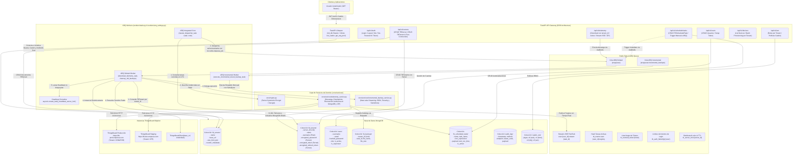

# ThingsBoard Super API Gateway - Documentación Técnica y Manual de Arquitectura

## 1. Visión General del Proyecto

**ThingsBoard Super API** es una plataforma backend de **API Gateway, Orquestador Multi-Servidor & Multi-Tenant e IAM Centralizado** construida con **FastAPI**, **MongoDB (Beanie ODM)**, **ARQ (Async Redis Queue)**, **Redis** y **PyCasbin**. Está diseñada para administrar, orquestar y ejecutar operaciones masivas (descarga histórica de telemetría, aprovisionamiento de dispositivos, ejecución de scripts y control de acceso granular) sobre múltiples servidores independientes de **ThingsBoard** y múltiples **Tenants** por servidor de forma 100% asíncrona nativa.

### 🎯 Capacidades Principales
1. **API Gateway Multi-Servidor & Multi-Tenant:** Registro de infraestructura (`TBServer`) y Tenants independientes (`TBTenant`) en MongoDB con credenciales de Tenant Admin, tokens JWT y metadatos flexibles específicos.
2. **Cifrado Simétrico en Reposo con Fernet (`core/crypto.py`):** Cifrado simétrico a nivel de aplicación (`cryptography.fernet`) para contraseñas y tokens JWT de ThingsBoard en MongoDB. Cero credenciales en texto plano en la base de datos y descifrado seguro exclusivo en memoria RAM para clientes HTTP.
3. **Pureza Asíncrona del Event Loop (ARQ & Redis Nativo):** Procesamiento de fondo 100% asíncrono con **ARQ** y cliente estándar `redis.asyncio`. Erradicación total del antipatrón `DynamicRedisClient` y eliminación absoluta de `asyncio.run()`, permitiendo ejecución concurrente no bloqueante de alto rendimiento.
4. **Ciclo de Vida de Workers (`WorkerSettings` & Inyección de Contexto):** Inicialización única de conexiones MongoDB (`Beanie ODM`) y pool HTTP (`httpx.AsyncClient`) en el `on_startup` del worker, e inyección en `ctx` para reutilización eficiente entre miles de tareas.
5. **Control de Acceso Basado en Roles por Dominios (IAM & PyCasbin):** Autorización RBAC multi-tenant con dominios (`sub, dom, obj, act`) gestionada en MongoDB (`casbin-motor-adapter`), bootstrapping automático de Superadmin y dependencia declarativa `CasbinAuth`.
6. **Autenticación JWT Segura y Revocación en Tiempo Real:** Hashing `bcrypt`, emisión de tokens JWT firmados con UUID `jti` único y lista negra distribuida en Redis (`tb_revoked_token:{token}`) para invalidación inmediata de sesiones al hacer Logout.
7. **Políticas de Hardening DevSecOps:** Endpoint `/api/v1/auth/set-password` con tokens de configuración inicial de un solo uso (`setup_token` anti-replay en Redis), política estricta de contraseñas (mínimo 10 caracteres, números y símbolos) y protección anti fuerza bruta (5 intentos fallidos $\to$ HTTP 429 Too Many Requests con bloqueo temporal).
8. **Auditoría Estructurada Sanitizada (`AuditLog`):** Registro de auditoría persistente en MongoDB para todas las peticiones mutantes (`POST`, `PUT`, `DELETE`, `PATCH`), enmascarando contraseñas, credenciales y tokens con `"***"`.
9. **Enrutador Ligero de ARQ & Capa de Servicios:** Tareas asíncronas puras (`async def`) que resuelven dinámicamente `tenant_id` y `TBServer` en MongoDB y delegan la ejecución pesada a la capa de servicios (`core/services/`).
10. **Renovación Autónoma de Tokens con Persistencia:** Mecanismo resiliente en el ARQ Worker que intercepta errores HTTP 401, renueva el par de tokens (`token` y `refresh_token`) y **actualiza asíncronamente el documento `TBTenant` cifrado en MongoDB** para futuras ejecuciones.
11. **Orquestador de Telemetría Masiva y Catálogo TBBackup:** Particionado automático por meses, paginación continua por marcas de tiempo (`ts`), control de concurrencia con semáforos, *checkpoints* en Redis, compresión ZIP en volúmenes locales persistentes y catálogo histórico `TBBackup` en MongoDB.
12. **Distributed Lock & Heartbeat No Bloqueante (`asyncio.create_task`):** Candado distribuido en Redis (`tb_server_lock:{server_id}`) con Fail Fast (HTTP 409 Conflict) en FastAPI, latido asíncrono (Heartbeat) de renovación cada 30 min (TTL 1 hora) ejecutado como corrutina en segundo plano en el mismo loop del worker y `job_timeout` de 10 días (`864,000s`) para descargas ininterrumpidas de larga duración.
13. **Automatizaciones y Patrón Dispatcher con Cron Integrado de ARQ (`TBScheduledTask`):** Programación dinámica de tareas en base de datos sin alterar código fuente, resolución periódica cada 1 min mediante `cron(master_dispatcher_task, second=0)` integrado en ARQ (sin requerir daemon de Beat externo), conversión de zonas horarias locales (`America/Mexico_City`) a UTC puro, aislamiento granular ante fallos y disparo manual bajo demanda.
14. **Política de Retención y Limpieza Automatizada de Disco (`tasks.cleanup_old_backups`):** Sincronización estricta con el catálogo `TBBackup` en MongoDB, purga defensiva de archivos ZIP caducados (`days_to_keep`) y barrido de directorios temporales huérfanos/zombis (`tmp_*` con antigüedad mayor a 24 horas).
15. **Data Lake de Respaldos Incrementales de Mes Vencido (`tasks.schedule_monthly_incremental_backups` y `tasks.execute_incremental_tenant_backup`):** Orquestación mensual secuencial por Tenant hacia la cola `incremental_backups` en ARQ, cálculo estricto de fronteras temporales en milisegundos con `ZoneInfo(settings.APP_TIMEZONE)`, concurrencia interna de hasta 4 llaves con `asyncio.Semaphore`, resiliencia extrema con `tenacity` (reintentos ante 429, 500, 502, 503, 504, ReadTimeout y auto-renovación en 401), streaming de JSON sin sobreescritura a `.parcial.json` e idempotencia con `.completo.json` en `tenant_backups/<TENANT>/<DEVICE>/<AÑO>/<MES>/`.
16. **Blindaje de E/S Asíncrona, Aislamiento con `asyncio.to_thread()` y Semáforo Global de I/O (`core/io_limiter.py`):** Escritura no bloqueante de fragmentos JSON en streaming con `aiofiles`, delegación de compresión pesada (`shutil.make_archive`) y purga de directorios (`shutil.rmtree`) a hilos secundarios vía `asyncio.to_thread()`, semáforo global `get_zip_semaphore()` para limitar empaquetados simultáneos (máximo 3) y manejo transaccional defensivo con purga inmediata ante fallos de disco (`OSError`, `IOError`).
17. **Motor de Extracción Híbrido de Telemetría (Local Data Lake + REST API con `ijson` y Delta Calculator):** Comparación dinámica de rangos temporales contra archivos locales en `tenant_backups/<TENANT>/<DEVICE>/<AÑO>/<MES>/`, lectura no bloqueante en streaming con `ijson` delegada a `asyncio.to_thread()` (consumo de RAM $O(1)$), tratamiento de `max_ts` en archivos `.parcial.json` como punto de corte para consultas REST a ThingsBoard (`max_ts + 1`) y consolidación asíncrona concurrente con `aiofiles` en `backups/tmp_<TASK_ID>/` antes del empaquetado ZIP.

---

## 2. Arquitectura del Sistema


```mermaid
flowchart TD
    subgraph Clients ["Clientes y Aplicaciones"]
        User["Usuario Autenticado (JWT Bearer)"]
    end

    subgraph Gateway ["FastAPI API Gateway (DDD Architecture)"]
        Lifespan["FastAPI Lifespan\n(init_db: Beanie + Motor, init_casbin, get_arq_pool)"]
        AuthRouter["/api/v1/auth\n(Login / Logout / Me / Set-Password / Token)"]
        UsersRouter["/api/v1/users\n(CRUD Usuarios / Setup Token)"]
        IAMRouter["/api/v1/iam\n(Roles por Tenant / Políticas Casbin)"]
        ServerRouter["/api/v1/servers\n(CRUD TBServer, CRUD TBTenant & Test-Connection)"]
        TelemRouter["/api/v1/telemetry\n(Download con tenant_id / Active / Stream SSE / ZIP)"]
        DeviceRouter["/api/v1/devices\n(List Devices / Batch Provisioning por Tenant)"]
        SchedulerRouter["/api/v1/scheduler/tasks\n(CRUD TBScheduledTask / Trigger Manual a ARQ)"]
    end

    subgraph Mongo ["Base de Datos MongoDB"]
        TBServersCol[("Colección 'tb_servers'\n- name\n- base_url\n- rate_limit_rpm\n- custom_metadata")]
        TBTenantsCol[("Colección 'tb_tenants'\n- server_id (Link)\n- name\n- username (Plain)\n- encrypted_password (Fernet)\n- encrypted_token (Fernet)\n- encrypted_refresh_token (Fernet)")]
        UsersCol[("Colección 'users'\n- username\n- email\n- hashed_password\n- role, is_active, is_superuser")]
        BackupsCol[("Colección 'tb_backups'\n- tenant_id (Link)\n- task_id, file_name, file_size")]
        ScheduledCol[("Colección 'tb_scheduled_tasks'\n- name, task_name, cron_expression\n- payload, next_run_time, is_active")]
        AuditCol[("Colección 'audit_logs'\n- timestamp, method, endpoint, status_code, payload")]
        CasbinCol[("Colección 'casbin_rule'\n- ptype, v0 (sub), v1 (dom), v2 (obj), v3 (act)")]
    end

    subgraph Broker ["Redis State & ARQ Queue"]
        ARQDefault["Cola ARQ Default\n(arq:queue)"]
        ARQIncr["Cola ARQ Incremental\n(arq:queue:incremental_backups)"]
        PubSubStreams["Streams SSE Pub/Sub\nuser:{user_id}:stream:{task_id}"]
        UserRegistry["Hash Tareas Activas\ntb_events:user:{user_id}:registry"]
        TokenBlacklist["Lista Negra de Tokens\ntb_revoked_token:{token}"]
        RateLimits["Límites de Intentos de Login\ntb_auth_failed:{ip}:{user}"]
        DistLocks["Distributed Locks & TTL\ntb_server_lock:{server_id}"]
    end

    subgraph ARQWorkers ["ARQ Workers (workers/tasks.py & workers/arq_settings.py)"]
        CronRunner["ARQ Integrated Cron\n(master_dispatcher_task cada 1 min)"]
        WorkerMain["ARQ Default Worker\n(download_telemetry_task, cleanup_old_backups)"]
        WorkerIncr["ARQ Incremental Worker\n(execute_incremental_tenant_backup_task)"]
        HeartbeatTask["Heartbeat Coroutine\nasyncio.create_task(_heartbeat_server_lock)"]
    end

    subgraph Services ["Capa de Servicios de Dominio (core/services/)"]
        CryptoService["core/crypto.py\n(Fernet Symmetric Encrypt / Decrypt)"]
        TelemService["core/services/telemetry_service.py\n(Descarga, Checkpoints, Renovación Autónoma en MongoDB y ZIP)"]
        IncrService["core/services/incremental_backup_service.py\n(Data Lake Streaming JSON, Tenacity y Semáforos)"]
    end

    subgraph TBInstances ["Instancias ThingsBoard Objetivo"]
        TB_Prod["ThingsBoard Producción\nhttps://tb-prod.empresa.com\n(Tenant: CONAFOR)"]
        TB_Staging["ThingsBoard Staging\nhttps://tb-dev.empresa.com\n(Tenant: CFE)"]
        TB_Dynamic["ThingsBoardClient(base_url, credentials)"]
    end

    User -->|JWT Auth & Casbin Enforcement| Gateway
    Lifespan -->|Conecta e inicializa Beanie, Casbin y ArqRedis Pool| Mongo
    ServerRouter -->|CRUD Documentos TBServer| TBServersCol
    ServerRouter -->|CRUD TBTenants con Fernet| TBTenantsCol
    UsersRouter -->|Gestión de Cuentas| UsersCol
    IAMRouter -->|Políticas RBAC| CasbinCol
    SchedulerRouter -->|CRUD Automatizaciones| ScheduledCol
    SchedulerRouter -.->|Trigger Inmediato via ArqRedis| ARQDefault
    TelemRouter -->|Encola descarga via ArqRedis| ARQDefault

    CronRunner -->|1. Consulta tareas vencidas en UTC| ScheduledCol
    CronRunner -->|2. Despacha asíncronamente con ctx.redis.enqueue_job| ARQDefault
    ARQDefault --> WorkerMain
    ARQIncr --> WorkerIncr

    WorkerMain -->|1. Consulta TBTenant por tenant_id| TBTenantsCol
    WorkerMain -->|2. Resuelve Servidor Padre| TBServersCol
    WorkerMain -->|3. Descifra credenciales en RAM| CryptoService
    WorkerMain -->|4. Instancia Dinámicamente| TB_Dynamic
    WorkerMain -->|5. Lanza Heartbeat no bloqueante| HeartbeatTask
    WorkerMain -->|6. Delega ejecución| TelemService

    WorkerIncr -->|Ejecuta Respaldo Mensual con Semáforos| IncrService

    TelemService -->|Peticiones HTTP Asíncronas| TB_Prod
    TelemService -->|Peticiones HTTP Asíncronas| TB_Staging
    TelemService -->|Si 401: Renueva y Actualiza MongoDB cifrado| TBTenantsCol
    TelemService -->|Publica Progreso en Tiempo Real| PubSubStreams
    TelemService -->|Registra Catálogo de Respaldo| BackupsCol
```

### Componentes Tecnológicos
- **Lenguaje:** Python 3.12+
- **Framework Web:** FastAPI + Uvicorn (Arquitectura asíncrona no bloqueante y modular DDD)
- **Persistencia NoSQL:** MongoDB + Motor + Beanie ODM (Documentos BSON con validación Pydantic v2)
- **Autorización & RBAC:** PyCasbin (`casbin` + `casbin-motor-adapter`) con modelo de dominios/tenants
- **Cola de Tareas Asíncrona:** ARQ (`arq==0.26.1` sobre Redis nativo con pureza total de Event Loop)
- **Broker & Estado en Tiempo Real:** Redis (Gestión de sesiones, lista negra de tokens, Pub/Sub SSE, checkpoints, colas ARQ y connection pooling)
- **Cliente HTTP Asíncrono:** HTTPX (Conexiones `keep-alive`, timeout configurable y pool compartido en contexto de worker)
- **Criptografía Simétrica:** Cryptography (`cryptography.fernet.Fernet` con derivación SHA-256 fallback para credenciales en reposo)
- **Seguridad Criptográfica JWT & Hash:** Passlib + Bcrypt + Python-Jose (JWT con claims inyectados y UUID `jti` único)
- **Resiliencia y Reintentos:** Tenacity (reintentos exponenciales ante 429, 50x y fallos transitorios de red)
- **Herramienta Standalone Legacy:** Node.js (CommonJS, Axios, Luxon, Winston) en `scripts/BackupManager`

---

## 3. Estructura de Directorios

```text
Thingsboard_Api/
├── api/                               # Capa de presentación y endpoints HTTP (FastAPI)
│   ├── __init__.py
│   ├── deps.py                        # Inyección de dependencias (get_current_user, CasbinAuth, JWT, Redis blacklist)
│   ├── main.py                        # Instancia de FastAPI, lifespan con init_db, Casbin, get_arq_pool y routers DDD
│   └── endpoints/                     # Endpoints organizados por dominio (DDD)
│       ├── __init__.py                # Exportación centralizada de routers de dominio
│       ├── auth/                      # Dominio de Autenticación (/api/v1/auth)
│       │   ├── __init__.py
│       │   └── router.py              # Login OAuth2 con MongoDB, Logout con revocación en Redis, Me, Set-Password, Token
│       ├── users/                     # Dominio de Gestión de Usuarios (/api/v1/users)
│       │   ├── __init__.py
│       │   └── router.py              # CRUD completo de usuarios en MongoDB (Create, List, Get, Update, Delete)
│       ├── iam/                       # Dominio de IAM y Políticas Casbin (/api/v1/iam)
│       │   ├── __init__.py
│       │   └── router.py              # Asignación/revocación de roles por tenant, gestión de políticas Casbin
│       ├── servers/                   # Dominio de Servidores y Tenants (/api/v1/servers)
│       │   ├── __init__.py
│       │   └── router.py              # CRUD TBServer, CRUD TBTenant con Fernet, Lock Status y test-connection
│       ├── telemetry/                 # Dominio de Telemetría y Respaldos (/api/v1/telemetry)
│       │   ├── __init__.py
│       │   └── router.py              # Encolado en ARQ, tareas activas, SSE y descarga de ZIP
│       ├── devices/                   # Dominio de Dispositivos y Aprovisionamiento (/api/v1/devices)
│       │   ├── __init__.py
│       │   └── router.py              # Listado y aprovisionamiento masivo por Tenant
│       └── scheduler/                 # Dominio de Automatizaciones y Tareas Programadas (/api/v1/scheduler/tasks)
│           ├── __init__.py
│           ├── schemas.py             # DTOs Pydantic v2 (ScheduledTaskCreate/Update/Response) con validación croniter
│           └── router.py              # CRUD de automatizaciones, recálculo cron y trigger manual en ARQ
├── core/                              # Capa de infraestructura y configuración del núcleo
│   ├── __init__.py
│   ├── arq_pool.py                    # Singleton de conexión ArqRedis (get_arq_pool, close_arq_pool)
│   ├── bootstrap.py                   # Arranque idempotente y creación de Superadmin inicial + políticas raíz
│   ├── casbin_enforcer.py             # Instancia global y ciclo de vida de AsyncEnforcer con casbin-motor-adapter
│   ├── config.py                      # Configuración centralizada (MONGO_URI, REDIS_URL, JWT, ENCRYPTION_KEY, etc.)
│   ├── crypto.py                      # Cifrado simétrico a nivel de aplicación con Fernet (encrypt_data, decrypt_data)
│   ├── database.py                    # Conexión asíncrona a MongoDB e inicialización de Beanie ODM
│   ├── io_limiter.py                  # Semáforos de I/O y operaciones no bloqueantes (asyncio.to_thread para ZIP y rmtree)
│   ├── logger.py                      # Logging unificado (consola y logs/telemetry.log)
│   ├── rbac_with_domains_model.conf   # Configuración de modelo RBAC con Dominios (sub, dom, obj, act)
│   ├── redis_client.py                # Cliente asíncrono estándar redis.asyncio con connection pool
│   ├── security.py                    # Funciones criptográficas bcrypt, tokens de configuración y JWT con jti único
│   ├── tb_client.py                   # Cliente dinámico ThingsBoardClient(base_url, credentials)
│   ├── models/                        # Modelos de documentos Beanie (MongoDB)
│   │   ├── __init__.py                # Exportación de User, TBServer, TBTenant, TBBackup, AuditLog, TBScheduledTask
│   │   ├── user.py                    # Modelo User (username, email, hashed_password, role, is_active, is_superuser)
│   │   ├── tb_server.py               # Modelo TBServer (Infraestructura, base_url, rate_limits)
│   │   ├── tb_tenant.py               # Modelo TBTenant (server_id Link, credenciales y tokens cifrados Fernet)
│   │   ├── tb_backup.py               # Modelo TBBackup (Catálogo de respaldos: tenant_id Link, task_id, requested_by, fechas, tamaño)
│   │   ├── tb_scheduled_task.py       # Modelo TBScheduledTask (Automatizaciones con expresiones cron)
│   │   └── audit_log.py               # Modelo AuditLog (Trazabilidad DevSecOps con payloads sanitizados)
│   └── services/                      # Servicios de negocio y lógica pesada desacoplada
│       ├── __init__.py
│       ├── telemetry_service.py       # Descarga masiva en tmp_{task_id}, checkpoints, catálogo TBBackup y ZIP
│       └── incremental_backup_service.py # Data Lake de respaldos incrementales (mes vencido), tenacity, semáforos y streaming JSON
├── workers/                           # Procesamiento asíncrono en segundo plano (ARQ)
│   ├── __init__.py
│   ├── arq_settings.py                # WorkerSettings (on_startup, on_shutdown, cron, timeouts, concurrency)
│   └── tasks.py                       # Tareas 100% async def (download_telemetry, master_dispatcher, cleanup, incrementales)
├── scripts/                           # Suites completas de verificación y herramientas auxiliares
│   ├── verify_async_io_and_disk_hardening.py # Suite de E/S asíncrona (aiofiles), asyncio.to_thread y semáforos de disco
│   ├── verify_arq_migration.py        # Suite de pureza asíncrona, WorkerSettings, startup/shutdown y ARQ router
│   ├── verify_fernet_encryption.py    # Suite de verificación de cifrado simétrico Fernet en MongoDB crudo
│   ├── verify_multiserver_gateway.py  # Suite de verificación MongoDB, Beanie, Multi-Tenant y Renovación
│   ├── verify_multitenant_security.py # Suite de verificación de seguridad multi-tenant, hashing y JWT
│   ├── verify_iam_and_rbac_domains.py # Suite de verificación de IAM, CRUD de Usuarios y PyCasbin RBAC
│   ├── verify_distributed_lock_and_heartbeat.py # Suite de verificación de distributed lock atómico y heartbeat
│   ├── verify_workspace_isolation_and_backup_catalog.py # Suite de aislamiento tmp_{task_id} y catálogo TBBackup
│   ├── verify_security_hardening.py   # Suite de hardening DevSecOps, anti fuerza bruta, setup token y auditoría
│   ├── verify_celery_beat_dispatcher.py # Suite de verificación de ARQ Cron Dispatcher y Timezones
│   ├── verify_cleanup_old_backups.py  # Suite de verificación de retención de respaldos y barrido de temporales zombis
│   ├── verify_scheduler_endpoints.py  # Suite de verificación de endpoints HTTP del Scheduler y validación croniter
│   ├── verify_incremental_backups.py  # Suite de verificación de Data Lake incremental (mes vencido), tenacity y streaming JSON
│   └── BackupManager/                 # Herramienta standalone en Node.js para respaldos manuales
│       ├── backups/                   # Carpeta de salida de respaldos generados por Node.js
│       ├── helpers/
│       │   └── logger.js              # Logger Winston con formato y niveles personalizados
│       ├── configuracion.json         # Configuración de fechas, entidades y límites para Node.js
│       ├── index.js                   # Script principal de descarga concurrente en Node.js
│       ├── package.json               # Dependencias de Node.js (axios, dotenv, luxon, winston)
│       └── README.md                  # Documentación específica del BackupManager de Node.js
├── backups/                           # Directorio unificado para archivos ZIP generados y temporales aislados
├── tenant_backups/                    # Data Lake persistente organizado por tenant/device/año/mes en streaming JSON
├── Dockerfile                         # Imagen Docker optimizada (Python 3.12-slim, curl, healthcheck)
├── docker-compose.yml                 # Orquestación de contenedores (MongoDB, Redis, API, Workers ARQ)
├── .dockerignore                      # Archivos excluidos del build context de Docker
├── requirements.txt                   # Dependencias de Python limpias (sin Celery)
├── .gitignore                         # Archivos ignorados por Git
└── Gemini.md                          # Manual y guía técnica completa
```

---

## 4. Análisis Detallado de Módulos y Modelos

### 4.1. `core/arq_pool.py` (Pool de Conexiones ARQ)
- `get_arq_pool() -> ArqRedis`: Inicializa y reutiliza un singleton de conexión `ArqRedis` conectado a `settings.REDIS_URL`.
- `close_arq_pool()`: Cierra limpiamente el pool de conexiones al detener la aplicación.

### 4.2. `workers/arq_settings.py` (Configuración y Ciclo de Vida de Workers)
- `startup(ctx: dict)`: Hook `on_startup` ejecutado al levantar el worker:
  1. Conecta e inicializa Beanie ODM con MongoDB.
  2. Inicializa un cliente `httpx.AsyncClient` reutilizable con pool de conexiones y lo inyecta en `ctx["http_client"]`.
- `shutdown(ctx: dict)`: Hook `on_shutdown` ejecutado al detener el worker:
  1. Cierra el cliente `ctx["http_client"]`.
  2. Invoca `close_db()` para cerrar las conexiones a MongoDB.
  - `functions`: Registro de tareas `[download_telemetry_task, master_dispatcher_task, cleanup_old_backups_task, schedule_monthly_incremental_backups_task, execute_incremental_tenant_backup_task]`, con soporte de nombres canónicos con prefijo `tasks.*` vía `arq.worker.func`.
  - `cron_jobs`: Planificador integrado `[cron(master_dispatcher_task, second=0)]` ejecutado cada minuto al segundo 0.
  - `job_timeout`: `864000` segundos (10 días) para soportar descargas de larga duración.
  - `max_jobs`: `10` tareas concurrentes por réplica (escalable horizontalmente con `deploy.replicas: 5` en Docker Compose).
  - `max_tries`: `5` reintentos por defecto.
- `IncrementalWorkerSettings`: Configuración especializada para respaldos mensuales con `queue_name = "incremental_backups"` y `max_jobs = 2`.

### 4.3. `workers/tasks.py` (Tareas Asíncronas Puras)
- Todas las funciones son `async def` recibiendo `ctx: dict` como primer argumento:
  - `download_telemetry_task(ctx, payload)`: Resuelve `tenant_id` y servidor padre en MongoDB, descifra credenciales en RAM, inicia `_heartbeat_server_lock` como corrutina en segundo plano con `asyncio.create_task()`, delega a `run_download_orchestrator` y en bloque `finally:` cancela el heartbeat y libera el candado `tb_server_lock:{server_id}`. Soporta reintentos exponenciales con `arq.Retry(defer=...)`.
  - `master_dispatcher_task(ctx)`: Evalúa tareas vencidas en MongoDB (`next_run_time <= now_utc`), despacha asíncronamente con `await ctx['redis'].enqueue_job(...)`, calcula el próximo `next_run_time` en base a la zona horaria local (`America/Mexico_City`) y aísla fallos individualmente.
  - `cleanup_old_backups_task(ctx, days_to_keep=30)`: Purga documentos caducados en MongoDB, borra archivos ZIP y barre carpetas temporales zombis (`tmp_*` con >24 horas).
  - `schedule_monthly_incremental_backups_task(ctx, payload)`: Orquestador mensual que encola trabajos por Tenant hacia la cola `incremental_backups`.
  - `execute_incremental_tenant_backup_task(ctx, payload)`: Descarga incremental del mes vencido para un Tenant con streaming JSON y reintentos Tenacity.

### 4.4. `core/models/tb_server.py` (Infraestructura del Servidor)
Modelo de documento `TBServer(Document)` para persistencia de la instancia ThingsBoard:
- `name`: Nombre descriptivo (ej: `"ThingsBoard Producción Bajío"`).
- `base_url`: URL base de la instancia ThingsBoard.
- `description`: Notas o metadatos de la instancia.
- `rate_limit_rpm`: Límite de peticiones por minuto individual para proteger el servidor objetivo.
- `custom_metadata`: Diccionario abierto (`Dict[str, Any]`) para propiedades de infraestructura (proxies, certificados, flags, puertos MQTT).
- `user_id`: Identificador del usuario propietario en el Gateway.
- `is_active`: Estado activo/inactivo.

### 4.5. `core/models/tb_tenant.py` (Tenants de ThingsBoard con Cifrado Fernet)
Modelo de documento `TBTenant(Document)` que almacena los tenants alojados en un servidor con cifrado simétrico en reposo:
- `server_id`: Link Beanie (`Link[TBServer]`) al servidor padre.
- `name`: Nombre del tenant (ej: `"CONAFOR"`).
- `username`: Email/Usuario del Tenant Admin en ThingsBoard (en texto plano para búsquedas).
- `encrypted_password`: Contraseña del Tenant Admin cifrada simétricamente con Fernet.
- `encrypted_token`, `encrypted_refresh_token`: Tokens JWT de sesión cifrados simétricamente con Fernet.
- `custom_metadata`: Diccionario abierto (`Dict[str, Any]`) con metadatos específicos del tenant (subestaciones, cuotas, flags).
- `user_id`: Identificador del usuario propietario en el Gateway.
- `is_active`: Estado activo/inactivo.
- Métodos seguros de cifrado/descifrado en RAM: `set_password()`, `get_password()`, `set_tokens()`, `get_token()`, `get_refresh_token()`.
- Métodos auxiliares: `get_server()` (resuelve el documento `TBServer` padre) y `get_server_id_str()`.

### 4.6. `core/models/tb_backup.py` (Catálogo de Respaldos de Telemetría)
Modelo de documento `TBBackup(Document)` para persistencia del catálogo histórico de respaldos ZIP:
- `tenant_id`: Link Beanie (`Link[TBTenant]`) al tenant propietario del respaldo.
- `task_id`: Identificador del trabajo en ARQ (`task_id`).
- `requested_by`: Identificador del usuario que solicitó el respaldo (`user_id`).
- `file_name`: Nombre del archivo ZIP (`{tenant_name}_{start_date}_to_{end_date}_{task_id}.zip`).
- `start_date`, `end_date`: Rango de telemetría cubierto por el archivo.
- `file_size_bytes`: Tamaño del archivo en bytes.
- `created_at`: Fecha y hora de creación.
- Métodos auxiliares: `get_tenant()` y `get_tenant_id_str()`.

### 4.7. `core/models/tb_scheduled_task.py` (Tareas Programadas y Despachador Dinámico)
Modelo de documento `TBScheduledTask(Document)` para el Patrón Dispatcher Dinámico con Cron de ARQ:
- `name`: Nombre descriptivo de la tarea (ej: `"Monitoreo de Telemetría Bajío"`).
- `task_name`: Nombre registrado en ARQ (ej: `"tasks.download_telemetry"`, `"cleanup_old_backups_task"`).
- `cron_expression`: Expresión cron estándar de 5 campos (ej: `"0 8 * * *"`, `"*/15 * * * *"`).
- `payload`: Diccionario (`Dict[str, Any]`) con los kwargs a despachar en ARQ.
- `next_run_time`: Marca de tiempo estricta en UTC (`datetime`) para la próxima ejecución.
- `is_active`: Flag booleano que activa o desactiva la tarea.
- `last_run_status`: Estado o identificador de la última ejecución (ej: `"DISPATCHED (ARQ Job ID: ...)"`, `"ERROR: ..."`).
- `last_run_at`: Marca de tiempo UTC de la última ejecución despachada.
- Método `compute_next_run(base_time, tz_str)`: Interpreta la expresión cron en la zona horaria local (`settings.APP_TIMEZONE = "America/Mexico_City"`) y retorna la fecha calculada convertida a UTC puro.
- Validador `ensure_tz_aware`: Garantiza que todas las fechas recuperadas de BSON sean offset-aware en UTC (`+00:00`).

---

## 5. Formato de Almacenamiento, Particionado y Checkpoints

Durante la descarga concurrente de los ARQ Workers, cada tarea opera en un espacio de trabajo aislado temporal:

```text
backups/
└── tmp_<TASK_ID>/                                      # Espacio de trabajo temporal aislado por tarea
    └── <TENANT_NAME>/
        └── <DEVICE_NAME>/
            └── <AÑO>/
                └── <MES>/
                    └── <ENTITY_UUID>.<KEY>.<MM-AAAA>.<ESTADO>.json
```

### Estructura del Archivo JSON:
```json
{
    "data": [
        {
            "ts": 1777615205411,
            "value": "20.5"
        }
    ],
    "length": 1
}
```

- **`<ESTADO>`:**
  - `completo`: Si el intervalo finalizó y se descargó el rango completo del mes.
  - `parcial`: Si la descarga corresponde al mes actual en curso o a un rango acotado que no abarcó todo el mes.
- **Nomenclatura Explícita de Archivos JSON:** `{entity_id}.{key}.{MM-AAAA}.{estado}.json` (ej: `036eb5ec-8c17-48f8-b328-98e6da58a5f0.temperature.01-2026.completo.json`).
- **Empaquetado Final y Limpieza:** El worker genera el archivo ZIP descriptivo en `backups/{tenant_name}_{start_date}_to_{end_date}_{task_id}.zip`, registra la entrada en `TBBackup` (MongoDB) y **elimina completamente la carpeta `tmp_{task_id}`**.
- **Checkpoints en Redis:** Se almacena la última marca de tiempo (`ts`) procesada bajo la clave `tb_backup:<tenant_name>:<entity_id>:<key>:<YYYY_MM>:last_ts` para reanudación ante fallos.

---

## 6. Especificación de Endpoints (API Reference v1)

### 6.1. Dominio de Autenticación (`/api/v1/auth`)

#### 1. Inicio de Sesión (Login OAuth2 / JWT)
- **Método:** `POST` | **Ruta:** `/api/v1/auth/login`
- **Cuerpo (Form Data):** `username`, `password`
- **Protección Fuerza Bruta:** Bloqueo temporal tras 5 intentos fallidos (HTTP 429).
- **Respuesta (200 OK):**
```json
{
  "access_token": "eyJhbGciOiJIUzI1NiIsInR5cCI6IkpXVCJ9...",
  "token_type": "bearer",
  "user_id": "6a8cf6b4b165bf33192e1d54",
  "username": "user_a"
}
```

#### 2. Perfil del Usuario Actual
- **Método:** `GET` | **Ruta:** `/api/v1/auth/me`
- **Cabecera:** `Authorization: Bearer <ACCESS_TOKEN>`
- **Respuesta (200 OK):** Objeto `UserResponse`.

#### 3. Cierre de Sesión (Logout con Revocación en Redis)
- **Método:** `POST` | **Ruta:** `/api/v1/auth/logout`
- **Cabecera:** `Authorization: Bearer <ACCESS_TOKEN>`
- **Efecto:** Registra el token en `tb_revoked_token:{token}` con TTL restante.

#### 4. Configuración de Contraseña Inicial (Set-Password con Setup Token)
- **Método:** `POST` | **Ruta:** `/api/v1/auth/set-password`
- **Cuerpo:**
```json
{
  "setup_token": "eyJhbGciOiJIUzI1NiIsInR5cCI6IkpXVCJ9...",
  "new_password": "SuperPassword2026!#"
}
```
- **Protección Anti-Replay:** Consumo único validado en Redis (`tb_used_setup_token:{jti}`).

#### 5. Obtención y Caché de Token ThingsBoard
- **Método:** `POST` | **Ruta:** `/api/v1/auth/token`
- **Cabecera:** `Authorization: Bearer <ACCESS_TOKEN>`
- **Cuerpo:** `{"server_url": "...", "username": "...", "password": "..."}`

---

### 6.2. Dominio de Gestión de Usuarios (`/api/v1/users`)

#### 1. Crear Usuario (Emisión de `setup_token`)
- **Método:** `POST` | **Ruta:** `/api/v1/users`
- **Autorización:** `CasbinAuth(resource="users", action="write")`
- **Cuerpo:**
```json
{
  "username": "operador_bajio",
  "email": "operador@empresa.com",
  "role": "operator",
  "is_active": true,
  "is_superuser": false
}
```
- **Respuesta (201 Created):** Retorna el usuario y el `setup_token` para que configure su contraseña de forma segura.

#### 2. Listar Usuarios
- **Método:** `GET` | **Ruta:** `/api/v1/users`
- **Autorización:** `CasbinAuth(resource="users", action="read")`

#### 3. Obtener Detalle de Usuario
- **Método:** `GET` | **Ruta:** `/api/v1/users/{user_id}`

#### 4. Actualizar Usuario
- **Método:** `PUT` | **Ruta:** `/api/v1/users/{user_id}`

#### 5. Eliminar Usuario
- **Método:** `DELETE` | **Ruta:** `/api/v1/users/{user_id}`
- **Salvaguarda:** No se permite eliminar al único superadministrador activo.

---

### 6.3. Dominio de Identidad y Control de Acceso IAM (`/api/v1/iam`)

#### 1. Asignar Rol en Dominio / Tenant
- **Método:** `POST` | **Ruta:** `/api/v1/iam/roles/assign`
- **Cuerpo:**
```json
{
  "user_id": "6a8cf6b4b165bf33192e1d54",
  "role": "tenant_admin",
  "domain": "67b848a362dbf2d144808b51"
}
```

#### 2. Revocar Rol en Dominio
- **Método:** `POST` | **Ruta:** `/api/v1/iam/roles/revoke`
- **Cuerpo:** `{"user_id": "...", "role": "tenant_admin", "domain": "..."}`

#### 3. Consultar Roles de un Usuario
- **Método:** `GET` | **Ruta:** `/api/v1/iam/users/{user_id}/roles?domain=*`

#### 4. Consultar Usuarios con un Rol en un Dominio
- **Método:** `GET` | **Ruta:** `/api/v1/iam/roles/{role}/users?domain=*`

#### 5. Listar Políticas de Autorización Casbin
- **Método:** `GET` | **Ruta:** `/api/v1/iam/policies`

#### 6. Verificación Directa de Permisos (Enforce Check)
- **Método:** `POST` | **Ruta:** `/api/v1/iam/enforce`

---

### 6.4. Dominio de Servidores y Tenants (`/api/v1/servers`)

#### 1. Registrar Servidor ThingsBoard
- **Método:** `POST` | **Ruta:** `/api/v1/servers`
- **Cuerpo:**
```json
{
  "name": "ThingsBoard Producción Bajío",
  "base_url": "https://tb-bajio.empresa.com",
  "description": "Cluster principal de telemetría",
  "rate_limit_rpm": 120,
  "custom_metadata": {
    "region": "Bajio",
    "proxy_url": "http://proxy.internal:8080"
  }
}
```

#### 2. Listar Servidores Registrados
- **Método:** `GET` | **Ruta:** `/api/v1/servers`

#### 3. Obtener Detalle de Servidor
- **Método:** `GET` | **Ruta:** `/api/v1/servers/{server_id}`

#### 4. Actualizar Servidor
- **Método:** `PUT` | **Ruta:** `/api/v1/servers/{server_id}`

#### 5. Eliminar Servidor
- **Método:** `DELETE` | **Ruta:** `/api/v1/servers/{server_id}`

#### 6. Probar Conexión del Servidor
- **Método:** `POST` | **Ruta:** `/api/v1/servers/{server_id}/test-connection`

#### 7. Consultar Estado de Concurrencia (Lock Distribuido)
- **Método:** `GET` | **Ruta:** `/api/v1/servers/{server_id}/status`
- **Respuesta (200 OK):** `{"server_id": "...", "is_busy": false}`

#### 8. Desbloqueo Forzado de Emergencia
- **Método:** `POST` | **Ruta:** `/api/v1/servers/{server_id}/unlock`

#### 9. Registrar Tenant bajo un Servidor (Cifrado Fernet)
- **Método:** `POST` | **Ruta:** `/api/v1/servers/{server_id}/tenants`
- **Cuerpo:**
```json
{
  "name": "CONAFOR",
  "username": "conafor_admin@empresa.com",
  "password": "miPasswordSeguro",
  "token": "eyJhbGciOiJIUzUxMiJ9...",
  "refresh_token": "eyJhbGciOiJIUzUxMiJ9...",
  "custom_metadata": {
    "department": "Monitoreo Forestal",
    "device_quota": 500
  }
}
```
- **Persistencia:** Las credenciales y tokens se cifran con `Fernet` antes de tocar MongoDB.

#### 10. Listar Tenants de un Servidor
- **Método:** `GET` | **Ruta:** `/api/v1/servers/{server_id}/tenants`

#### 11. Obtener Detalle de Tenant
- **Método:** `GET` | **Ruta:** `/api/v1/servers/{server_id}/tenants/{tenant_id}`

#### 12. Actualizar Tenant
- **Método:** `PUT` | **Ruta:** `/api/v1/servers/{server_id}/tenants/{tenant_id}`

#### 13. Eliminar Tenant
- **Método:** `DELETE` | **Ruta:** `/api/v1/servers/{server_id}/tenants/{tenant_id}`

#### 14. Probar Conexión y Autenticación del Tenant
- **Método:** `POST` | **Ruta:** `/api/v1/servers/{server_id}/tenants/{tenant_id}/test-connection`

---

### 6.5. Dominio de Telemetría (`/api/v1/telemetry`)

#### 1. Iniciar Descarga Masiva de Telemetría (por `tenant_id`)
- **Método:** `POST` | **Ruta:** `/api/v1/telemetry/download`
- **Cuerpo:**
```json
{
  "tenant_id": "6a896a562dbf2d144808b5b6",
  "start_date": "2026-01-01T00:00:00",
  "end_date": "2026-08-01T23:59:59",
  "time_zone": "America/Mexico_City",
  "concurrency_limit": 3,
  "page_limit": 2000
}
```
- **Fail Fast (409 Conflict):** Si el servidor ThingsBoard padre ya está ocupado procesando otra descarga.

#### 2. Consultar Tareas Activas del Usuario
- **Método:** `GET` | **Ruta:** `/api/v1/telemetry/tasks/active`

#### 3. Transmisión de Progreso en Tiempo Real (SSE)
- **Método:** `GET` | **Ruta:** `/api/v1/telemetry/stream/{task_id}`
- **Tipo de Contenido:** `text/event-stream`

#### 4. Consultar Catálogo de Respaldos de un Tenant
- **Método:** `GET` | **Ruta:** `/api/v1/telemetry/backups?tenant_id={tenant_id}`

#### 5. Descargar Archivo ZIP Generado (Catálogo TBBackup)
- **Método:** `GET` | **Ruta:** `/api/v1/telemetry/download/file/{task_id}`
- **Respuesta:** Archivo binario `application/zip`.

#### 6. Consultar Estado de Tarea en ARQ
- **Método:** `GET` | **Ruta:** `/api/v1/telemetry/status/{task_id}`

---

### 6.6. Dominio de Dispositivos (`/api/v1/devices`)

#### 1. Listar Dispositivos de un Servidor / Tenant
- **Método:** `GET` | **Ruta:** `/api/v1/devices/{server_id}?tenant_id={tenant_id}&limit=100&page=0`

#### 2. Consultar Detalle de Dispositivo
- **Método:** `GET` | **Ruta:** `/api/v1/devices/{server_id}/{device_id}?tenant_id={tenant_id}`

#### 3. Plantilla de Aprovisionamiento Masivo por Tenant
- **Método:** `POST` | **Ruta:** `/api/v1/devices/{server_id}/provision`
- **Cuerpo:**
```json
{
  "tenant_id": "6a896a562dbf2d144808b5b6",
  "devices": [
    {
      "name": "Medidor_Energia_01",
      "type": "energy_meter",
      "label": "Planta Norte",
      "additional_info": {"model": "EM-3000"}
    }
  ]
}
```

---

### 6.7. Dominio de Automatizaciones y Scheduler (`/api/v1/scheduler/tasks`)

#### 1. Crear Tarea Programada
- **Método:** `POST` | **Ruta:** `/api/v1/scheduler/tasks`
- **Permiso Casbin:** `resource="scheduler"`, `action="write"`, `domain="server"`
- **Cuerpo:**
```json
{
  "name": "Purga Diaria de Respaldos",
  "task_name": "tasks.cleanup_old_backups",
  "cron_expression": "0 3 * * *",
  "payload": {
    "days_to_keep": 30
  },
  "is_active": true
}
```
- **Respuesta (201 Created):** Objeto `ScheduledTaskResponse` con `next_run_time` inicial calculado en UTC según `settings.APP_TIMEZONE`.

#### 2. Listar Tareas Programadas
- **Método:** `GET` | **Ruta:** `/api/v1/scheduler/tasks?is_active=true&task_name=tasks.cleanup_old_backups`
- **Permiso Casbin:** `resource="scheduler"`, `action="read"`, `domain="server"`
- **Respuesta (200 OK):** Lista de `ScheduledTaskResponse`.

#### 3. Consultar Detalle de Tarea Programada
- **Método:** `GET` | **Ruta:** `/api/v1/scheduler/tasks/{task_id}`
- **Permiso Casbin:** `resource="scheduler"`, `action="read"`, `domain="server"`

#### 4. Actualizar Tarea Programada
- **Método:** `PUT` | **Ruta:** `/api/v1/scheduler/tasks/{task_id}`
- **Permiso Casbin:** `resource="scheduler"`, `action="write"`, `domain="server"`
- **Efecto:** Si `cron_expression` cambia, recalcula automáticamente `next_run_time` en tiempo real.

#### 5. Eliminar Tarea Programada
- **Método:** `DELETE` | **Ruta:** `/api/v1/scheduler/tasks/{task_id}`
- **Permiso Casbin:** `resource="scheduler"`, `action="delete"`, `domain="server"`

#### 6. Disparo Manual Inmediato (Trigger Bajo Demanda)
- **Método:** `POST` | **Ruta:** `/api/v1/scheduler/tasks/{task_id}/trigger`
- **Permiso Casbin:** `resource="scheduler"`, `action="write"`, `domain="server"`
- **Efecto:** Encola la tarea en ARQ inmediatamente (`await arq_pool.enqueue_job(task_name, payload=...)`), actualizando `last_run_status` a `MANUALLY_TRIGGERED` sin alterar el calendario de cron programado.
- **Respuesta (200 OK):**
```json
{
  "task_id": "6a8e8135d05f43e58c362ac1",
  "job_id": "c1f7b882-9f6c-48be-8f6a-49c905b22b6d",
  "status": "DISPATCHED",
  "message": "Tarea 'Purga Diaria de Respaldos' despachada exitosamente a ARQ",
  "dispatched_at": "2026-08-26T09:00:00Z"
}
```

---

## 7. Guía Completa de Configuración, Despliegue y Ejecución

### 7.1. Requisitos Previos
- **Python:** 3.12 o superior
- **Redis:** Servidor activo en el puerto `6379` (Broker de ARQ, Pub/Sub SSE, Checkpoints, Rate Limits y Token Blacklist)
- **MongoDB:** Servidor activo en el puerto `27017` (Persistencia ODM con Motor, Beanie y Casbin)

---

### 7.2. Entorno Virtual e Instalación de Dependencias

```powershell
# 1. Crear entorno virtual (si no existe)
python -m venv venv

# 2. Activar entorno virtual en Windows PowerShell
venv\Scripts\Activate.ps1

# En Linux / macOS:
# source venv/bin/activate

# 3. Instalar dependencias del proyecto
pip install -r requirements.txt
```

---

### 7.3. Variables de Entorno (`.env`)

Crea o edita el archivo `.env` en la raíz del proyecto (`ThingsboardApiGateway/.env`):

```env
# ==============================================================================
# ThingsBoard Super API Gateway - Configuración Local de Entorno (.env)
# ==============================================================================

# ------------------------------------------------------------------------------
# 1. Configuración General de la Aplicación y Almacenamiento
# ------------------------------------------------------------------------------
PROJECT_NAME="ThingsBoard Super API Gateway"
DEBUG=false
APP_TIMEZONE="America/Mexico_City"
BACKUP_DIR="backups"

# ------------------------------------------------------------------------------
# 2. Base de Datos MongoDB
# ------------------------------------------------------------------------------
MONGO_URI="mongodb://localhost:27017"
MONGO_DB_NAME="tb_super_api"

# ------------------------------------------------------------------------------
# 3. Redis Broker & Estado Distribuido
# ------------------------------------------------------------------------------
REDIS_URL="redis://localhost:6379/0"

# ------------------------------------------------------------------------------
# 4. Parámetros de Seguridad JWT y Criptografía
# ------------------------------------------------------------------------------
SECRET_KEY="super-secret-key-change-in-production-thingsboard-2026"
ALGORITHM="HS256"
ACCESS_TOKEN_EXPIRE_MINUTES=1440

# Clave simétrica Fernet (Debe ser una clave base64 url-safe de 32 bytes)
ENCRYPTION_KEY="cw_0x689RpI-jtRR7oE8h_eQsKImvJapLeSbXpwF4e4="

# ------------------------------------------------------------------------------
# 5. Bootstrapping y Superadministrador Inicial
# ------------------------------------------------------------------------------
FIRST_SUPERUSER_USERNAME="superadmin"
FIRST_SUPERUSER_EMAIL="superadmin@thingsboard.com"
FIRST_SUPERUSER_PASSWORD="SuperAdminSecret2026!"

# ------------------------------------------------------------------------------
# 6. Configuración de PyCasbin (IAM / RBAC)
# ------------------------------------------------------------------------------
CASBIN_MODEL_PATH="core/rbac_with_domains_model.conf"
CASBIN_COLLECTION_NAME="casbin_rule"
```

---

### 7.4. Inicialización de Servicios con Docker Compose

Para desplegar la plataforma completa en contenedores Docker:

```powershell
# Levantar todos los servicios (MongoDB, Redis, API Gateway, Worker Default y Worker Incremental)
docker-compose up -d
```

Servicios levantados:
- **`tb_mongo`**: MongoDB 7.0 (Puerto 27017)
- **`tb_redis`**: Redis 7 Alpine con AOF (Puerto 6379)
- **`tb_api`**: FastAPI Web Server (Puerto 8000)
- **`tb_worker`**: ARQ Worker Default (`arq workers.arq_settings.WorkerSettings`) con Cron integrado
- **`tb_incremental_worker`**: ARQ Worker Incremental (`arq workers.arq_settings.IncrementalWorkerSettings`)

---

### 7.5. Ejecución Manual de Servicios en Desarrollo

#### 🚀 Terminal 1: Servidor Web FastAPI (API Gateway)

```powershell
# Activar entorno virtual
venv\Scripts\Activate.ps1

# Iniciar servidor FastAPI con Uvicorn y Hot-Reload
uvicorn api.main:app --host 0.0.0.0 --port 8000 --reload
```

- **Swagger UI Interactiva:** [http://localhost:8000/docs](http://localhost:8000/docs)
- **Redoc UI:** [http://localhost:8000/redoc](http://localhost:8000/redoc)
- **Root Healthcheck:** [http://localhost:8000/](http://localhost:8000/)

#### ⚙️ Terminal 2: ARQ Worker Principal (Procesamiento y Cron Integrado)

```powershell
# Activar entorno virtual
venv\Scripts\Activate.ps1

# Iniciar Worker ARQ con cron jobs integrados
arq workers.arq_settings.WorkerSettings
```

#### 📦 Terminal 3: ARQ Worker de Respaldos Incrementales (Opcional)

```powershell
# Activar entorno virtual
venv\Scripts\Activate.ps1

# Iniciar Worker para la cola 'incremental_backups'
arq workers.arq_settings.IncrementalWorkerSettings
```

---

### 7.6. Ejecución de las Suites de Pruebas Automatizadas

El proyecto incluye una batería completa de 13 suites de pruebas automatizadas con `mongomock_motor`, `httpx.ASGITransport` y simulación en memoria para validaciones determinísticas, resilientes y 100% aisladas:

```powershell
# 1. Probar Blindaje de E/S Asíncrona (aiofiles), Aislamiento con asyncio.to_thread y Semáforos de Disco
venv\Scripts\python scripts/verify_async_io_and_disk_hardening.py

# 2. Probar Pureza de Código Asíncrono, WorkerSettings, Ciclo de Vida y ARQ Router
venv\Scripts\python scripts/verify_arq_migration.py

# 3. Probar Cifrado Simétrico Fernet, getters/setters seguros y Cero Texto Plano en MongoDB crudo
venv\Scripts\python scripts/verify_fernet_encryption.py

# 4. Probar API Gateway Multi-Servidor, Multi-Tenant, Beanie y Renovación Autónoma de Tokens
venv\Scripts\python scripts/verify_multiserver_gateway.py

# 5. Probar Seguridad Multi-Tenant, Hashing bcrypt, JWT, Aislamiento SSE y Revocación de Sesión
venv\Scripts\python scripts/verify_multitenant_security.py

# 6. Probar Identidad y Control de Acceso (IAM), CRUD de Usuarios y Dominios PyCasbin RBAC
venv\Scripts\python scripts/verify_iam_and_rbac_domains.py

# 7. Probar Distributed Lock Atómico en Redis, Fail Fast (409 Conflict) y Latidos (Heartbeat)
venv\Scripts\python scripts/verify_distributed_lock_and_heartbeat.py

# 8. Probar Aislamiento de Espacios de Trabajo (tmp_{task_id}), Nomenclatura y Catálogo TBBackup
venv\Scripts\python scripts/verify_workspace_isolation_and_backup_catalog.py

# 9. Probar Hardening DevSecOps, Protección Anti Fuerza Bruta (429), Setup Tokens y Auditoría Sanitizada
venv\Scripts\python scripts/verify_security_hardening.py

# 10. Probar ARQ Cron Dispatcher, Patrón Despachador Dinámico y Conversión de Timezones
venv\Scripts\python scripts/verify_celery_beat_dispatcher.py

# 11. Probar Política de Retención de Respaldos, Sincronización en MongoDB y Purga de Temporales Zombis
venv\Scripts\python scripts/verify_cleanup_old_backups.py

# 12. Probar Endpoints HTTP del Scheduler (/api/v1/scheduler/tasks), Validación croniter y RBAC
venv\Scripts\python scripts/verify_scheduler_endpoints.py

# 13. Probar Data Lake de Respaldos Incrementales (Mes Vencido), Tenacity, Semáforos y Streaming JSON
venv\Scripts\python scripts/verify_incremental_backups.py
```

---

### 7.7. Uso de la Herramienta Standalone Legacy (`scripts/BackupManager`)

Si se requiere ejecutar descargas de respaldo manuales con la herramienta heredada en Node.js:

```powershell
# Navegar al directorio de la herramienta
cd scripts/BackupManager

# Instalar dependencias de Node.js
npm install

# Configurar parámetros en configuracion.json y ejecutar
node index.js
```
