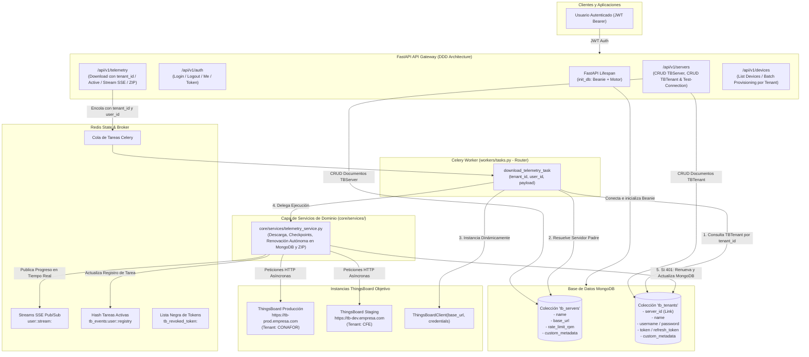

# ThingsBoard Super API Gateway - Documentación Técnica y Manual de Arquitectura

## 1. Visión General del Proyecto

**ThingsBoard Super API** es una plataforma backend de **API Gateway y Orquestador Multi-Servidor & Multi-Tenant** construida con **FastAPI**, **MongoDB (Beanie ODM)**, **Celery** y **Redis**. Está diseñada para administrar, orquestar y ejecutar operaciones masivas (descarga histórica de telemetría, aprovisionamiento de dispositivos y ejecución de scripts) sobre múltiples servidores independientes de **ThingsBoard** y múltiples **Tenants** por servidor.

### 🎯 Capacidades Principales
1. **API Gateway Multi-Servidor & Multi-Tenant:** Registro de infraestructura (`TBServer`) y Tenants independientes (`TBTenant`) en MongoDB con credenciales de Tenant Admin, tokens JWT y metadatos flexibles específicos.
2. **Autenticación JWT y Seguridad Multi-Tenant:** Control de acceso mediante tokens JWT seguros (`bcrypt` + `python-jose`), perfiles de usuario y revocación de sesión en tiempo real vía Redis blacklist.
3. **Aislamiento Estricto de Tareas y Streams:** Canales Pub/Sub SSE (`user:<user_id>:stream:<task_id>`) y registros de tareas activas (`tb_events:user:<user_id>:registry`) particionados por usuario.
4. **Enrutador Ligero de Celery & Capa de Servicios:** Tareas de Celery que resuelven dinámicamente `tenant_id` y `TBServer` en MongoDB y delegan la ejecución pesada a la capa de servicios (`core/services/`).
5. **Renovación Autónoma de Tokens con Persistencia:** Mecanismo resiliente en el Celery Worker que intercepta errores HTTP 401, renueva el par de tokens (`token` y `refresh_token`) y **actualiza asíncronamente el documento `TBTenant` en MongoDB** para futuras ejecuciones.
6. **Orquestador de Telemetría Masiva:** Particionado automático por meses, paginación continua por marcas de tiempo (`ts`), control de concurrencia con semáforos, *checkpoints* en Redis y compresión ZIP.
7. **Esquema NoSQL Flexible:** Capacidad de almacenar metadatos variables específicos por servidor y tenant (rate limits, proxies, headers, puertos MQTT, subestaciones) sin migraciones de base de datos.
8. **Distributed Lock & Heartbeat para Tareas Multi-Día:** Candado distribuido en Redis (`tb_server_lock:{server_id}`) con Fail Fast (HTTP 409 Conflict) en FastAPI, latido asíncrono (Heartbeat) de renovación cada 30 min (TTL 1 hora) en el Celery Worker y `visibility_timeout` de 10 días (`864,000s`) para descargas ininterrumpidas de larga duración (6 a 8 días).

---

## 2. Arquitectura del Sistema


```mermaid
flowchart TD
    subgraph Clients ["Clientes y Aplicaciones"]
        User["Usuario Autenticado (JWT Bearer)"]
    end

    subgraph Gateway ["FastAPI API Gateway (DDD Architecture)"]
        Lifespan["FastAPI Lifespan\n(init_db: Beanie + Motor)"]
        AuthRouter["/api/v1/auth\n(Login / Logout / Me / Token)"]
        ServerRouter["/api/v1/servers\n(CRUD TBServer, CRUD TBTenant & Test-Connection)"]
        TelemRouter["/api/v1/telemetry\n(Download con tenant_id / Active / Stream SSE / ZIP)"]
        DeviceRouter["/api/v1/devices\n(List Devices / Batch Provisioning por Tenant)"]
    end

    subgraph Mongo ["Base de Datos MongoDB"]
        TBServersCol[("Colección 'tb_servers'\n- name\n- base_url\n- rate_limit_rpm\n- custom_metadata")]
        TBTenantsCol[("Colección 'tb_tenants'\n- server_id (Link)\n- name\n- username / password\n- token / refresh_token\n- custom_metadata")]
    end

    subgraph Broker ["Redis State & Broker"]
        CeleryQueue["Cola de Tareas Celery"]
        PubSubStreams["Streams SSE Pub/Sub\nuser:<user_id>:stream:<task_id>"]
        UserRegistry["Hash Tareas Activas\ntb_events:user:<user_id>:registry"]
        TokenBlacklist["Lista Negra de Tokens\ntb_revoked_token:<token>"]
    end

    subgraph CeleryWorker ["Celery Worker (workers/tasks.py - Router)"]
        TaskRouter["download_telemetry_task\n(tenant_id, user_id, payload)"]
    end

    subgraph Services ["Capa de Servicios de Dominio (core/services/)"]
        TelemService["core/services/telemetry_service.py\n(Descarga, Checkpoints, Renovación Autónoma en MongoDB y ZIP)"]
    end

    subgraph TBInstances ["Instancias ThingsBoard Objetivo"]
        TB_Prod["ThingsBoard Producción\nhttps://tb-prod.empresa.com\n(Tenant: CONAFOR)"]
        TB_Staging["ThingsBoard Staging\nhttps://tb-dev.empresa.com\n(Tenant: CFE)"]
        TB_Dynamic["ThingsBoardClient(base_url, credentials)"]
    end

    User -->|JWT Auth| Gateway
    Lifespan -->|Conecta e inicializa Beanie| Mongo
    ServerRouter -->|CRUD Documentos TBServer| TBServersCol
    ServerRouter -->|CRUD Documentos TBTenant| TBTenantsCol
    TelemRouter -->|Encola con tenant_id y user_id| CeleryQueue

    CeleryQueue --> TaskRouter
    TaskRouter -->|1. Consulta TBTenant por tenant_id| TBTenantsCol
    TaskRouter -->|2. Resuelve Servidor Padre| TBServersCol
    TaskRouter -->|3. Instancia Dinámicamente| TB_Dynamic
    TaskRouter -->|4. Delega Ejecución| TelemService

    TelemService -->|Peticiones HTTP Asíncronas| TB_Prod
    TelemService -->|Peticiones HTTP Asíncronas| TB_Staging
    TelemService -->|5. Si 401: Renueva y Actualiza MongoDB| TBTenantsCol
    TelemService -->|Publica Progreso en Tiempo Real| PubSubStreams
    TelemService -->|Actualiza Registro de Tarea| UserRegistry
```

### Componentes Tecnológicos
- **Lenguaje:** Python 3.12+
- **Framework Web:** FastAPI + Uvicorn (Arquitectura asíncrona no bloqueante y modular DDD)
- **Persistencia NoSQL:** MongoDB + Motor + Beanie ODM (Documentos BSON con validación Pydantic v2)
- **Cola de Tareas & Enrutamiento:** Celery (Enrutador de tareas distribuido)
- **Broker & Estado en Tiempo Real:** Redis (Gestión de sesiones, lista negra de tokens, Pub/Sub SSE, checkpoints y broker de Celery)
- **Cliente HTTP Asíncrono:** HTTPX (Conexiones `keep-alive`, timeout configurable y reintentos)
- **Seguridad Criptográfica:** Passlib + Bcrypt + Python-Jose (JWT con claims inyectados)
- **Herramienta Standalone Legacy:** Node.js (CommonJS, Axios, Luxon, Winston) en `scripts/BackupManager`

---

## 3. Estructura de Directorios

```text
Thingsboard_Api/
├── api/                               # Capa de presentación y endpoints HTTP (FastAPI)
│   ├── __init__.py
│   ├── deps.py                        # Inyección de dependencias (get_current_user, JWT, Redis blacklist)
│   ├── main.py                        # Instancia de FastAPI, lifespan con init_db y routers DDD
│   └── endpoints/                     # Endpoints organizados por dominio (DDD)
│       ├── __init__.py                # Exportación centralizada de routers de dominio
│       ├── auth/                      # Dominio de Autenticación (/api/v1/auth)
│       │   ├── __init__.py
│       │   └── router.py              # Login OAuth2, Logout con revocación en Redis, Me, Token ThingsBoard
│       ├── servers/                   # Dominio de Servidores y Tenants (/api/v1/servers)
│       │   ├── __init__.py
│       │   └── router.py              # CRUD TBServer, CRUD TBTenant y test-connection
│       ├── telemetry/                 # Dominio de Telemetría y Respaldos (/api/v1/telemetry)
│       │   ├── __init__.py
│       │   └── router.py              # Encolado por tenant_id, tareas activas, SSE y descarga de ZIP
│       └── devices/                   # Dominio de Dispositivos y Aprovisionamiento (/api/v1/devices)
│           ├── __init__.py
│           └── router.py              # Listado y aprovisionamiento masivo por Tenant
├── core/                              # Capa de infraestructura y configuración del núcleo
│   ├── __init__.py
│   ├── config.py                      # Configuración centralizada (MONGO_URI, REDIS_URL, JWT, etc.)
│   ├── database.py                    # Conexión asíncrona a MongoDB e inicialización de Beanie ODM
│   ├── logger.py                      # Logging unificado (consola y logs/telemetry.log)
│   ├── redis_client.py                # Conexión asíncrona de Redis
│   ├── security.py                    # Funciones criptográficas bcrypt y JWT
│   ├── tb_client.py                   # Cliente dinámico ThingsBoardClient(base_url, credentials)
│   ├── models/                        # Modelos de documentos Beanie (MongoDB)
│   │   ├── __init__.py                # Exportación de TBServer, TBTenant y TBBackup
│   │   ├── tb_server.py               # Modelo TBServer (Infraestructura, base_url, rate_limits)
│   │   ├── tb_tenant.py               # Modelo TBTenant (server_id Link, credenciales, tokens, metadatos)
│   │   └── tb_backup.py               # Modelo TBBackup (Catálogo de respaldos: tenant_id Link, task_id, requested_by, fechas, tamaño)
│   └── services/                      # Servicios de negocio y lógica pesada desacoplada
│       ├── __init__.py
│       └── telemetry_service.py       # Descarga masiva en tmp_{task_id}, checkpoints, catálogo TBBackup y ZIP
├── workers/                           # Procesamiento asíncrono en segundo plano
│   ├── __init__.py
│   └── tasks.py                       # Enrutador ligero de Celery (resuelve tenant_id y server en Mongo)
├── scripts/                           # Scripts de verificación y herramientas auxiliares
│   ├── verify_workspace_isolation_and_backup_catalog.py # Suite de verificación de aislamiento, nomenclatura y catálogo TBBackup
│   ├── verify_multiserver_gateway.py  # Suite de verificación MongoDB, Beanie, Multi-Tenant y Renovación
│   ├── verify_multitenant_security.py # Suite de verificación de seguridad multi-tenant y JWT
│   └── BackupManager/                 # Herramienta standalone en Node.js para respaldos manuales
│       ├── backups/                   # Carpeta de salida de respaldos generados por Node.js
│       ├── helpers/
│       │   └── logger.js              # Logger Winston con formato y niveles personalizados
│       ├── configuracion.json         # Configuración de fechas, entidades y límites para Node.js
│       ├── index.js                   # Script principal de descarga concurrente en Node.js
│       ├── package.json               # Dependencias de Node.js (axios, dotenv, luxon, winston)
│       └── README.md                  # Documentación específica del BackupManager de Node.js
├── backups/                           # Directorio unificado para archivos ZIP generados y temporales aislados
├── logs/                              # Directorio de logs de la aplicación Python (telemetry.log)
├── docker-compose.yml                 # Archivo para orquestación de contenedores (MongoDB, Redis, API, Worker)
├── requirements.txt                   # Dependencias de Python
├── .gitignore                         # Archivos ignorados por Git
└── Gemini.md                          # Manual y guía técnica completa
```

---

## 4. Análisis Detallado de Módulos y Modelos

### 4.1. `core/models/tb_server.py` (Infraestructura del Servidor)
Modelo de documento `TBServer(Document)` para persistencia de la instancia ThingsBoard:
- `name`: Nombre descriptivo (ej: `"ThingsBoard Producción Bajío"`).
- `base_url`: URL base de la instancia ThingsBoard.
- `description`: Notas o metadatos de la instancia.
- `rate_limit_rpm`: Límite de peticiones por minuto individual para proteger el servidor objetivo.
- `custom_metadata`: Diccionario abierto (`Dict[str, Any]`) para propiedades de infraestructura (proxies, certificados, flags, puertos MQTT).
- `user_id`: Identificador del usuario propietario en el Gateway.
- `is_active`: Estado activo/inactivo.

### 4.2. `core/models/tb_tenant.py` (Tenants de ThingsBoard)
Modelo de documento `TBTenant(Document)` que almacena los tenants alojados en un servidor:
- `server_id`: Link Beanie (`Link[TBServer]`) al servidor padre.
- `name`: Nombre del tenant (ej: `"CONAFOR"`).
- `username`, `password`: Credenciales del Tenant Admin en ThingsBoard.
- `token`, `refresh_token`: Tokens JWT de sesión con ThingsBoard.
- `custom_metadata`: Diccionario abierto (`Dict[str, Any]`) con metadatos específicos del tenant (subestaciones, cuotas, flags).
- `user_id`: Identificador del usuario propietario en el Gateway.
- `is_active`: Estado activo/inactivo.
- Métodos auxiliares: `get_server()` (resuelve el documento `TBServer` padre) y `get_server_id_str()`.

### 4.3. `core/models/tb_backup.py` (Catálogo de Respaldos de Telemetría)
Modelo de documento `TBBackup(Document)` para persistencia del catálogo histórico de respaldos ZIP:
- `tenant_id`: Link Beanie (`Link[TBTenant]`) al tenant propietario del respaldo.
- `task_id`: Identificador de la tarea de Celery (`task_id`).
- `requested_by`: Identificador del usuario que solicitó el respaldo (`user_id`).
- `file_name`: Nombre del archivo ZIP (`{tenant_name}_{start_date}_to_{end_date}_{task_id}.zip`).
- `start_date`, `end_date`: Rango de telemetría cubierto por el archivo.
- `file_size_bytes`: Tamaño del archivo en bytes.
- `created_at`: Fecha y hora de creación.
- Métodos auxiliares: `get_tenant()` y `get_tenant_id_str()`.

### 4.4. `core/database.py`
- `init_db(custom_client=None, database_name=None)`: Inicializa la conexión asíncrona con Motor y registra todos los modelos Beanie (`TBServer`, `TBTenant`, `TBBackup`).
- `close_db()`: Cierra conexiones activas de MongoDB.

### 4.5. `core/services/telemetry_service.py`
- `refresh_tenant_tokens_in_db(tenant_id, tb, token_ref, payload)`: Ejecuta la renovación autónoma ante errores HTTP 401 usando `refresh_token` o credenciales y **actualiza el documento `TBTenant` en MongoDB de forma asíncrona**.
- `download_telemetry_for_key()`: Paginación continua por marcas de tiempo con guardado en ruta aislada `backups/tmp_{task_id}/...`, checkpointing en Redis, captura de 401 y semáforos de concurrencia.
- `run_download_orchestrator()`: Orquestador principal que descubre dispositivos, particiona intervalos mensuales, ejecuta descargas paralelas, empaqueta el ZIP descriptivo en `backups/`, registra el documento `TBBackup` en MongoDB y elimina completamente la carpeta temporal `tmp_{task_id}`.

### 4.6. `workers/tasks.py` (Enrutador Ligero de Celery)
- `_execute_routed_telemetry_download(task_id, payload)`:
  1. Resuelve `tenant_id` en MongoDB usando Beanie.
  2. Obtiene el documento `TBServer` padre mediante `tenant.get_server()`.
  3. Instancia `ThingsBoardClient(base_url, token, refresh_token, username, password)`.
  4. Delega la ejecución a `run_download_orchestrator`.

---

## 5. Flexibilidad NoSQL: Metadatos Variables sin Migraciones

El uso de **MongoDB + Beanie ODM** aporta ventajas arquitectónicas cruciales frente a bases de datos relacionales tradicionales:

| Característica | MongoDB + Beanie | Base de Datos Relacional (SQL) |
| :--- | :--- | :--- |
| **Metadatos Variables** | `custom_metadata: Dict[str, Any]` guarda proxies, headers y certificados directamente | Requiere tablas EAV complejas o columnas JSON sin tipado nativo |
| **Rate Limit por Servidor** | `rate_limit_rpm` configurable por documento individual | Requiere modificar esquemas y migraciones DDL |
| **Evolución de Campos** | Nuevos campos con valores por defecto son compatibles de inmediato | Requiere ejecutar scripts de migración `ALTER TABLE` |
| **Multi-Tenancy Jerárquico** | `Link[TBServer]` y documentos `TBTenant` embeben metadatos sin joins costosos | Requiere múltiples tablas puente y foreign keys rígidas |
| **Catálogo de Respaldos** | `Link[TBTenant]` en `TBBackup` permite asociar metadatos de archivos y descargas compartidas | Requiere claves foráneas rígidas y esquemas estáticos |
| **Escalabilidad IoT** | Ideal para estructuras jerárquicas y documentos de configuración heterogéneos | Rígido ante cambios frecuentes en dispositivos y servidores |

---

## 6. Formato de Almacenamiento, Particionado y Checkpoints

Durante la descarga concurrente de los Celery Workers, cada tarea opera en un espacio de trabajo aislado temporal:

```text
backups/
└── tmp_<TASK_ID>/                                      # Espacio de trabajo temporal aislado por tarea
    └── <TENANT_NAME>/
        └── <DEVICE_NAME>/
            └── <AÑO>/
                └── <MES>/
                    └── <ENTITY_UUID>.<KEY>.<MM-AAAA>.<ESTADO>.json
```

### Estructura del Archivo JSON:
```json
{
    "data": [
        {
            "ts": 1777615205411,
            "value": "20.5"
        }
    ],
    "length": 1
}
```

- **`<ESTADO>`:**
  - `completo`: Si el intervalo finalizó y se descargó el rango completo del mes.
  - `parcial`: Si la descarga corresponde al mes actual en curso o a un rango acotado que no abarcó todo el mes.
- **Nomenclatura Explícita de Archivos JSON:** `{entity_id}.{key}.{MM-AAAA}.{estado}.json` (ej: `036eb5ec-8c17-48f8-b328-98e6da58a5f0.temperature.01-2026.completo.json`).
- **Empaquetado Final y Limpieza:** El worker genera el archivo ZIP descriptivo en `backups/{tenant_name}_{start_date}_to_{end_date}_{task_id}.zip`, registra la entrada en `TBBackup` (MongoDB) y **elimina completamente la carpeta `tmp_{task_id}`**.
- **Checkpoints en Redis:** Se almacena la última marca de tiempo (`ts`) procesada bajo la clave `tb_backup:<tenant_name>:<entity_id>:<key>:<YYYY_MM>:last_ts` para reanudación ante fallos.

---

## 7. Especificación de Endpoints (API Reference v1)

### 7.1. Dominio de Autenticación (`/api/v1/auth`)

#### 1. Inicio de Sesión (Login OAuth2 / JWT)
- **Método:** `POST` | **Ruta:** `/api/v1/auth/login`
- **Cuerpo (Form Data):** `username`, `password`
- **Usuarios de prueba:** `user_a` (`secret_a_123`), `user_b` (`secret_b_456`), `admin` (`admin_pass_789`)
- **Respuesta (200 OK):**
```json
{
  "access_token": "eyJhbGciOiJIUzI1NiIsInR5cCI6IkpXVCJ9...",
  "token_type": "bearer",
  "user_id": "user_a_001",
  "username": "user_a"
}
```

#### 2. Perfil del Usuario Actual
- **Método:** `GET` | **Ruta:** `/api/v1/auth/me`
- **Cabecera:** `Authorization: Bearer <ACCESS_TOKEN>`
- **Respuesta (200 OK):**
```json
{
  "id": "user_a_001",
  "username": "user_a",
  "email": "user_a@tkmecloud.com",
  "role": "user",
  "is_active": true
}
```

#### 3. Cierre de Sesión (Logout con Revocación en Redis)
- **Método:** `POST` | **Ruta:** `/api/v1/auth/logout`
- **Cabecera:** `Authorization: Bearer <ACCESS_TOKEN>`
- **Respuesta (200 OK):**
```json
{
  "status": "ok",
  "message": "Sesión cerrada exitosamente para el usuario user_a"
}
```

#### 4. Obtención y Caché de Token ThingsBoard
- **Método:** `POST` | **Ruta:** `/api/v1/auth/token`
- **Cabecera:** `Authorization: Bearer <ACCESS_TOKEN>`
- **Cuerpo:**
```json
{
  "server_url": "https://thingsboard.cloud",
  "username": "usuario@empresa.com",
  "password": "miPasswordSeguro"
}
```

---

### 7.2. Dominio de Servidores y Tenants (`/api/v1/servers`)

#### 1. Registrar Servidor ThingsBoard
- **Método:** `POST` | **Ruta:** `/api/v1/servers`
- **Cabecera:** `Authorization: Bearer <ACCESS_TOKEN>`
- **Cuerpo:**
```json
{
  "name": "ThingsBoard Producción Bajío",
  "base_url": "https://tb-bajio.empresa.com",
  "description": "Cluster principal de telemetría",
  "rate_limit_rpm": 120,
  "custom_metadata": {
    "region": "Bajio",
    "proxy_url": "http://proxy.internal:8080"
  }
}
```
- **Respuesta (201 Created):** Objeto `ServerResponse` con el `id` generado en MongoDB.

#### 2. Listar Servidores Registrados
- **Método:** `GET` | **Ruta:** `/api/v1/servers`
- **Cabecera:** `Authorization: Bearer <ACCESS_TOKEN>`
- **Respuesta (200 OK):** Lista de servidores pertenecientes al usuario autenticado.

#### 3. Obtener Detalle de Servidor
- **Método:** `GET` | **Ruta:** `/api/v1/servers/{server_id}`

#### 4. Actualizar Servidor y Metadatos
- **Método:** `PUT` | **Ruta:** `/api/v1/servers/{server_id}`

#### 5. Eliminar Servidor
- **Método:** `DELETE` | **Ruta:** `/api/v1/servers/{server_id}`

#### 6. Probar Conexión del Servidor
- **Método:** `POST` | **Ruta:** `/api/v1/servers/{server_id}/test-connection`
- **Respuesta (200 OK):**
```json
{
  "success": true,
  "reachable": true,
  "authenticated": false,
  "base_url": "https://tb-bajio.empresa.com"
}
```

#### 7. Consultar Estado de Concurrencia (Lock Distribuido) del Servidor
- **Método:** `GET` | **Ruta:** `/api/v1/servers/{server_id}/status`
- **Cabecera:** `Authorization: Bearer <ACCESS_TOKEN>`
- **Respuesta (200 OK):**
```json
{
  "server_id": "6a896a562dbf2d144808b5b5",
  "is_busy": false
}
```

#### 8. Registrar Tenant bajo un Servidor
- **Método:** `POST` | **Ruta:** `/api/v1/servers/{server_id}/tenants`
- **Cabecera:** `Authorization: Bearer <ACCESS_TOKEN>`
- **Cuerpo:**
```json
{
  "name": "CONAFOR",
  "username": "conafor_admin@empresa.com",
  "password": "miPasswordSeguro",
  "token": "eyJhbGciOiJIUzUxMiJ9...",
  "refresh_token": "eyJhbGciOiJIUzUxMiJ9...",
  "custom_metadata": {
    "department": "Monitoreo Forestal",
    "device_quota": 500
  }
}
```
- **Respuesta (201 Created):** Objeto `TenantResponse` con `id`, `server_id`, `name`, `has_token`, `has_credentials`.

#### 8. Listar Tenants de un Servidor
- **Método:** `GET` | **Ruta:** `/api/v1/servers/{server_id}/tenants`
- **Respuesta (200 OK):** Lista de tenants pertenecientes al usuario bajo dicho servidor.

#### 9. Obtener Detalle de un Tenant
- **Método:** `GET` | **Ruta:** `/api/v1/servers/{server_id}/tenants/{tenant_id}`

#### 10. Actualizar Tenant
- **Método:** `PUT` | **Ruta:** `/api/v1/servers/{server_id}/tenants/{tenant_id}`

#### 11. Eliminar Tenant
- **Método:** `DELETE` | **Ruta:** `/api/v1/servers/{server_id}/tenants/{tenant_id}`

#### 12. Probar Conexión y Autenticación del Tenant
- **Método:** `POST` | **Ruta:** `/api/v1/servers/{server_id}/tenants/{tenant_id}/test-connection`
- **Respuesta (200 OK):**
```json
{
  "success": true,
  "reachable": true,
  "authenticated": true,
  "base_url": "https://tb-bajio.empresa.com",
  "tenant_name": "CONAFOR",
  "tenant_id": "6a896a562dbf2d144808b5b6"
}
```

---

### 7.3. Dominio de Telemetría (`/api/v1/telemetry`)

#### 1. Iniciar Descarga Masiva de Telemetría (por `tenant_id`)
- **Método:** `POST` | **Ruta:** `/api/v1/telemetry/download`
- **Cabecera:** `Authorization: Bearer <ACCESS_TOKEN>`
- **Cuerpo:**
```json
{
  "tenant_id": "6a896a562dbf2d144808b5b6",
  "start_date": "2026-01-01T00:00:00",
  "end_date": "2026-08-01T23:59:59",
  "time_zone": "America/Mexico_City",
  "concurrency_limit": 3,
  "page_limit": 2000
}
```
- **Respuesta (200 OK):**
```json
{
  "task_id": "3c91a0ef-7952-4418-9717-b08e70a3c2be",
  "status": "Task enqueued",
  "user_id": "user_a_001",
  "tenant_id": "6a896a562dbf2d144808b5b6",
  "tenant_name": "CONAFOR",
  "server_id": "6a896a562dbf2d144808b5b5",
  "server_url": "https://tb-bajio.empresa.com"
}
```
- **Respuesta (409 Conflict - Fail Fast):**
Si el servidor ThingsBoard asociado al Tenant ya se encuentra procesando otro respaldo (`tb_server_lock:{server_id}` activo):
```json
{
  "detail": "El servidor ThingsBoard se encuentra actualmente ocupado procesando otro respaldo. Por favor, intente más tarde."
}
```

#### 2. Consultar Tareas Activas del Usuario
- **Método:** `GET` | **Ruta:** `/api/v1/telemetry/tasks/active`
- **Cabecera:** `Authorization: Bearer <ACCESS_TOKEN>`

#### 3. Transmisión de Progreso en Tiempo Real (SSE)
- **Método:** `GET` | **Ruta:** `/api/v1/telemetry/stream/{task_id}`
- **Cabecera:** `Authorization: Bearer <ACCESS_TOKEN>`
- **Tipo de Contenido:** `text/event-stream`

#### 4. Consultar Catálogo de Respaldos de un Tenant
- **Método:** `GET` | **Ruta:** `/api/v1/telemetry/backups?tenant_id={tenant_id}`
- **Cabecera:** `Authorization: Bearer <ACCESS_TOKEN>`
- **Respuesta (200 OK):**
```json
[
  {
    "id": "6a8988c00ad49b69e742d1d0",
    "tenant_id": "6a896a562dbf2d144808b5b6",
    "tenant_name": "CONAFOR",
    "task_id": "3c91a0ef-7952-4418-9717-b08e70a3c2be",
    "requested_by": "user_a_001",
    "file_name": "CONAFOR_20260101_to_20260801_3c91a0ef-7952-4418-9717-b08e70a3c2be.zip",
    "start_date": "2026-01-01T00:00:00Z",
    "end_date": "2026-08-01T23:59:59Z",
    "file_size_bytes": 15482910,
    "created_at": "2026-08-22T11:30:00Z",
    "download_url": "/api/v1/telemetry/download/file/3c91a0ef-7952-4418-9717-b08e70a3c2be"
  }
]
```

#### 5. Descargar Archivo ZIP Generado (Catálogo TBBackup)
- **Método:** `GET` | **Ruta:** `/api/v1/telemetry/download/file/{task_id}`
- **Cabecera:** `Authorization: Bearer <ACCESS_TOKEN>`
- **Respuesta:** Archivo binario `application/zip` (`{TENANT_NAME}_{START_DATE}_to_{END_DATE}_{TASK_ID}.zip`).

#### 6. Consultar Estado de Tarea en Celery
- **Método:** `GET` | **Ruta:** `/api/v1/telemetry/status/{task_id}`


---

### 7.4. Dominio de Dispositivos (`/api/v1/devices`)

#### 1. Listar Dispositivos de un Servidor / Tenant
- **Método:** `GET` | **Ruta:** `/api/v1/devices/{server_id}?tenant_id={tenant_id}&limit=100&page=0`
- **Cabecera:** `Authorization: Bearer <ACCESS_TOKEN>`

#### 2. Consultar Detalle de Dispositivo
- **Método:** `GET` | **Ruta:** `/api/v1/devices/{server_id}/{device_id}?tenant_id={tenant_id}`

#### 3. Plantilla de Aprovisionamiento Masivo por Tenant
- **Método:** `POST` | **Ruta:** `/api/v1/devices/{server_id}/provision`
- **Cabecera:** `Authorization: Bearer <ACCESS_TOKEN>`
- **Cuerpo:**
```json
{
  "tenant_id": "6a896a562dbf2d144808b5b6",
  "devices": [
    {
      "name": "Medidor_Energia_01",
      "type": "energy_meter",
      "label": "Planta Norte",
      "additional_info": {"model": "EM-3000"}
    }
  ]
}
```

---

## 8. Guía Completa de Configuración, Despliegue y Ejecución

### 8.1. Requisitos Previos
- **Python:** 3.12 o superior
- **Redis:** Servidor activo en el puerto `6379` (Broker de Celery, Pub/Sub SSE, Checkpoints y Token Blacklist)
- **MongoDB:** Servidor activo en el puerto `27017` (Persistencia ODM con Motor y Beanie)

---

### 8.2. Entorno Virtual e Instalación de Dependencias

```powershell
# 1. Crear entorno virtual (si no existe)
python -m venv venv

# 2. Activar entorno virtual en Windows PowerShell
venv\Scripts\Activate.ps1

# En Linux / macOS:
# source venv/bin/activate

# 3. Instalar dependencias del proyecto
pip install -r requirements.txt
```

---

### 8.3. Variables de Entorno (`.env`)

Crea o edita el archivo `.env` en la raíz del proyecto (`ThingsboardApiGateway/.env`):

```env
PROJECT_NAME="ThingsBoard Super API Gateway"
REDIS_URL="redis://localhost:6379/0"

# Base de Datos MongoDB
MONGO_URI="mongodb://localhost:27017"
MONGO_DB_NAME="tb_super_api"

# Parámetros de Seguridad JWT
SECRET_KEY="super-secret-key-change-in-production-thingsboard-2026"
ALGORITHM="HS256"
ACCESS_TOKEN_EXPIRE_MINUTES=1440
```

---

### 8.4. Inicialización de Servicios de Infraestructura (Redis & MongoDB)

Si utilizas Docker para ejecutar Redis y MongoDB localmente:

```powershell
# Iniciar contenedor de Redis
docker run -d --name tb-redis -p 6379:6379 redis:7-alpine

# Iniciar contenedor de MongoDB
docker run -d --name tb-mongo -p 27017:27017 mongo:7.0
```

---

### 8.5. Ejecución de los Servicios Principales

Para operar la plataforma completa se requieren dos terminales activas:

#### 🚀 Terminal 1: Servidor Web FastAPI (API Gateway)

```powershell
# Activar entorno virtual
venv\Scripts\Activate.ps1

# Iniciar servidor FastAPI con Uvicorn y Hot-Reload
uvicorn api.main:app --host 0.0.0.0 --port 8000 --reload
```

- **Swagger UI Interactiva:** [http://localhost:8000/docs](http://localhost:8000/docs)
- **Redoc UI:** [http://localhost:8000/redoc](http://localhost:8000/redoc)
- **Root Healthcheck:** [http://localhost:8000/](http://localhost:8000/)

#### ⚙️ Terminal 2: Celery Worker (Enrutador y Procesamiento en Segundo Plano)

- **En Windows (Requerido pool `solo` para evitar bloqueos de subprocesos):**
```powershell
# Activar entorno virtual
venv\Scripts\Activate.ps1

# Iniciar Celery Worker
celery -A workers.tasks.celery_app worker --loglevel=info -P solo
```

- **En Linux / macOS:**
```bash
source venv/bin/activate
celery -A workers.tasks.celery_app worker --loglevel=info -c 4
```

---

### 8.6. Ejecución de las Suites de Pruebas Automatizadas

El proyecto incluye suites completas con `mongomock_motor` y `httpx.ASGITransport` para pruebas aisladas y determinísticas:

```powershell
# 1. Probar API Gateway Multi-Servidor, Multi-Tenant, Beanie y Renovación Autónoma de Tokens
venv\Scripts\python scripts/verify_multiserver_gateway.py

# 2. Probar Seguridad Multi-Tenant, Hashing bcrypt, JWT, Aislamiento SSE y Revocación de Sesión
venv\Scripts\python scripts/verify_multitenant_security.py
```

---

### 8.7. Uso de la Herramienta Standalone Legacy (`scripts/BackupManager`)

Si se requiere ejecutar descargas de respaldo manuales con la herramienta heredada en Node.js:

```powershell
# Navegar al directorio de la herramienta
cd scripts/BackupManager

# Instalar dependencias de Node.js
npm install

# Configurar parámetros en configuracion.json y ejecutar
node index.js
```
