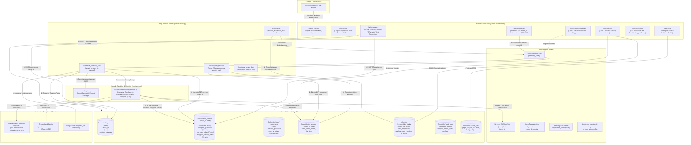

# ThingsBoard Super API Gateway - Documentación Técnica y Manual de Arquitectura

## 1. Visión General del Proyecto

**ThingsBoard Super API** es una plataforma backend de **API Gateway, Orquestador Multi-Servidor & Multi-Tenant e IAM Centralizado** construida con **FastAPI**, **MongoDB (Beanie ODM)**, **Celery**, **Redis** y **PyCasbin**. Está diseñada para administrar, orquestar y ejecutar operaciones masivas (descarga histórica de telemetría, aprovisionamiento de dispositivos, ejecución de scripts y control de acceso granular) sobre múltiples servidores independientes de **ThingsBoard** y múltiples **Tenants** por servidor.

### 🎯 Capacidades Principales
1. **API Gateway Multi-Servidor & Multi-Tenant:** Registro de infraestructura (`TBServer`) y Tenants independientes (`TBTenant`) en MongoDB con credenciales de Tenant Admin, tokens JWT y metadatos flexibles específicos.
2. **Cifrado Simétrico en Reposo con Fernet (`core/crypto.py`):** Cifrado simétrico a nivel de aplicación (`cryptography.fernet`) para contraseñas y tokens JWT de ThingsBoard en MongoDB. Cero credenciales en texto plano en la base de datos y descifrado seguro exclusivo en memoria RAM para clientes HTTP.
3. **Resiliencia de Event Loop en Redis (`DynamicRedisClient`):** Cliente asíncrono dinámico en `core/redis_client.py` que detecta automáticamente el cierre y recreación del Event Loop en ejecuciones consecutivas de Celery (`asyncio.run()`), eliminando errores de `Event loop is closed`.
4. **Control de Acceso Basado en Roles por Dominios (IAM & PyCasbin):** Autorización RBAC multi-tenant con dominios (`sub, dom, obj, act`) gestionada en MongoDB (`casbin-motor-adapter`), bootstrapping automático de Superadmin y dependencia declarativa `CasbinAuth`.
5. **Autenticación JWT Segura y Revocación en Tiempo Real:** Hashing `bcrypt`, emisión de tokens JWT firmados con UUID `jti` único y lista negra distribuida en Redis (`tb_revoked_token:{token}`) para invalidación inmediata de sesiones al hacer Logout.
6. **Políticas de Hardening DevSecOps:** Endpoint `/api/v1/auth/set-password` con tokens de configuración inicial de un solo uso (`setup_token` anti-replay en Redis), política estricta de contraseñas (mínimo 10 caracteres, números y símbolos) y protección anti fuerza bruta (5 intentos fallidos $\to$ HTTP 429 Too Many Requests con bloqueo temporal).
7. **Auditoría Estructurada Sanitizada (`AuditLog`):** Registro de auditoría persistente en MongoDB para todas las peticiones mutantes (`POST`, `PUT`, `DELETE`, `PATCH`), enmascarando contraseñas, credenciales y tokens con `"***"`.
8. **Enrutador Ligero de Celery & Capa de Servicios:** Tareas de Celery que resuelven dinámicamente `tenant_id` y `TBServer` en MongoDB y delegan la ejecución pesada a la capa de servicios (`core/services/`).
9. **Renovación Autónoma de Tokens con Persistencia:** Mecanismo resiliente en el Celery Worker que intercepta errores HTTP 401, renueva el par de tokens (`token` y `refresh_token`) y **actualiza asíncronamente el documento `TBTenant` cifrado en MongoDB** para futuras ejecuciones.
10. **Orquestador de Telemetría Masiva y Catálogo TBBackup:** Particionado automático por meses, paginación continua por marcas de tiempo (`ts`), control de concurrencia con semáforos, *checkpoints* en Redis, compresión ZIP en volúmenes locales persistentes y catálogo histórico `TBBackup` en MongoDB.
11. **Distributed Lock & Heartbeat para Tareas Multi-Día:** Candado distribuido en Redis (`tb_server_lock:{server_id}`) con Fail Fast (HTTP 409 Conflict) en FastAPI, latido asíncrono (Heartbeat) de renovación cada 30 min (TTL 1 hora) en el Celery Worker y `visibility_timeout` de 10 días (`864,000s`) para descargas ininterrumpidas de larga duración (6 a 8 días).
12. **Automatizaciones y Patrón Dispatcher con Celery Beat (`TBScheduledTask`):** Programación dinámica de tareas en base de datos sin alterar código fuente, resolución periódica cada 1 min (`tasks.master_dispatcher`), conversión de zonas horarias locales (`America/Mexico_City`) a UTC puro, aislamiento granular ante fallos y disparo manual bajo demanda.
13. **Política de Retención y Limpieza Automatizada de Disco (`tasks.cleanup_old_backups`):** Sincronización estricta con el catálogo `TBBackup` en MongoDB, purga defensiva de archivos ZIP caducados (`days_to_keep`) y barrido de directorios temporales huérfanos/zombis (`tmp_*` con antigüedad mayor a 24 horas).

---

## 2. Arquitectura del Sistema


```mermaid
flowchart TD
    subgraph Clients ["Clientes y Aplicaciones"]
        User["Usuario Autenticado (JWT Bearer)"]
    end

    subgraph Gateway ["FastAPI API Gateway (DDD Architecture)"]
        Lifespan["FastAPI Lifespan\n(init_db: Beanie + Motor, init_casbin)"]
        AuthRouter["/api/v1/auth\n(Login / Logout / Me / Set-Password / Token)"]
        UsersRouter["/api/v1/users\n(CRUD Usuarios / Setup Token)"]
        IAMRouter["/api/v1/iam\n(Roles por Tenant / Políticas Casbin)"]
        ServerRouter["/api/v1/servers\n(CRUD TBServer, CRUD TBTenant & Test-Connection)"]
        TelemRouter["/api/v1/telemetry\n(Download con tenant_id / Active / Stream SSE / ZIP)"]
        DeviceRouter["/api/v1/devices\n(List Devices / Batch Provisioning por Tenant)"]
        SchedulerRouter["/api/v1/scheduler/tasks\n(CRUD TBScheduledTask / Trigger Manual)"]
    end

    subgraph Mongo ["Base de Datos MongoDB"]
        TBServersCol[("Colección 'tb_servers'\n- name\n- base_url\n- rate_limit_rpm\n- custom_metadata")]
        TBTenantsCol[("Colección 'tb_tenants'\n- server_id (Link)\n- name\n- username (Plain)\n- encrypted_password (Fernet)\n- encrypted_token (Fernet)\n- encrypted_refresh_token (Fernet)")]
        UsersCol[("Colección 'users'\n- username\n- email\n- hashed_password\n- role, is_active, is_superuser")]
        BackupsCol[("Colección 'tb_backups'\n- tenant_id (Link)\n- task_id, file_name, file_size")]
        ScheduledCol[("Colección 'tb_scheduled_tasks'\n- name, task_name, cron_expression\n- payload, next_run_time, is_active")]
        AuditCol[("Colección 'audit_logs'\n- timestamp, method, endpoint, status_code, payload")]
        CasbinCol[("Colección 'casbin_rule'\n- ptype, v0 (sub), v1 (dom), v2 (obj), v3 (act)")]
    end

    subgraph Broker ["Redis State & Broker"]
        CeleryQueue["Cola de Tareas Celery\n(telemetry_tasks)"]
        PubSubStreams["Streams SSE Pub/Sub\nuser:{user_id}:stream:{task_id}"]
        UserRegistry["Hash Tareas Activas\ntb_events:user:{user_id}:registry"]
        TokenBlacklist["Lista Negra de Tokens\ntb_revoked_token:{token}"]
        RateLimits["Límites de Intentos de Login\ntb_login_attempts:{ip}"]
    end

    subgraph CeleryWorker ["Celery Workers & Beat (workers/tasks.py)"]
        BeatScheduler["Celery Beat\n(master_dispatcher_task cada 1 min)"]
        TaskRouter["download_telemetry_task\n(tenant_id, user_id, payload)"]
        CleanupTask["cleanup_old_backups\n(Purga ZIPs caducados y zombis tmp)"]
        Heartbeat["_heartbeat_server_lock\n(Renovación cada 30 min)"]
    end

    subgraph Services ["Capa de Servicios de Dominio (core/services/)"]
        CryptoService["core/crypto.py\n(Fernet Symmetric Encrypt / Decrypt)"]
        TelemService["core/services/telemetry_service.py\n(Descarga, Checkpoints, Renovación Autónoma en MongoDB y ZIP)"]
    end

    subgraph TBInstances ["Instancias ThingsBoard Objetivo"]
        TB_Prod["ThingsBoard Producción\nhttps://tb-prod.empresa.com\n(Tenant: CONAFOR)"]
        TB_Staging["ThingsBoard Staging\nhttps://tb-dev.empresa.com\n(Tenant: CFE)"]
        TB_Dynamic["ThingsBoardClient(base_url, credentials)"]
    end

    User -->|JWT Auth & Casbin Enforcement| Gateway
    Lifespan -->|Conecta e inicializa Beanie y Casbin| Mongo
    ServerRouter -->|CRUD Documentos TBServer| TBServersCol
    ServerRouter -->|CRUD TBTenants con Fernet| TBTenantsCol
    UsersRouter -->|Gestión de Cuentas| UsersCol
    IAMRouter -->|Políticas RBAC| CasbinCol
    SchedulerRouter -->|CRUD Automatizaciones| ScheduledCol
    SchedulerRouter -.->|Trigger Inmediato| CeleryQueue
    TelemRouter -->|Encola con tenant_id y user_id| CeleryQueue

    BeatScheduler -->|1. Consulta tareas vencidas en UTC| ScheduledCol
    BeatScheduler -->|2. Despacha dinámicamente| CeleryQueue
    CeleryQueue --> TaskRouter
    CeleryQueue --> CleanupTask

    TaskRouter -->|1. Consulta TBTenant por tenant_id| TBTenantsCol
    TaskRouter -->|2. Resuelve Servidor Padre| TBServersCol
    TaskRouter -->|3. Descifra credenciales en RAM| CryptoService
    TaskRouter -->|4. Instancia Dinámicamente| TB_Dynamic
    TaskRouter -->|5. Inicia Heartbeat y Delega| TelemService

    CleanupTask -->|1. Consulta registros vencidos| BackupsCol
    CleanupTask -->|2. Elimina ZIPs en disco y borra docs| BackupsCol

    TelemService -->|Peticiones HTTP Asíncronas| TB_Prod
    TelemService -->|Peticiones HTTP Asíncronas| TB_Staging
    TelemService -->|6. Si 401: Renueva y Actualiza MongoDB cifrado| TBTenantsCol
    TelemService -->|Publica Progreso en Tiempo Real| PubSubStreams
    TelemService -->|Registra Catálogo de Respaldo| BackupsCol
```

### Componentes Tecnológicos
- **Lenguaje:** Python 3.12+
- **Framework Web:** FastAPI + Uvicorn (Arquitectura asíncrona no bloqueante y modular DDD)
- **Persistencia NoSQL:** MongoDB + Motor + Beanie ODM (Documentos BSON con validación Pydantic v2)
- **Autorización & RBAC:** PyCasbin (`casbin` + `casbin-motor-adapter`) con modelo de dominios/tenants
- **Cola de Tareas & Enrutamiento:** Celery (Enrutador de tareas distribuido)
- **Broker & Estado en Tiempo Real:** Redis (Gestión de sesiones, lista negra de tokens, Pub/Sub SSE, checkpoints, Dynamic Connection Pooling y broker de Celery)
- **Cliente HTTP Asíncrono:** HTTPX (Conexiones `keep-alive`, timeout configurable y reintentos)
- **Criptografía Simétrica:** Cryptography (`cryptography.fernet.Fernet` con derivación SHA-256 fallback para credenciales en reposo)
- **Seguridad Criptográfica JWT & Hash:** Passlib + Bcrypt + Python-Jose (JWT con claims inyectados y UUID `jti` único)
- **Herramienta Standalone Legacy:** Node.js (CommonJS, Axios, Luxon, Winston) en `scripts/BackupManager`

---

## 3. Estructura de Directorios

```text
Thingsboard_Api/
├── api/                               # Capa de presentación y endpoints HTTP (FastAPI)
│   ├── __init__.py
│   ├── deps.py                        # Inyección de dependencias (get_current_user, CasbinAuth, JWT, Redis blacklist)
│   ├── main.py                        # Instancia de FastAPI, lifespan con init_db, Casbin y routers DDD
│   └── endpoints/                     # Endpoints organizados por dominio (DDD)
│       ├── __init__.py                # Exportación centralizada de routers de dominio
│       ├── auth/                      # Dominio de Autenticación (/api/v1/auth)
│       │   ├── __init__.py
│       │   └── router.py              # Login OAuth2 con MongoDB, Logout con revocación en Redis, Me, Set-Password, Token
│       ├── users/                     # Dominio de Gestión de Usuarios (/api/v1/users)
│       │   ├── __init__.py
│       │   └── router.py              # CRUD completo de usuarios en MongoDB (Create, List, Get, Update, Delete)
│       ├── iam/                       # Dominio de IAM y Políticas Casbin (/api/v1/iam)
│       │   ├── __init__.py
│       │   └── router.py              # Asignación/revocación de roles por tenant, gestión de políticas Casbin
│       ├── servers/                   # Dominio de Servidores y Tenants (/api/v1/servers)
│       │   ├── __init__.py
│       │   └── router.py              # CRUD TBServer, CRUD TBTenant con Fernet, Lock Status y test-connection
│       ├── telemetry/                 # Dominio de Telemetría y Respaldos (/api/v1/telemetry)
│       │   ├── __init__.py
│       │   └── router.py              # Encolado por tenant_id, tareas activas, SSE y descarga de ZIP
│       ├── devices/                   # Dominio de Dispositivos y Aprovisionamiento (/api/v1/devices)
│       │   ├── __init__.py
│       │   └── router.py              # Listado y aprovisionamiento masivo por Tenant
│       └── scheduler/                 # Dominio de Automatizaciones y Tareas Programadas (/api/v1/scheduler/tasks)
│           ├── __init__.py
│           ├── schemas.py             # DTOs Pydantic v2 (ScheduledTaskCreate/Update/Response) con validación croniter
│           └── router.py              # CRUD de automatizaciones, recálculo cron y trigger manual en Celery
├── core/                              # Capa de infraestructura y configuración del núcleo
│   ├── __init__.py
│   ├── bootstrap.py                   # Arranque idempotente y creación de Superadmin inicial + políticas raíz
│   ├── casbin_enforcer.py             # Instancia global y ciclo de vida de AsyncEnforcer con casbin-motor-adapter
│   ├── config.py                      # Configuración centralizada (MONGO_URI, REDIS_URL, JWT, ENCRYPTION_KEY, etc.)
│   ├── crypto.py                      # Cifrado simétrico a nivel de aplicación con Fernet (encrypt_data, decrypt_data)
│   ├── database.py                    # Conexión asíncrona a MongoDB e inicialización de Beanie ODM (User, TBServer, TBTenant, TBBackup, AuditLog)
│   ├── logger.py                      # Logging unificado (consola y logs/telemetry.log)
│   ├── rbac_with_domains_model.conf   # Configuración de modelo RBAC con Dominios (sub, dom, obj, act)
│   ├── redis_client.py                # Cliente dinámico de Redis consciente del Event Loop (DynamicRedisClient)
│   ├── security.py                    # Funciones criptográficas bcrypt, tokens de configuración y JWT con jti único
│   ├── tb_client.py                   # Cliente dinámico ThingsBoardClient(base_url, credentials)
│   ├── models/                        # Modelos de documentos Beanie (MongoDB)
│   │   ├── __init__.py                # Exportación de User, TBServer, TBTenant, TBBackup y AuditLog
│   │   ├── user.py                    # Modelo User (username, email, hashed_password, role, is_active, is_superuser)
│   │   ├── tb_server.py               # Modelo TBServer (Infraestructura, base_url, rate_limits)
│   │   ├── tb_tenant.py               # Modelo TBTenant (server_id Link, credenciales y tokens cifrados Fernet)
│   │   ├── tb_backup.py               # Modelo TBBackup (Catálogo de respaldos: tenant_id Link, task_id, requested_by, fechas, tamaño)
│   │   └── audit_log.py               # Modelo AuditLog (Trazabilidad DevSecOps con payloads sanitizados)
│   └── services/                      # Servicios de negocio y lógica pesada desacoplada
│       ├── __init__.py
│       └── telemetry_service.py       # Descarga masiva en tmp_{task_id}, checkpoints, catálogo TBBackup y ZIP
├── workers/                           # Procesamiento asíncrono en segundo plano
│   ├── __init__.py
│   └── tasks.py                       # Enrutador ligero de Celery (resuelve tenant_id y server en Mongo, Lock y Heartbeat)
├── scripts/                           # Suites completas de verificación y herramientas auxiliares
│   ├── verify_fernet_encryption.py    # Suite de verificación de cifrado simétrico Fernet en MongoDB crudo
│   ├── verify_multiserver_gateway.py  # Suite de verificación MongoDB, Beanie, Multi-Tenant y Renovación
│   ├── verify_multitenant_security.py # Suite de verificación de seguridad multi-tenant, hashing y JWT
│   ├── verify_iam_and_rbac_domains.py # Suite de verificación de IAM, CRUD de Usuarios y PyCasbin RBAC
│   ├── verify_distributed_lock_and_heartbeat.py # Suite de verificación de distributed lock atómico y heartbeat
│   ├── verify_workspace_isolation_and_backup_catalog.py # Suite de aislamiento tmp_{task_id} y catálogo TBBackup
│   ├── verify_security_hardening.py   # Suite de hardening DevSecOps, anti fuerza bruta, setup token y auditoría
│   ├── verify_celery_beat_dispatcher.py # Suite de verificación de Celery Beat, Dispatcher y Timezones
│   ├── verify_cleanup_old_backups.py  # Suite de verificación de retención de respaldos y barrido de temporales zombis
│   ├── verify_scheduler_endpoints.py  # Suite de verificación de endpoints HTTP del Scheduler y validación croniter
│   └── BackupManager/                 # Herramienta standalone en Node.js para respaldos manuales
│       ├── backups/                   # Carpeta de salida de respaldos generados por Node.js
│       ├── helpers/
│       │   └── logger.js              # Logger Winston con formato y niveles personalizados
│       ├── configuracion.json         # Configuración de fechas, entidades y límites para Node.js
│       ├── index.js                   # Script principal de descarga concurrente en Node.js
│       ├── package.json               # Dependencias de Node.js (axios, dotenv, luxon, winston)
│       └── README.md                  # Documentación específica del BackupManager de Node.js
├── backups/                           # Directorio unificado para archivos ZIP generados y temporales aislados
├── logs/                              # Directorio de logs de la aplicación Python (telemetry.log)
├── docker-compose.yml                 # Archivo para orquestación de contenedores (MongoDB, Redis, API, Worker)
├── requirements.txt                   # Dependencias de Python
├── .gitignore                         # Archivos ignorados por Git
└── Gemini.md                          # Manual y guía técnica completa
```

---

## 4. Análisis Detallado de Módulos y Modelos

### 4.1. `core/models/tb_server.py` (Infraestructura del Servidor)
Modelo de documento `TBServer(Document)` para persistencia de la instancia ThingsBoard:
- `name`: Nombre descriptivo (ej: `"ThingsBoard Producción Bajío"`).
- `base_url`: URL base de la instancia ThingsBoard.
- `description`: Notas o metadatos de la instancia.
- `rate_limit_rpm`: Límite de peticiones por minuto individual para proteger el servidor objetivo.
- `custom_metadata`: Diccionario abierto (`Dict[str, Any]`) para propiedades de infraestructura (proxies, certificados, flags, puertos MQTT).
- `user_id`: Identificador del usuario propietario en el Gateway.
- `is_active`: Estado activo/inactivo.

### 4.2. `core/models/tb_tenant.py` (Tenants de ThingsBoard con Cifrado Fernet)
Modelo de documento `TBTenant(Document)` que almacena los tenants alojados en un servidor con cifrado simétrico en reposo:
- `server_id`: Link Beanie (`Link[TBServer]`) al servidor padre.
- `name`: Nombre del tenant (ej: `"CONAFOR"`).
- `username`: Email/Usuario del Tenant Admin en ThingsBoard (en texto plano para búsquedas).
- `encrypted_password`: Contraseña del Tenant Admin cifrada simétricamente con Fernet.
- `encrypted_token`, `encrypted_refresh_token`: Tokens JWT de sesión cifrados simétricamente con Fernet.
- `custom_metadata`: Diccionario abierto (`Dict[str, Any]`) con metadatos específicos del tenant (subestaciones, cuotas, flags).
- `user_id`: Identificador del usuario propietario en el Gateway.
- `is_active`: Estado activo/inactivo.
- Métodos seguros de cifrado/descifrado en RAM: `set_password()`, `get_password()`, `set_tokens()`, `get_token()`, `get_refresh_token()`.
- Métodos auxiliares: `get_server()` (resuelve el documento `TBServer` padre) y `get_server_id_str()`.

### 4.3. `core/models/tb_backup.py` (Catálogo de Respaldos de Telemetría)
Modelo de documento `TBBackup(Document)` para persistencia del catálogo histórico de respaldos ZIP:
- `tenant_id`: Link Beanie (`Link[TBTenant]`) al tenant propietario del respaldo.
- `task_id`: Identificador de la tarea de Celery (`task_id`).
- `requested_by`: Identificador del usuario que solicitó el respaldo (`user_id`).
- `file_name`: Nombre del archivo ZIP (`{tenant_name}_{start_date}_to_{end_date}_{task_id}.zip`).
- `start_date`, `end_date`: Rango de telemetría cubierto por el archivo.
- `file_size_bytes`: Tamaño del archivo en bytes.
- `created_at`: Fecha y hora de creación.
- Métodos auxiliares: `get_tenant()` y `get_tenant_id_str()`.

### 4.4. `core/models/audit_log.py` (Auditoría y Trazabilidad DevSecOps)
Modelo de documento `AuditLog(Document)` para registro estructurado de eventos mutantes:
- `timestamp`: Marca de tiempo UTC del evento.
- `user_id`: Identificador del usuario que ejecutó la operación (o None si anónimo).
- `ip_address`: Dirección IP de origen (con soporte de proxies `X-Forwarded-For`).
- `method`: Método HTTP ejecutado (`POST`, `PUT`, `DELETE`, `PATCH`).
- `endpoint`: Ruta URL de la petición.
- `status_code`: Código de respuesta HTTP.
- `payload`: Diccionario sanitizado con contraseñas, tokens y credenciales enmascaradas con `"***"`.

### 4.5. `core/models/user.py` (Usuarios del API Gateway)
Modelo de documento `User(Document)` para la gestión de identidades y accesos del Gateway:
- `username`: Nombre de usuario único.
- `email`: Correo electrónico único.
- `hashed_password`: Hash seguro con `bcrypt` (o `None` al crearse si espera activación con `setup_token`).
- `role`: Rol descriptivo (`superadmin`, `admin`, `operator`, `viewer`, `user`).
- `is_active`: Estado activo/inactivo.
- `is_superuser`: Flag booleano de superadministrador.

### 4.6. `core/models/tb_scheduled_task.py` (Tareas Programadas y Despachador Dinámico)
Modelo de documento `TBScheduledTask(Document)` para el Patrón Dispatcher Dinámico con Celery Beat:
- `name`: Nombre descriptivo de la tarea (ej: `"Monitoreo de Telemetría Bajío"`).
- `task_name`: Nombre canónico registrado en Celery (ej: `"tasks.monitor_devices"`, `"download_telemetry_task"`).
- `cron_expression`: Expresión cron estándar (ej: `"0 8 * * *"`, `"*/15 * * * *"`).
- `payload`: Diccionario (`Dict[str, Any]`) con los kwargs a despachar en Celery.
- `next_run_time`: Marca de tiempo estricta en UTC (`datetime`) para la próxima ejecución.
- `is_active`: Flag booleano que activa o desactiva la tarea.
- `last_run_status`: Estado o identificador de la última ejecución (ej: `"DISPATCHED (Celery Task ID: ...)"`, `"ERROR: ..."`).
- `last_run_at`: Marca de tiempo UTC de la última ejecución despachada.
- Método `compute_next_run(base_time, tz_str)`: Interpreta la expresión cron en la zona horaria local (`settings.APP_TIMEZONE = "America/Mexico_City"`) y retorna la fecha calculada convertida a UTC puro.
- Validador `ensure_tz_aware`: Garantiza que todas las fechas recuperadas de BSON sean offset-aware en UTC (`+00:00`).

### 4.7. `core/crypto.py` (Criptografía Simétrica Fernet)
- `encrypt_data(plain_text: Optional[str]) -> Optional[str]`: Cifra texto plano utilizando AES-128-CBC autenticado con HMAC-SHA256 codificado en Base64 URL-Safe.
- `decrypt_data(cipher_text: Optional[str]) -> Optional[str]`: Descifra el ciphertext y recupera el texto plano en memoria RAM.
- Derivación determinística automática vía SHA-256 si `ENCRYPTION_KEY` es una frase de paso arbitraria.

### 4.8. `core/redis_client.py` (`DynamicRedisClient`)
- `DynamicRedisClient`: Wrapper dinámico que detecta el estado del Event Loop actual (`asyncio.get_running_loop()`) y reinicializa automáticamente el Connection Pool si el loop fue cerrado (evita `RuntimeError: Event loop is closed` en Celery Workers).
- `get_redis_client()`: Retorna la instancia de Redis activa y ligada al loop actual.

### 4.9. `core/casbin_enforcer.py` (IAM con PyCasbin)
- `init_casbin_enforcer()`: Inicializa el `AsyncEnforcer` de Casbin con el adaptador Motor (`casbin-motor-adapter`) apuntando a la colección `casbin_rule`.
- `get_casbin_enforcer()` / `reload_casbin_policy()`: Acceso global y recarga en caliente de políticas de autorización.

### 4.10. `core/database.py`
- `init_db(custom_client=None, database_name=None)`: Inicializa la conexión asíncrona con Motor y registra todos los modelos Beanie (`User`, `TBServer`, `TBTenant`, `TBBackup`, `AuditLog`, `TBScheduledTask`). Detecta y recupera conexiones si el Event Loop cambió.
- `close_db()`: Cierra conexiones activas de MongoDB.

### 4.11. `core/services/telemetry_service.py`
- `refresh_tenant_tokens_in_db(tenant_id, tb, token_ref, payload)`: Ejecuta la renovación autónoma ante errores HTTP 401 usando `refresh_token` o credenciales y **actualiza el documento `TBTenant` cifrado en MongoDB de forma asíncrona**.
- `download_telemetry_for_key()`: Paginación continua por marcas de tiempo con guardado en ruta aislada `backups/tmp_{task_id}/...`, checkpointing en Redis, captura de 401 y semáforos de concurrencia.
- `run_download_orchestrator()`: Orquestador principal que descubre dispositivos, particiona intervalos mensuales, ejecuta descargas paralelas, empaqueta el ZIP descriptivo en `backups/`, registra el documento `TBBackup` en MongoDB y elimina completamente la carpeta temporal `tmp_{task_id}`.

### 4.12. `workers/tasks.py` (Enrutador Ligero y Despachador Maestro Celery Beat)
- `celery_app.conf.timezone = "UTC"` y `beat_schedule`: Tarea programada cada 1 minuto (`crontab(minute='*')`) que invoca a `tasks.master_dispatcher`.
- `master_dispatcher_task()` / `_execute_master_dispatcher()`:
  1. Conexión resiliente a MongoDB Beanie.
  2. Búsqueda de tareas activas vencidas (`is_active == True` y `next_run_time <= now_utc`).
  3. Despacho dinámico a Celery con `send_task(task_name, kwargs=payload)`.
  4. Conversión de zona horaria local (`America/Mexico_City`) a UTC puro para calcular el siguiente `next_run_time`.
  5. Aislamiento granular de errores por tarea para garantizar continuidad del bucle.
- `_execute_routed_telemetry_download(task_id, payload)`:
  1. Resuelve `tenant_id` en MongoDB usando Beanie.
  2. Obtiene el documento `TBServer` padre mediante `tenant.get_server()`.
  3. Descifra credenciales en memoria RAM con `tenant.get_token()`, `tenant.get_password()`.
  4. Ejecuta arranque en frío (*Cold Start*) si no hay tokens iniciales y persiste tokens cifrados en MongoDB.
  5. Adquiere candado distribuido `tb_server_lock:{server_id}` e inicia latido `_heartbeat_server_lock` (cada 30 min).
  6. Instancia dinámicamente `ThingsBoardClient` y delega la ejecución al `telemetry_service`.
  7. En bloque `finally:`, cancela el heartbeat y libera el candado en Redis de forma garantizada.
- `cleanup_old_backups_task(days_to_keep=30)` / `_execute_cleanup_old_backups(days_to_keep=30)`:
  1. Sincronización estricta con MongoDB: Identifica documentos `TBBackup` con `created_at <= cutoff_date` (`days_to_keep`).
  2. Eliminación física segura: Borra los archivos ZIP en `settings.BACKUP_DIR` con control de excepciones y suprime los documentos del catálogo en MongoDB.
  3. Barrido de temporales zombis: Escanea el directorio base de respaldos y elimina directorios `tmp_*` huérfanos con antigüedad (`st_mtime`) superior a 24 horas (`shutil.rmtree`).
  4. Retorno estructurado de métricas operativas (`status`, `deleted_db_records`, `deleted_files`, `missing_files`, `zombie_dirs_deleted`, `errors`).

### 4.13. `api/endpoints/scheduler/` (Dominio de Automatizaciones y Scheduler HTTP)
- `schemas.py`:
  - `ScheduledTaskCreate`: DTO con validador `@field_validator("cron_expression")` que invoca `croniter.is_valid()` (HTTP 422 si la expresión es corrupta).
  - `ScheduledTaskUpdate`: DTO con campos opcionales y validación de cron.
  - `ScheduledTaskResponse` y `ScheduledTaskTriggerResponse`: DTOs de serialización enriquecidos con timestamps UTC y estado.
- `router.py` (`/api/v1/scheduler/tasks`):
  - `POST /`: Creación de tareas, cálculo en tiempo real del primer `next_run_time` en UTC y persistencia en MongoDB.
  - `GET /` & `GET /{task_id}`: Listado con filtros (`is_active`, `task_name`) y consulta individual protegidos con `CasbinAuth(action="read")`.
  - `PUT /{task_id}`: Actualización parcial y recálculo automático de `next_run_time` si la expresión cron cambia.
  - `DELETE /{task_id}`: Eliminación física en MongoDB.
  - `POST /{task_id}/trigger`: Disparo manual inmediato hacia Celery con `celery_app.send_task()`, registrando estado `MANUALLY_TRIGGERED` sin alterar el horario cron programado.

---

## 5. Flexibilidad NoSQL: Metadatos Variables sin Migraciones

El uso de **MongoDB + Beanie ODM** aporta ventajas arquitectónicas cruciales frente a bases de datos relacionales tradicionales:

| Característica | MongoDB + Beanie | Base de Datos Relacional (SQL) |
| :--- | :--- | :--- |
| **Metadatos Variables** | `custom_metadata: Dict[str, Any]` guarda proxies, headers y certificados directamente | Requiere tablas EAV complejas o columnas JSON sin tipado nativo |
| **Rate Limit por Servidor** | `rate_limit_rpm` configurable por documento individual | Requiere modificar esquemas y migraciones DDL |
| **Evolución de Campos** | Nuevos campos con valores por defecto son compatibles de inmediato | Requiere ejecutar scripts de migración `ALTER TABLE` |
| **Multi-Tenancy Jerárquico** | `Link[TBServer]` y documentos `TBTenant` embeben metadatos sin joins costosos | Requiere múltiples tablas puente y foreign keys rígidas |
| **Catálogo de Respaldos** | `Link[TBTenant]` en `TBBackup` permite asociar metadatos de archivos y descargas compartidas | Requiere claves foráneas rígidas y esquemas estáticos |
| **Escalabilidad IoT** | Ideal para estructuras jerárquicas y documentos de configuración heterogéneos | Rígido ante cambios frecuentes en dispositivos y servidores |

---

## 6. Formato de Almacenamiento, Particionado y Checkpoints

Durante la descarga concurrente de los Celery Workers, cada tarea opera en un espacio de trabajo aislado temporal:

```text
backups/
└── tmp_<TASK_ID>/                                      # Espacio de trabajo temporal aislado por tarea
    └── <TENANT_NAME>/
        └── <DEVICE_NAME>/
            └── <AÑO>/
                └── <MES>/
                    └── <ENTITY_UUID>.<KEY>.<MM-AAAA>.<ESTADO>.json
```

### Estructura del Archivo JSON:
```json
{
    "data": [
        {
            "ts": 1777615205411,
            "value": "20.5"
        }
    ],
    "length": 1
}
```

- **`<ESTADO>`:**
  - `completo`: Si el intervalo finalizó y se descargó el rango completo del mes.
  - `parcial`: Si la descarga corresponde al mes actual en curso o a un rango acotado que no abarcó todo el mes.
- **Nomenclatura Explícita de Archivos JSON:** `{entity_id}.{key}.{MM-AAAA}.{estado}.json` (ej: `036eb5ec-8c17-48f8-b328-98e6da58a5f0.temperature.01-2026.completo.json`).
- **Empaquetado Final y Limpieza:** El worker genera el archivo ZIP descriptivo en `backups/{tenant_name}_{start_date}_to_{end_date}_{task_id}.zip`, registra la entrada en `TBBackup` (MongoDB) y **elimina completamente la carpeta `tmp_{task_id}`**.
- **Checkpoints en Redis:** Se almacena la última marca de tiempo (`ts`) procesada bajo la clave `tb_backup:<tenant_name>:<entity_id>:<key>:<YYYY_MM>:last_ts` para reanudación ante fallos.

---

## 7. Especificación de Endpoints (API Reference v1)

### 7.1. Dominio de Autenticación (`/api/v1/auth`)

#### 1. Inicio de Sesión (Login OAuth2 / JWT)
- **Método:** `POST` | **Ruta:** `/api/v1/auth/login`
- **Cuerpo (Form Data):** `username`, `password`
- **Protección Fuerza Bruta:** Bloqueo temporal tras 5 intentos fallidos (HTTP 429).
- **Respuesta (200 OK):**
```json
{
  "access_token": "eyJhbGciOiJIUzI1NiIsInR5cCI6IkpXVCJ9...",
  "token_type": "bearer",
  "user_id": "6a8cf6b4b165bf33192e1d54",
  "username": "user_a"
}
```

#### 2. Perfil del Usuario Actual
- **Método:** `GET` | **Ruta:** `/api/v1/auth/me`
- **Cabecera:** `Authorization: Bearer <ACCESS_TOKEN>`
- **Respuesta (200 OK):** Objeto `UserProfileResponse`.

#### 3. Cierre de Sesión (Logout con Revocación en Redis)
- **Método:** `POST` | **Ruta:** `/api/v1/auth/logout`
- **Cabecera:** `Authorization: Bearer <ACCESS_TOKEN>`
- **Efecto:** Registra el token en `tb_revoked_token:{token}` con TTL restante.

#### 4. Configuración de Contraseña Inicial (Set-Password con Setup Token)
- **Método:** `POST` | **Ruta:** `/api/v1/auth/set-password`
- **Cuerpo:**
```json
{
  "setup_token": "eyJhbGciOiJIUzI1NiIsInR5cCI6IkpXVCJ9...",
  "new_password": "SuperPassword2026!#"
}
```
- **Protección Anti-Replay:** Consumo único validado en Redis (`tb_used_setup_token:{jti}`).

#### 5. Obtención y Caché de Token ThingsBoard
- **Método:** `POST` | **Ruta:** `/api/v1/auth/token`
- **Cabecera:** `Authorization: Bearer <ACCESS_TOKEN>`
- **Cuerpo:** `{"server_url": "...", "username": "...", "password": "..."}`

---

### 7.2. Dominio de Gestión de Usuarios (`/api/v1/users`)

#### 1. Crear Usuario (Emisión de `setup_token`)
- **Método:** `POST` | **Ruta:** `/api/v1/users`
- **Autorización:** `CasbinAuth(resource="users", action="write")`
- **Cuerpo:**
```json
{
  "username": "operador_bajio",
  "email": "operador@empresa.com",
  "role": "operator",
  "is_active": true,
  "is_superuser": false
}
```
- **Respuesta (201 Created):** Retorna el usuario y el `setup_token` para que configure su contraseña de forma segura.

#### 2. Listar Usuarios
- **Método:** `GET` | **Ruta:** `/api/v1/users`
- **Autorización:** `CasbinAuth(resource="users", action="read")`

#### 3. Obtener Detalle de Usuario
- **Método:** `GET` | **Ruta:** `/api/v1/users/{user_id}`

#### 4. Actualizar Usuario
- **Método:** `PUT` | **Ruta:** `/api/v1/users/{user_id}`

#### 5. Eliminar Usuario
- **Método:** `DELETE` | **Ruta:** `/api/v1/users/{user_id}`
- **Salvaguarda:** No se permite eliminar al único superadministrador activo.

---

### 7.3. Dominio de Identidad y Control de Acceso IAM (`/api/v1/iam`)

#### 1. Asignar Rol en Dominio / Tenant
- **Método:** `POST` | **Ruta:** `/api/v1/iam/roles/assign`
- **Cuerpo:**
```json
{
  "user_id": "6a8cf6b4b165bf33192e1d54",
  "role": "tenant_admin",
  "domain": "67b848a362dbf2d144808b51"
}
```

#### 2. Revocar Rol en Dominio
- **Método:** `POST` | **Ruta:** `/api/v1/iam/roles/revoke`
- **Cuerpo:** `{"user_id": "...", "role": "tenant_admin", "domain": "..."}`

#### 3. Consultar Roles de un Usuario
- **Método:** `GET` | **Ruta:** `/api/v1/iam/users/{user_id}/roles?domain=*`

#### 4. Consultar Usuarios con un Rol en un Dominio
- **Método:** `GET` | **Ruta:** `/api/v1/iam/roles/{role}/users?domain=*`

#### 5. Listar Políticas de Autorización Casbin
- **Método:** `GET` | **Ruta:** `/api/v1/iam/policies`

#### 6. Verificación Directa de Permisos (Enforce Check)
- **Método:** `POST` | **Ruta:** `/api/v1/iam/enforce`

---

### 7.4. Dominio de Servidores y Tenants (`/api/v1/servers`)

#### 1. Registrar Servidor ThingsBoard
- **Método:** `POST` | **Ruta:** `/api/v1/servers`
- **Cuerpo:**
```json
{
  "name": "ThingsBoard Producción Bajío",
  "base_url": "https://tb-bajio.empresa.com",
  "description": "Cluster principal de telemetría",
  "rate_limit_rpm": 120,
  "custom_metadata": {
    "region": "Bajio",
    "proxy_url": "http://proxy.internal:8080"
  }
}
```

#### 2. Listar Servidores Registrados
- **Método:** `GET` | **Ruta:** `/api/v1/servers`

#### 3. Obtener Detalle de Servidor
- **Método:** `GET` | **Ruta:** `/api/v1/servers/{server_id}`

#### 4. Actualizar Servidor
- **Método:** `PUT` | **Ruta:** `/api/v1/servers/{server_id}`

#### 5. Eliminar Servidor
- **Método:** `DELETE` | **Ruta:** `/api/v1/servers/{server_id}`

#### 6. Probar Conexión del Servidor
- **Método:** `POST` | **Ruta:** `/api/v1/servers/{server_id}/test-connection`

#### 7. Consultar Estado de Concurrencia (Lock Distribuido)
- **Método:** `GET` | **Ruta:** `/api/v1/servers/{server_id}/status`
- **Respuesta (200 OK):** `{"server_id": "...", "is_busy": false}`

#### 8. Desbloqueo Forzado de Emergencia
- **Método:** `POST` | **Ruta:** `/api/v1/servers/{server_id}/unlock`

#### 9. Registrar Tenant bajo un Servidor (Cifrado Fernet)
- **Método:** `POST` | **Ruta:** `/api/v1/servers/{server_id}/tenants`
- **Cuerpo:**
```json
{
  "name": "CONAFOR",
  "username": "conafor_admin@empresa.com",
  "password": "miPasswordSeguro",
  "token": "eyJhbGciOiJIUzUxMiJ9...",
  "refresh_token": "eyJhbGciOiJIUzUxMiJ9...",
  "custom_metadata": {
    "department": "Monitoreo Forestal",
    "device_quota": 500
  }
}
```
- **Persistencia:** Las credenciales y tokens se cifran con `Fernet` antes de tocar MongoDB.

#### 10. Listar Tenants de un Servidor
- **Método:** `GET` | **Ruta:** `/api/v1/servers/{server_id}/tenants`

#### 11. Obtener Detalle de Tenant
- **Método:** `GET` | **Ruta:** `/api/v1/servers/{server_id}/tenants/{tenant_id}`

#### 12. Actualizar Tenant
- **Método:** `PUT` | **Ruta:** `/api/v1/servers/{server_id}/tenants/{tenant_id}`

#### 13. Eliminar Tenant
- **Método:** `DELETE` | **Ruta:** `/api/v1/servers/{server_id}/tenants/{tenant_id}`

#### 14. Probar Conexión y Autenticación del Tenant
- **Método:** `POST` | **Ruta:** `/api/v1/servers/{server_id}/tenants/{tenant_id}/test-connection`

---

### 7.5. Dominio de Telemetría (`/api/v1/telemetry`)

#### 1. Iniciar Descarga Masiva de Telemetría (por `tenant_id`)
- **Método:** `POST` | **Ruta:** `/api/v1/telemetry/download`
- **Cuerpo:**
```json
{
  "tenant_id": "6a896a562dbf2d144808b5b6",
  "start_date": "2026-01-01T00:00:00",
  "end_date": "2026-08-01T23:59:59",
  "time_zone": "America/Mexico_City",
  "concurrency_limit": 3,
  "page_limit": 2000
}
```
- **Fail Fast (409 Conflict):** Si el servidor ThingsBoard padre ya está ocupado procesando otra descarga.

#### 2. Consultar Tareas Activas del Usuario
- **Método:** `GET` | **Ruta:** `/api/v1/telemetry/tasks/active`

#### 3. Transmisión de Progreso en Tiempo Real (SSE)
- **Método:** `GET` | **Ruta:** `/api/v1/telemetry/stream/{task_id}`
- **Tipo de Contenido:** `text/event-stream`

#### 4. Consultar Catálogo de Respaldos de un Tenant
- **Método:** `GET` | **Ruta:** `/api/v1/telemetry/backups?tenant_id={tenant_id}`

#### 5. Descargar Archivo ZIP Generado (Catálogo TBBackup)
- **Método:** `GET` | **Ruta:** `/api/v1/telemetry/download/file/{task_id}`
- **Respuesta:** Archivo binario `application/zip`.

#### 6. Consultar Estado de Tarea en Celery
- **Método:** `GET` | **Ruta:** `/api/v1/telemetry/status/{task_id}`

---

### 7.6. Dominio de Dispositivos (`/api/v1/devices`)

#### 1. Listar Dispositivos de un Servidor / Tenant
- **Método:** `GET` | **Ruta:** `/api/v1/devices/{server_id}?tenant_id={tenant_id}&limit=100&page=0`

#### 2. Consultar Detalle de Dispositivo
- **Método:** `GET` | **Ruta:** `/api/v1/devices/{server_id}/{device_id}?tenant_id={tenant_id}`

#### 3. Plantilla de Aprovisionamiento Masivo por Tenant
- **Método:** `POST` | **Ruta:** `/api/v1/devices/{server_id}/provision`
- **Cuerpo:**
```json
{
  "tenant_id": "6a896a562dbf2d144808b5b6",
  "devices": [
    {
      "name": "Medidor_Energia_01",
      "type": "energy_meter",
      "label": "Planta Norte",
      "additional_info": {"model": "EM-3000"}
    }
  ]
}
```

---

### 7.7. Dominio de Automatizaciones y Scheduler (`/api/v1/scheduler/tasks`)

#### 1. Crear Tarea Programada
- **Método:** `POST` | **Ruta:** `/api/v1/scheduler/tasks`
- **Permiso Casbin:** `resource="scheduler"`, `action="write"`, `domain="server"`
- **Cuerpo:**
```json
{
  "name": "Purga Diaria de Respaldos",
  "task_name": "tasks.cleanup_old_backups",
  "cron_expression": "0 3 * * *",
  "payload": {
    "days_to_keep": 30
  },
  "is_active": true
}
```
- **Respuesta (201 Created):** Objeto `ScheduledTaskResponse` con `next_run_time` inicial calculado en UTC según `settings.APP_TIMEZONE`.

#### 2. Listar Tareas Programadas
- **Método:** `GET` | **Ruta:** `/api/v1/scheduler/tasks?is_active=true&task_name=tasks.cleanup_old_backups`
- **Permiso Casbin:** `resource="scheduler"`, `action="read"`, `domain="server"`
- **Respuesta (200 OK):** Lista de `ScheduledTaskResponse`.

#### 3. Consultar Detalle de Tarea Programada
- **Método:** `GET` | **Ruta:** `/api/v1/scheduler/tasks/{task_id}`
- **Permiso Casbin:** `resource="scheduler"`, `action="read"`, `domain="server"`
- **Respuesta (200 OK):** Objeto `ScheduledTaskResponse`.

#### 4. Actualizar Tarea Programada
- **Método:** `PUT` | **Ruta:** `/api/v1/scheduler/tasks/{task_id}`
- **Permiso Casbin:** `resource="scheduler"`, `action="write"`, `domain="server"`
- **Efecto:** Si `cron_expression` cambia, recalcula automáticamente `next_run_time` en tiempo real.
- **Respuesta (200 OK):** Objeto `ScheduledTaskResponse` actualizado.

#### 5. Eliminar Tarea Programada
- **Método:** `DELETE` | **Ruta:** `/api/v1/scheduler/tasks/{task_id}`
- **Permiso Casbin:** `resource="scheduler"`, `action="delete"`, `domain="server"`
- **Respuesta (200 OK):** Confirmación de eliminación física en MongoDB.

#### 6. Disparo Manual Inmediato (Trigger Bajo Demanda)
- **Método:** `POST` | **Ruta:** `/api/v1/scheduler/tasks/{task_id}/trigger`
- **Permiso Casbin:** `resource="scheduler"`, `action="write"`, `domain="server"`
- **Efecto:** Encola la tarea en Celery inmediatamente (`celery_app.send_task()`) con sus kwargs, actualizando `last_run_status` a `MANUALLY_TRIGGERED` sin alterar el calendario de cron programado.
- **Respuesta (200 OK):**
```json
{
  "task_id": "6a8e8135d05f43e58c362ac1",
  "celery_task_id": "c1f7b882-9f6c-48be-8f6a-49c905b22b6d",
  "status": "DISPATCHED",
  "message": "Tarea 'Purga Diaria de Respaldos' despachada exitosamente a Celery",
  "dispatched_at": "2026-08-26T09:00:00Z"
}
```

---

## 8. Guía Completa de Configuración, Despliegue y Ejecución

### 8.1. Requisitos Previos
- **Python:** 3.12 o superior
- **Redis:** Servidor activo en el puerto `6379` (Broker de Celery, Pub/Sub SSE, Checkpoints, Rate Limits y Token Blacklist)
- **MongoDB:** Servidor activo en el puerto `27017` (Persistencia ODM con Motor, Beanie y Casbin)

---

### 8.2. Entorno Virtual e Instalación de Dependencias

```powershell
# 1. Crear entorno virtual (si no existe)
python -m venv venv

# 2. Activar entorno virtual en Windows PowerShell
venv\Scripts\Activate.ps1

# En Linux / macOS:
# source venv/bin/activate

# 3. Instalar dependencias del proyecto
pip install -r requirements.txt
```

---

### 8.3. Variables de Entorno (`.env`)

Crea o edita el archivo `.env` en la raíz del proyecto (`ThingsboardApiGateway/.env`):

```env
# ==============================================================================
# ThingsBoard Super API Gateway - Configuración Local de Entorno (.env)
# ==============================================================================

# ------------------------------------------------------------------------------
# 1. Configuración General de la Aplicación y Almacenamiento
# ------------------------------------------------------------------------------
PROJECT_NAME="ThingsBoard Super API Gateway"
DEBUG=false
APP_TIMEZONE="America/Mexico_City"
BACKUP_DIR="backups"

# ------------------------------------------------------------------------------
# 2. Base de Datos MongoDB
# ------------------------------------------------------------------------------
MONGO_URI="mongodb://localhost:27017"
MONGO_DB_NAME="tb_super_api"

# ------------------------------------------------------------------------------
# 3. Redis Broker & Estado Distribuido
# ------------------------------------------------------------------------------
REDIS_URL="redis://localhost:6379/0"

# ------------------------------------------------------------------------------
# 4. Parámetros de Seguridad JWT y Criptografía
# ------------------------------------------------------------------------------
SECRET_KEY="super-secret-key-change-in-production-thingsboard-2026"
ALGORITHM="HS256"
ACCESS_TOKEN_EXPIRE_MINUTES=1440

# Clave simétrica Fernet (Debe ser una clave base64 url-safe de 32 bytes)
# Para generar una nueva clave ejecuta: python -c "from cryptography.fernet import Fernet; print(Fernet.generate_key().decode())"
ENCRYPTION_KEY="cw_0x689RpI-jtRR7oE8h_eQsKImvJapLeSbXpwF4e4="

# ------------------------------------------------------------------------------
# 5. Bootstrapping y Superadministrador Inicial
# ------------------------------------------------------------------------------
FIRST_SUPERUSER_USERNAME="superadmin"
FIRST_SUPERUSER_EMAIL="superadmin@thingsboard.com"
FIRST_SUPERUSER_PASSWORD="SuperAdminSecret2026!"

# ------------------------------------------------------------------------------
# 6. Configuración de PyCasbin (IAM / RBAC)
# ------------------------------------------------------------------------------
CASBIN_MODEL_PATH="core/rbac_with_domains_model.conf"
CASBIN_COLLECTION_NAME="casbin_rule"
```

---

### 8.4. Inicialización de Servicios de Infraestructura (Redis & MongoDB)

Si utilizas Docker para ejecutar Redis y MongoDB localmente con volúmenes administrados para garantizar la persistencia de los datos:

```powershell
# 1. Iniciar contenedor de MongoDB con volumen persistente
docker run -d --name tb-mongo -v tb-mongo-data:/data/db -p 27017:27017 mongo:7.0

# 2. Iniciar contenedor de Redis con volumen persistente y AOF activo
docker run -d --name tb-redis -v tb-redis-data:/data -p 6379:6379 redis:7-alpine redis-server --appendonly yes
```

---

### 8.5. Ejecución de los Servicios Principales

Para operar la plataforma completa se requieren tres terminales activas:

#### 🚀 Terminal 1: Servidor Web FastAPI (API Gateway)

```powershell
# Activar entorno virtual
venv\Scripts\Activate.ps1

# Iniciar servidor FastAPI con Uvicorn y Hot-Reload
uvicorn api.main:app --host 0.0.0.0 --port 8000 --reload
```

- **Swagger UI Interactiva:** [http://localhost:8000/docs](http://localhost:8000/docs)
- **Redoc UI:** [http://localhost:8000/redoc](http://localhost:8000/redoc)
- **Root Healthcheck:** [http://localhost:8000/](http://localhost:8000/)

#### ⚙️ Terminal 2: Celery Worker (Enrutador y Procesamiento en Segundo Plano)

- **En Windows (Pool `solo`):**
```powershell
# Activar entorno virtual
venv\Scripts\Activate.ps1

# Iniciar Celery Worker
celery -A workers.tasks.celery_app worker --loglevel=info -P solo
```

> [!WARNING]
> **Nota Crítica sobre Celery en Windows (Pool `solo`):**
> En Windows, el pool de ejecución `solo` opera de manera estrictamente síncrona y monoproceso. Las rutinas de latido asíncrono y tareas concurrentes en segundo plano (`_heartbeat_server_lock`) requieren ejecutarse de forma no bloqueante o aislarse en un hilo dedicado (`threading.Thread`) para no impedir el flujo del loop principal.
> 
> **Recomendación de Producción / Desarrollo:** Se recomienda utilizar **WSL (Windows Subsystem for Linux)** o desplegar los workers en contenedores Linux/Docker para disponer de soporte nativo de prefork (`-c 4`), multiprocesamiento y gestión transparente del Event Loop.

- **En Linux / macOS / WSL:**
```bash
source venv/bin/activate
celery -A workers.tasks.celery_app worker --loglevel=info -c 4
```

#### ⏰ Terminal 3: Celery Beat (Despachador Maestro Periódico)

```powershell
# Activar entorno virtual
venv\Scripts\Activate.ps1

# Iniciar Celery Beat Scheduler
celery -A workers.tasks.celery_app beat --loglevel=info
```

---

### 8.6. Ejecución de las Suites de Pruebas Automatizadas

El proyecto incluye una batería integral de 10 suites de pruebas automatizadas con `mongomock_motor`, `httpx.ASGITransport` y simulación en memoria para validaciones determinísticas, resilientes y 100% aisladas:

```powershell
# 1. Probar Cifrado Simétrico Fernet, getters/setters seguros y Cero Texto Plano en MongoDB crudo
venv\Scripts\python scripts/verify_fernet_encryption.py

# 2. Probar API Gateway Multi-Servidor, Multi-Tenant, Beanie y Renovación Autónoma de Tokens
venv\Scripts\python scripts/verify_multiserver_gateway.py

# 3. Probar Seguridad Multi-Tenant, Hashing bcrypt, JWT, Aislamiento SSE y Revocación de Sesión
venv\Scripts\python scripts/verify_multitenant_security.py

# 4. Probar Identidad y Control de Acceso (IAM), CRUD de Usuarios y Dominios PyCasbin RBAC
venv\Scripts\python scripts/verify_iam_and_rbac_domains.py

# 5. Probar Distributed Lock Atómico en Redis, Fail Fast (409 Conflict) y Latidos (Heartbeat)
venv\Scripts\python scripts/verify_distributed_lock_and_heartbeat.py

# 6. Probar Aislamiento de Espacios de Trabajo (tmp_{task_id}), Nomenclatura y Catálogo TBBackup
venv\Scripts\python scripts/verify_workspace_isolation_and_backup_catalog.py

# 7. Probar Hardening DevSecOps, Protección Anti Fuerza Bruta (429), Setup Tokens y Auditoría Sanitizada
venv\Scripts\python scripts/verify_security_hardening.py

# 8. Probar Celery Beat, Despachador Maestro Dinámico y Conversión de Timezones (America/Mexico_City -> UTC)
venv\Scripts\python scripts/verify_celery_beat_dispatcher.py

# 9. Probar Política de Retención de Respaldos, Sincronización en MongoDB y Purga de Temporales Zombis
venv\Scripts\python scripts/verify_cleanup_old_backups.py

# 10. Probar Endpoints HTTP del Scheduler (/api/v1/scheduler/tasks), Validación croniter y RBAC
venv\Scripts\python scripts/verify_scheduler_endpoints.py
```

---

### 8.7. Uso de la Herramienta Standalone Legacy (`scripts/BackupManager`)

Si se requiere ejecutar descargas de respaldo manuales con la herramienta heredada en Node.js:

```powershell
# Navegar al directorio de la herramienta
cd scripts/BackupManager

# Instalar dependencias de Node.js
npm install

# Configurar parámetros en configuracion.json y ejecutar
node index.js
```
