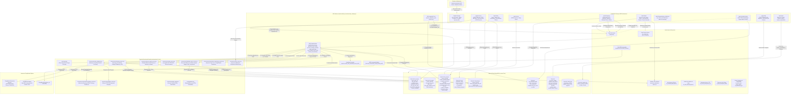

# ThingsBoard Super API Gateway - Documentación Técnica y Manual de Arquitectura

## 1. Visión General del Proyecto

**ThingsBoard Super API** es una plataforma backend de **API Gateway, Orquestador Multi-Servidor & Multi-Tenant e IAM Centralizado** construida con **FastAPI**, **MongoDB (Beanie ODM)**, **ARQ (Async Redis Queue)**, **Redis** y **PyCasbin**. Está diseñada para administrar, orquestar y ejecutar operaciones masivas (descarga histórica de telemetría, aprovisionamiento de dispositivos, generación de reportes avanzados en Excel y PDF, ejecución de scripts y control de acceso granular) sobre múltiples servidores independientes de **ThingsBoard** y múltiples **Tenants** por servidor de forma 100% asíncrona nativa.

### 🎯 Capacidades Principales
1. **API Gateway Multi-Servidor & Multi-Tenant:** Registro de infraestructura (`TBServer`) y Tenants independientes (`TBTenant`) en MongoDB con credenciales de Sysadmin y Tenant Admin, tokens JWT cifrados y metadatos flexibles específicos.
2. **Cifrado Simétrico en Reposo con Fernet (`core/crypto.py`):** Cifrado simétrico a nivel de aplicación (`cryptography.fernet`) para contraseñas y tokens JWT de Sysadmin (`TBServer`), credenciales SSH (`TBServer`, `TBNode`), contraseñas SMTP (`TBEmailConfig`) y Tenant Admin (`TBTenant`) en MongoDB. Cero credenciales en texto plano en la base de datos y descifrado seguro exclusivo en memoria RAM para clientes HTTP y SSH.
3. **Pureza Asíncrona del Event Loop (ARQ & Redis Nativo):** Procesamiento de fondo 100% asíncrono con **ARQ** y cliente estándar `redis.asyncio`. Erradicación total del antipatrón `DynamicRedisClient` y eliminación absoluta de `asyncio.run()`, permitiendo ejecución concurrente no bloqueante de alto rendimiento.
4. **Ciclo de Vida de Workers (`WorkerSettings` & Inyección de Contexto):** Inicialización única de conexiones MongoDB (`Beanie ODM`) y pool HTTP (`httpx.AsyncClient`) en el `on_startup` del worker, e inyección en `ctx` para reutilización eficiente entre miles de tareas.
5. **Control de Acceso Basado en Roles por Dominios (IAM & PyCasbin):** Autorización RBAC multi-tenant con dominios (`sub, dom, obj, act`) gestionada en MongoDB (`casbin-motor-adapter`), bootstrapping automático de Superadmin y dependencia declarativa `CasbinAuth`.
6. **Autenticación JWT Segura y Revocación en Tiempo Real:** Hashing `bcrypt`, emisión de tokens JWT firmados con UUID `jti` único y lista negra distribuida en Redis (`tb_revoked_token:{token}`) para invalidación inmediata de sesiones al hacer Logout.
7. **Políticas de Hardening DevSecOps:** Asignación de contraseña inicial de un solo uso en la creación de cuentas (`POST /api/v1/users`), detección obligatoria en primer login con flag `must_change_password: true`, restricción granular de endpoints de negocio hasta la asignación de contraseña permanente (`POST /api/v1/auth/change-password`), política estricta de contraseñas (mínimo 10 caracteres, números y símbolos) y protección anti fuerza bruta (5 intentos fallidos $\to$ HTTP 429 Too Many Requests con bloqueo temporal).
8. **Auditoría Estructurada Sanitizada (`AuditLog`):** Registro de auditoría persistente en MongoDB para todas las peticiones mutantes (`POST`, `PUT`, `DELETE`, `PATCH`), enmascarando contraseñas, credenciales y tokens con `"***"`.
9. **Enrutador Ligero de ARQ & Capa de Servicios:** Tareas asíncronas puras (`async def`) que resuelven dinámicamente `tenant_id` y `TBServer` en MongoDB y delegan la ejecución pesada a la capa de servicios (`core/services/`).
10. **Renovación Autónoma de Tokens con Persistencia:** Mecanismo resiliente en el ARQ Worker y servicios HTTP que intercepta errores HTTP 401, renueva el par de tokens (`token` y `refresh_token`) y **actualiza asíncronamente los documentos `TBTenant` y `TBServer` cifrados en MongoDB** para futuras ejecuciones.
11. **Orquestador de Telemetría Masiva y Catálogo TBBackup:** Particionado automático por meses, paginación continua por marcas de tiempo (`ts`), control de concurrencia con semáforos, *checkpoints* en Redis, compresión ZIP en volúmenes locales persistentes y catálogo histórico `TBBackup` en MongoDB tipificado por tipo de artefacto (`telemetry`, `excel_report`, `heatmap`).
12. **Distributed Lock & Heartbeat No Bloqueante (`asyncio.create_task`):** Candado distribuido en Redis (`tb_server_lock:{server_id}`) con Fail Fast (HTTP 409 Conflict) en FastAPI, latido asíncrono (Heartbeat) de renovación cada 30 min (TTL 1 hora) ejecutado como corrutina en segundo plano en el mismo loop del worker y `job_timeout` de 10 días (`864,000s`) para descargas ininterrumpidas de larga duración.
13. **Automatizaciones y Patrón Dispatcher con Cron Integrado de ARQ (`TBScheduledTask`):** Programación dinámica de tareas en base de datos sin alterar código fuente, resolución periódica cada 1 min mediante `cron(master_dispatcher_task, second=0)` integrado en ARQ (sin requerir daemon de Beat externo), conversión de zonas horarias locales (`America/Mexico_City`) a UTC puro, aislamiento granular ante fallos y disparo manual bajo demanda.
14. **Política de Retención y Limpieza Automatizada de Disco (`tasks.cleanup_old_backups`):** Sincronización estricta con el catálogo `TBBackup` en MongoDB, purga defensiva de archivos ZIP caducados (`days_to_keep`) y barrido de directorios temporales huérfanos/zombis (`tmp_*` con antigüedad mayor a 24 horas).
15. **Data Lake de Respaldos Incrementales de Mes Vencido (`tasks.schedule_monthly_incremental_backups` y `tasks.execute_incremental_tenant_backup`):** Orquestación mensual secuencial por Tenant hacia la cola `incremental_backups` en ARQ, cálculo estricto de fronteras temporales en milisegundos con `ZoneInfo(settings.APP_TIMEZONE)`, concurrencia interna de hasta 4 llaves con `asyncio.Semaphore`, resiliencia extrema con `tenacity` (reintentos ante 429, 500, 502, 503, 504, ReadTimeout y auto-renovación en 401), streaming de JSON sin sobreescritura a `.parcial.json` e idempotencia con `.completo.json` en `tenant_backups/<TENANT>/<DEVICE>/<AÑO>/<MES>/`.
16. **Blindaje de E/S Asíncrona, Aislamiento con `asyncio.to_thread()` y Semáforo Global de I/O (`core/io_limiter.py`):** Escritura no bloqueante de fragmentos JSON en streaming con `aiofiles`, delegación de compresión pesada (`shutil.make_archive`) y purga de directorios (`shutil.rmtree`) a hilos secundarios vía `asyncio.to_thread()`, semáforo global `get_zip_semaphore()` para limitar empaquetados simultáneos (máximo 3) y manejo transaccional defensivo con purga inmediata ante fallos de disco (`OSError`, `IOError`).
17. **Motor de Extracción Híbrido de Telemetría (Local Data Lake + REST API con `ijson` y Delta Calculator):** Comparación dinámica de rangos temporales contra archivos locales en `tenant_backups/<TENANT>/<DEVICE>/<AÑO>/<MES>/`, lectura no bloqueante en streaming con `ijson` delegada a `asyncio.to_thread()` (consumo de RAM $O(1)$), tratamiento de `max_ts` en archivos `.parcial.json` como punto de corte para consultas REST a ThingsBoard (`max_ts + 1`) y consolidación asíncrona concurrente con `aiofiles` en `backups/tmp_<TASK_ID>/` antes del empaquetado ZIP.
18. **Módulo de Exportación de Telemetría a Excel (`.xlsx`), Whitelist y Control de Memoria (`core/services/excel_report_service.py`):** Persistencia de listas blancas por tenant/dispositivo en `custom_metadata.report_config` (`PUT /api/v1/servers/{server_id}/tenants/{tenant_id}/report-config`), DTO `ExcelReportRequest` con validación mutuamente exclusiva de fechas exactas o año/mes dinámico (`calendar.monthrange`), resolución de Sitios y Dispositivos sin N+1 mediante Entity Query (`/api/entitiesQuery/find`), tarea ARQ `generate_excel_report_task` con filtrado estricto antes de construir DataFrames de Pandas, y gestión agresiva de memoria e I/O no bloqueante con `asyncio.to_thread()` (`combine_in_single_file == True` genera un `.xlsx` multi-hoja; `False` genera múltiples `.xlsx` con `gc.collect()` tras cada archivo, empaquetado en `.zip` y purga de residuales).
19. **Monitoreo de Infraestructura y Métricas de Sistema (`GET /api/admin/systemInfo` y `tasks.collect_servers_system_info`):** Recolección programable o bajo demanda del uso de CPU, memoria RAM y almacenamiento en disco desde ThingsBoard para todos los servidores o instancias específicas, prevención de arranque en frío para Sysadmin, persistencia de `last_system_info` en `custom_metadata` y auto-renovación resiliente ante 401.
20. **Módulo de Correo Electrónico Asíncrono Dinámico en MongoDB, Singleton y Gestión de Adjuntos (`core/models/tb_email_config.py`, `core/services/email_service.py`, `workers.tasks.send_email_task` y `api/endpoints/utils/router.py`):** Persistencia y gestión dinámica de credenciales SMTP en MongoDB con contraseñas cifradas simétricamente mediante Fernet (`TBEmailConfig`). **Restricción Singleton estricta:** Solo puede existir una única configuración en todo el sistema (`singleton_key` único en BD e interceptación HTTP 409 Conflict ante intentos de duplicado). Endpoints CRUD RESTful puros sin requerir ID (`GET /api/v1/utils/email-config`, `POST /api/v1/utils/email-config`, `PUT /api/v1/utils/email-config`, `DELETE /api/v1/utils/email-config` y `POST /api/v1/utils/email-config/test`). Construcción RFC 2046 de mensajes `MIMEMultipart` (mixed + alternative + `MIMEBase`), lectura no bloqueante de adjuntos locales en disco con `aiofiles` sin saturar la memoria de Redis (paso exclusivo de `attachment_paths`), tarea ARQ con `arq.Retry` explícito y retroceso exponencial ante fallos transitorios, y bloque `finally:` con eliminación asíncrona no bloqueante (`asyncio.to_thread(os.remove)`) de archivos temporales tras envío exitoso o fallo definitivo.
21. **Módulo de Reportes de Mapas de Calor (Heatmaps) en PDF, Aislamiento de CPU y Reglas Seguras (`core/services/heatmap_report_service.py`, `workers/tasks.generate_monthly_heatmap_task` y `POST /api/v1/telemetry/report/heatmap`):** Generación de reportes de cumplimiento y telemetría mensual en PDF. Cuadrícula uniforme con celdas cuadradas tipo píldora (Pill Tiles) mediante `seaborn.heatmap(square=True)` y ajuste dinámico de `figsize` según las dimensiones de la matriz. Mapeo 100% seguro de reglas mediante el módulo nativo `operator` de Python (`>=`, `<=`, `>`, `<`, `==`, `!=`), erradicando absolutamente el uso de `eval()`. Aislamiento estricto de CPU mediante `ProcessPoolExecutor` y `asyncio.get_running_loop().run_in_executor()` para evitar bloqueo del GIL del worker de ARQ, con `matplotlib.pyplot.close('all')` y `gc.collect()` tras generar cada imagen. Tarea ARQ que resuelve `TBTenant` y `TBServer`, filtra dispositivos por `heatmap_active == True` en atributos de servidor, lee la lista blanca `custom_metadata.heatmap_config` y extrae telemetría vía REST API. Almacenamiento temporal en `backups/heatmaps/{task_id}_{tenant_name}_heatmap.pdf`, registro en catálogo `TBBackup` en MongoDB y bloque `finally:` para liberación de distributed lock y limpieza defensiva del entorno.
22. **Dominio Centralizado y Agnóstico de Gestión de Tareas (`/api/v1/tasks`, `api/endpoints/tasks/` y `core/services/task_registry.py`):** Desacoplamiento total del ciclo de vida de tareas en segundo plano en ARQ. Monitoreo unificado de tareas activas (`GET /api/v1/tasks/active`) con soporte para filtrado multidominio por `task_type` (`telemetry`, `excel_report`, `heatmap`, `email`), consulta exhaustiva de estado y diagnósticos de ejecución (`GET /api/v1/tasks/{task_id}`), canal universal de Server-Sent Events (SSE) con keep-alive `ping` cada 15s (`GET /api/v1/tasks/{task_id}/stream`) y Botón de Pánico Universal (`POST /api/v1/tasks/{job_id}/cancel`) que aborta trabajos en ARQ y limpia de forma atómica Redis Pub/Sub y registros en Hash.
23. **Matriz Dinámica de Acceso y Permisos por Tenant para Usuarios (`GET /api/v1/auth/me/tenants`):** Endpoint de introspección de permisos en tiempo real. Resuelve para el usuario autenticado todos los Tenants accesibles, asociando metadatos del servidor padre (`server_id`, `server_name`, `server_base_url`) y calculando la matriz granular de permisos efectivos (`canRead`, `canWrite`, `canDelete`) para recursos del sistema (`telemetry`, `devices`, `scheduler`) mediante evaluación de políticas directas (`p`), agrupaciones de roles en dominios Casbin (`g`) y verificación de propiedad de recursos (`is_owner`).
24. **Defensa en Profundidad y Restricción Estricta en IAM (`require_superadmin`):** Blindaje perimetral absoluto del módulo de IAM (`/api/v1/iam`). Implementación de la dependencia `require_superadmin` en `api/deps.py` que bloquea inmediatamente con HTTP 403 Forbidden a cualquier usuario que no cuente con `is_superuser=True` o `role="superadmin"`, neutralizando intentos de escalamiento de privilegios o envenenamiento de políticas Casbin.
25. **Topología de Servidores (Standalone vs Cluster) y Gestión SSH Desacoplada (`TBServer` y `TBNode`):** Soporte en `TBServer` para despliegues monolíticos (`standalone`) y clusters distribuidos (`cluster`), derivación de host SSH desde `base_url` y administración remota SSH nativa (puerto, usuario, autenticación por contraseña o llave PEM/RSA cifradas en reposo con Fernet en formato `bytes`). Introducción del modelo Beanie `TBNode` (`tb_nodes`) vinculado a `TBServer` (`server_id: Link[TBServer]`) para el registro de nodos secundarios (workers, Cassandra/PostgreSQL, transportes MQTT/HTTP, UI) con credenciales SSH cifradas simétricamente y resolución jerárquica en memoria RAM.
26. **Resolución Inteligente de Sitios y Dispositivos Relacionados ("Desde" y "Hacia"):** Optimización del endpoint `GET /api/v1/tenants/{tenant_id}/devices/sites` mediante consultas de red asíncronas con `httpx.AsyncClient` reutilizable, resolución prioritaria de relaciones salientes ("Desde": `fromId={site_id}&fromType=ASSET`), fallback bidireccional a relaciones entrantes ("Hacia"), enriquecimiento de metadatos en $O(1)$ a partir del catálogo indexado de dispositivos (`devices_lookup`), semáforo de concurrencia `asyncio.Semaphore(10)` y mitigación de estampidas (thundering herd) con double-checked locking ante re-autenticación 401.
27. **Paginación Estandarizada y Metadatos Reutilizables (`core/pagination.py`):** Contenedor genérico Pydantic v2 `PaginatedResponse[T]` y `PaginationMetadata` (`total`, `page`, `page_size`, `total_pages`, `has_next`, `has_prev`) con helper `build_pagination_metadata`. Implementación en el catálogo de respaldos `GET /api/v1/telemetry/backups` (`PaginatedBackupResponse`) y tipificación de artefactos con `backup_type: str = "telemetry"` indexado en MongoDB (`TBBackup`) con resolución automática por extensión (`.pdf` $\to$ `heatmap`, `.xlsx` $\to$ `excel_report`, `.zip` $\to$ `telemetry`).
28. **Refinamiento de Reportes PDF en Mapas de Calor (Heatmaps), Aislamiento Estricto y Entrega SMTP:** Badging visual institucional TKmE CLOUD (`core/assets/tkme_logo_badge.png`), escala Letter Landscape maximizada (~87% de ancho y ~79% de alto), leyenda dinámica basada en reglas, numeración de página `"pagina {n} de {m}"` a la derecha, optimización de DPI a 100 reduciendo el peso de PDF en >60% (~1.8 MB), resolución inteligente de llaves con/sin prefijo `HM_`, fallback temporal extendido, **aislamiento estricto de listas blancas en `custom_metadata.heatmap_config`** (erradicando cualquier sustitución o adivinanza arbitraria en ThingsBoard), y opción de despacho por correo (`send_email=True`, `HeatmapEmailOptions`) con reintentos exponenciales y timeout dinámico (base 60s + 15s/MB, mín. 120s).
29. **Factoría Modular de Logging y Pureza Offset-Aware en Zonas Horarias:** Refactorización de `core/logger.py` con `get_logger(name)` modular eliminando el acoplamiento rígido con `telemetry_downloader`, prevención de handlers duplicados, soporte configurable de archivos y consola. Configuración estricta de Motor con `AsyncIOMotorClient(..., tz_aware=True)` en `core/database.py` y validadores `@field_validator(..., mode="after")` `ensure_tz_aware` en todos los modelos Beanie para garantizar que todas las marcas de tiempo sean offset-aware en UTC puro (`+00:00`).
30. **Formateo Avanzado de Remitente (`sender_name` / `from_name`) y Envío Dual (Síncrono/Asíncrono) de Correos:** Formateo de cabecera `From:` según RFC 5322 con `formataddr` y codificación RFC 2047 (UTF-8), preservando la dirección pura de correo en el sobre SMTP (RFC 5321). Soporte para destinatarios múltiples (`to_email`, `cc`, `bcc`) y parámetro `sync=True|False` en `/api/v1/utils/test-email` y `/api/v1/utils/email-config/test` con URLs de seguimiento a `/api/v1/tasks/{task_id}` y `/api/v1/tasks/{task_id}/stream`.
31. **Cliente de Notificaciones Telegram 100% Agnóstico (`core/services/telegram_service.py`):** Cliente HTTP desacoplado y sin estado para la API de Telegram Bot (`sendMessage`), 100% libre de Redis o dependencias de infraestructura de colas. Responsable exclusivo de la resolución de credenciales (`TG_BOT_TOKEN`, `TG_CHAT_ID`), truncamiento defensivo a 4096 caracteres, formateo HTML estandarizado (`format_alert_message`, `escape_html_text`), envío asíncrono con `httpx.AsyncClient` y manejo tipificado de respuestas de error.
32. **Despachador Inteligente de Alertas y Debouncer Anti-Spam en Redis (`core/services/alert_dispatcher.py`):** Módulo de dominio especializado que implementa el circuito anti-spam con candados atómicos distribuidos en Redis (`SET tb_alert_lock:{alert_hash} 1 NX EX {ttl_seconds}`), hashing SHA-256 (`calculate_alert_hash`), auto-sanación con liberación defensiva de candado ante fallos transitorios (`release_lock_on_failure=True`) y semántica **Fail-Open** ante contingencias en Redis para no bloquear alertas críticas.
33. **Ingesta Machine-to-Machine de Estado de Dispositivos (`POST /api/v1/telemetry/webhooks/device-status`):** Endpoint de alta concurrencia diseñado específicamente para la integración directa con el Rule Engine de ThingsBoard sin requerir sesión interactiva JWT. Validación estricta con Pydantic v2 anti-type-confusion, formateo enriquecido de alertas, encolamiento asíncrono no bloqueante en ARQ de `send_telegram_alert_task` y respuesta inmediata HTTP 202 Accepted.
34. **Supresión Jerárquica de Alertas (Capa 3 vs Capa 4) con Mitigación Thundering Herd (`core/services/hierarchical_suppression_service.py` y `workers/tasks.py`):** Algoritmo de supresión inteligente que intercepta alertas de sensores perimetrales en Capa 4 y consulta el estado del IOTGateway padre (Capa 3) a través del modelo de relaciones de ThingsBoard (`/api/relations/info`). Si el concentrador padre está inactivo (`active == False` u `OFFLINE`), la alerta del sensor es abortada silenciosamente (0 spam a Telegram). Mitigación estricta de Thundering Herd con caché de relaciones (TTL 300s), caché de estado (TTL 45s), mutex SingleFlight (`tb_lock:check_gw`), semáforo HTTP (`asyncio.Semaphore(10)`) y semántica Fail-Open.
35. **Ejecución Remota Segura de Comandos SSH desde el Dashboard (`POST /api/v1/servers/{server_id}/ssh/execute` y `core/services/ssh_service.py`):** Módulo de administración remota SSH nativo mediante `asyncssh`, restringido rígidamente a Superadministradores (`require_superadmin`), con lista blanca inmutable de comandos de mantenimiento (`ALLOWED_SSH_COMMANDS` para `systemctl`, `journalctl`, `docker`, `uptime`, `df`, `free`), neutralización de 13 metacaracteres de inyección de shell (`;`, `&&`, `|`, `$()`, backticks, redirecciones, `\0`, `{}`), descifrado simétrico Fernet exclusivamente en memoria RAM para contraseñas y llaves PEM/RSA, y cero fuga de secretos.

---

## 2. Arquitectura del Sistema


```mermaid
flowchart TD
    subgraph Clients ["Clientes y Aplicaciones"]
        User["Usuario Autenticado (JWT Bearer / HttpOnly Cookie)"]
    end

    subgraph Gateway ["FastAPI API Gateway (DDD Architecture)"]
        Lifespan["FastAPI Lifespan\n(init_db: Beanie + Motor tz_aware, init_casbin, get_arq_pool)"]
        AuthRouter["/api/v1/auth\n(Login / Logout / Me / me/tenants / Set-Password / Token)"]
        UsersRouter["/api/v1/users\n(CRUD Usuarios / Setup Token)"]
        IAMRouter["/api/v1/iam\n(Roles por Tenant / Políticas Casbin / require_superadmin)"]
        ServerRouter["/api/v1/servers\n(CRUD TBServer, CRUD TBTenant, Test-Connection & SSH Execute)"]
        TelemRouter["/api/v1/telemetry\n(Download / Excel / Heatmap / Backups / Webhook Device-Status)"]
        DeviceRouter["/api/v1/tenants/{tenant_id}/devices\n(List / Sites con Relaciones / Batch Provisioning)"]
        TasksRouter["/api/v1/tasks\n(Active con task_type / Status / Universal SSE Stream / Cancel Universal)"]
        SchedulerRouter["/api/v1/scheduler/tasks\n(CRUD TBScheduledTask / Trigger Manual a ARQ)"]
        UtilsRouter["/api/v1/utils\n(CRUD TBEmailConfig Singleton / Test-Email Sync & Async)"]
    end

    subgraph Mongo ["Base de Datos MongoDB (tz_aware=True)"]
        TBServersCol[("Colección 'tb_servers'\n- name, base_url, rate_limit_rpm\n- installation_type (standalone/cluster)\n- ssh_port, ssh_user, Fernet SSH credentials\n- custom_metadata")]
        TBNodesCol[("Colección 'tb_nodes'\n- server_id (Link)\n- ssh_host, ssh_port, node_role\n- ssh_auth_method, Fernet SSH credentials")]
        TBTenantsCol[("Colección 'tb_tenants'\n- server_id (Link)\n- name, username (Plain)\n- encrypted_password (Fernet)\n- encrypted_token (Fernet)\n- encrypted_refresh_token (Fernet)\n- custom_metadata (heatmap_config, report_config)")]
        UsersCol[("Colección 'users'\n- username, email, hashed_password\n- role, is_active, is_superuser, must_change_password")]
        BackupsCol[("Colección 'tb_backups'\n- tenant_id (Link)\n- task_id, file_name, file_size\n- backup_type (telemetry/excel_report/heatmap)")]
        ScheduledCol[("Colección 'tb_scheduled_tasks'\n- name, task_name, cron_expression\n- payload, next_run_time, is_active")]
        EmailConfigCol[("Colección 'tb_email_configs'\n- singleton_key (Único)\n- host, port, username, encrypted_password (Fernet)\n- sender_email, sender_name, use_tls")]
        AuditCol[("Colección 'audit_logs'\n- timestamp, method, endpoint, status_code, payload")]
        CasbinCol[("Colección 'casbin_rule'\n- ptype, v0 (sub), v1 (dom), v2 (obj), v3 (act)")]
    end

    subgraph Broker ["Redis State & ARQ Queue"]
        ARQDefault["Cola ARQ Default\n(arq:queue)"]
        ARQIncr["Cola ARQ Incremental\n(arq:queue:incremental_backups)"]
        PubSubStreams["Streams SSE Pub/Sub\nuser:{user_id}:stream:{task_id}"]
        UserRegistry["Hash Tareas Activas\ntb_events:user:{user_id}:registry"]
        TokenBlacklist["Lista Negra de Tokens\ntb_revoked_token:{token}"]
        RateLimits["Límites de Intentos de Login\ntb_auth_failed:{ip}:{user}"]
        DistLocks["Distributed Locks & TTL\ntb_server_lock:{server_id}"]
        AlertLocks["Debouncer Anti-Spam\ntb_alert_lock:{alert_hash}"]
        HierarchicalCache["Caché Jerárquica & SingleFlight\ntb_parent_gw / tb_gw_status / tb_lock:check_gw"]
    end

    subgraph ARQWorkers ["ARQ Workers (workers/tasks.py & workers/arq_settings.py)"]
        CronRunner["ARQ Integrated Cron\n(master_dispatcher_task cada 1 min)"]
        WorkerMain["ARQ Default Worker\n(download_telemetry, generate_excel_report,\ngenerate_monthly_heatmap, send_email_task,\nsend_telegram_alert_task, cleanup_old_backups)"]
        WorkerIncr["ARQ Incremental Worker\n(execute_incremental_tenant_backup_task)"]
        HeartbeatTask["Heartbeat Coroutine\nasyncio.create_task(_heartbeat_server_lock)"]
    end

    subgraph Services ["Capa de Servicios de Dominio (core/services/ & core/)"]
        CryptoService["core/crypto.py\n(Fernet Symmetric Encrypt / Decrypt)"]
        TelemService["core/services/telemetry_service.py\n(Descarga, Checkpoints, Catálogo TBBackup y ZIP)"]
        IncrService["core/services/incremental_backup_service.py\n(Data Lake Streaming JSON, Tenacity y Semáforos)"]
        ExcelService["core/services/excel_report_service.py\n(Filtrado Whitelist, DataFrames en Memoria y Pandas)"]
        HeatmapService["core/services/heatmap_report_service.py\n(ProcessPoolExecutor, Seaborn Square, Badge TKmE y ReportLab)"]
        EmailService["core/services/email_service.py\n(aiosmtplib, RFC 5322/2047, Timeout Dinámico)"]
        TelegramService["core/services/telegram_service.py\n(Cliente HTTP 100% Agnóstico Telegram)"]
        AlertDispatcher["core/services/alert_dispatcher.py\n(Debouncer Anti-Spam Redis & Fail-Open)"]
        HierarchicalSuppression["core/services/hierarchical_suppression_service.py\n(Supresión Capa 3 vs 4, SingleFlight & Semáforos)"]
        SSHService["core/services/ssh_service.py\n(asyncssh, Whitelist de Comandos & RAM Fernet)"]
        TaskRegistry["core/services/task_registry.py\n(Eventos Pub/Sub SSE y Hash Redis)"]
        PaginationMod["core/pagination.py\n(PaginatedResponse DTOs & Metadata)"]
    end

    subgraph TBInstances ["Instancias ThingsBoard Objetivo"]
        TB_Prod["ThingsBoard Producción\nhttps://tb-prod.empresa.com\n(Tenant: CONAFOR)"]
        TB_Staging["ThingsBoard Staging\nhttps://tb-dev.empresa.com\n(Tenant: CFE)"]
        TB_Dynamic["ThingsBoardClient(base_url, credentials)"]
    end

    User -->|JWT Auth & Casbin Enforcement| Gateway
    Lifespan -->|Conecta Beanie con tz_aware=True, Casbin y ArqRedis Pool| Mongo
    ServerRouter -->|CRUD Documentos TBServer| TBServersCol
    ServerRouter -->|CRUD TBTenants con Fernet| TBTenantsCol
    ServerRouter -->|Ejecución SSH Remota Segura| SSHService
    AuthRouter -->|Matriz de Permisos por Tenant| TBTenantsCol
    UsersRouter -->|Gestión de Cuentas| UsersCol
    IAMRouter -->|Restricción require_superadmin y Políticas| CasbinCol
    SchedulerRouter -->|CRUD Automatizaciones| ScheduledCol
    SchedulerRouter -.->|Trigger Inmediato via ArqRedis| ARQDefault
    TelemRouter -->|Encola Descarga / Reporte via ArqRedis| ARQDefault
    TelemRouter -->|Webhook M2M Estado Dispositivos| ARQDefault
    TelemRouter -->|Consulta Respaldos Paginados| BackupsCol
    TasksRouter -->|Monitorea Tareas Activas por task_type| UserRegistry
    TasksRouter -->|Streaming Universal SSE| PubSubStreams
    TasksRouter -->|Botón de Pánico Cancel| ARQDefault
    UtilsRouter -->|Gestión SMTP Singleton| EmailConfigCol

    CronRunner -->|1. Consulta tareas vencidas en UTC| ScheduledCol
    CronRunner -->|2. Despacha asíncronamente con ctx.redis.enqueue_job| ARQDefault
    ARQDefault --> WorkerMain
    ARQIncr --> WorkerIncr

    WorkerMain -->|1. Consulta TBTenant por tenant_id| TBTenantsCol
    WorkerMain -->|2. Resuelve Servidor Padre| TBServersCol
    WorkerMain -->|3. Descifra credenciales en RAM| CryptoService
    WorkerMain -->|4. Instancia Dinámicamente| TB_Dynamic
    WorkerMain -->|5. Lanza Heartbeat no bloqueante| HeartbeatTask
    WorkerMain -->|6. Delega ejecución según tarea| TelemService
    WorkerMain -->|7. Genera Reportes Excel| ExcelService
    WorkerMain -->|8. Genera Heatmaps en Proceso Aislado| HeatmapService
    WorkerMain -->|9. Envío SMTP Resiliente| EmailService
    WorkerMain -->|10. Supresión Jerárquica Capa 4| HierarchicalSuppression
    WorkerMain -->|11. Despacho Anti-Spam con Candado| AlertDispatcher

    AlertDispatcher -->|Despacha a Bot Telegram| TelegramService

    WorkerIncr -->|Ejecuta Respaldo Mensual con Semáforos| IncrService

    TelemService -->|Peticiones HTTP Asíncronas| TB_Prod
    TelemService -->|Peticiones HTTP Asíncronas| TB_Staging
    TelemService -->|Si 401: Renueva y Actualiza MongoDB cifrado| TBTenantsCol
    TelemService -->|Publica Progreso via TaskRegistry| PubSubStreams
    TelemService -->|Registra Catálogo de Respaldo Tipificado| BackupsCol
    HeatmapService -->|Exporta PDF con Badge y DPI 100| BackupsCol
    ExcelService -->|Exporta XLSX / ZIP de Reportes| BackupsCol
```

### Componentes Tecnológicos
- **Lenguaje:** Python 3.12+
- **Framework Web:** FastAPI + Uvicorn (Arquitectura asíncrona no bloqueante y modular DDD)
- **Persistencia NoSQL:** MongoDB + Motor + Beanie ODM (Conexión nativa con `tz_aware=True` y validadores UTC)
- **Autorización & RBAC:** PyCasbin (`casbin` + `casbin-motor-adapter`) con modelo de dominios/tenants y dependencia perimetral `require_superadmin`
- **Cola de Tareas Asíncrona:** ARQ (`arq==0.26.1` sobre Redis nativo con pureza total de Event Loop)
- **Broker & Estado en Tiempo Real:** Redis (Gestión de sesiones, lista negra de tokens, Pub/Sub SSE, checkpoints, candados de debouncing, colas ARQ y connection pooling)
- **Cliente HTTP Asíncrono:** HTTPX (Conexiones `keep-alive`, timeout configurable, pool compartido en contexto de worker y double-checked lock ante 401)
- **Criptografía Simétrica:** Cryptography (`cryptography.fernet.Fernet` con derivación SHA-256 fallback para credenciales en reposo en MongoDB)
- **Seguridad Criptográfica JWT & Hash:** Passlib + Bcrypt + Python-Jose (JWT con claims inyectados y UUID `jti` único)
- **Administración Remota SSH:** AsyncSSH (`asyncssh>=2.24.0` para conexión y ejecución 100% asíncrona, autenticación por contraseña y llaves PEM/RSA descifradas en memoria RAM con protección anti-inyección de comandos)
- **Resiliencia y Reintentos:** Tenacity (reintentos exponenciales ante 429, 50x y fallos transitorios de red)
- **Motor de Reportes y Gráficos:** Matplotlib + Seaborn (renderizado aislado en `ProcessPoolExecutor`, celdas cuadradas y `plt.close('all')`), ReportLab (compilación de PDFs profesionales con `SimpleDocTemplate` en Letter Landscape) y Pandas + OpenPyXL (generación de libros de trabajo Excel con control agresivo de memoria)
- **Módulo de Correo:** `aiosmtplib` (conexión asíncrona segura con TLS/STARTTLS, formateo RFC 5322 con `formataddr` y codificación RFC 2047 para caracteres no ASCII)
- **Herramienta Standalone Legacy:** Node.js (CommonJS, Axios, Luxon, Winston) en `scripts/BackupManager`

---

## 3. Estructura de Directorios

```text
Thingsboard_Api/
├── api/                               # Capa de presentación y endpoints HTTP (FastAPI)
│   ├── __init__.py
│   ├── deps.py                        # Inyección de dependencias (get_current_user, require_superadmin, CasbinAuth, JWT, Redis blacklist)
│   ├── main.py                        # Instancia de FastAPI, lifespan con init_db (tz_aware), Casbin, get_arq_pool y routers DDD
│   └── endpoints/                     # Endpoints organizados por dominio (DDD)
│       ├── __init__.py                # Exportación centralizada de routers de dominio
│       ├── auth/                      # Dominio de Autenticación (/api/v1/auth)
│       │   ├── __init__.py
│       │   └── router.py              # Login OAuth2 con MongoDB, Logout con revocación en Redis, Me, me/tenants, Set-Password, Token
│       ├── users/                     # Dominio de Gestión de Usuarios (/api/v1/users)
│       │   ├── __init__.py
│       │   └── router.py              # CRUD completo de usuarios en MongoDB (Create, List, Get, Update, Delete)
│       ├── iam/                       # Dominio de IAM y Políticas Casbin (/api/v1/iam)
│       │   ├── __init__.py
│       │   └── router.py              # Asignación/revocación de roles por tenant, políticas Casbin y blindaje con require_superadmin
│       ├── servers/                   # Dominio de Servidores y Tenants (/api/v1/servers)
│       │   ├── __init__.py
│       │   ├── schemas.py             # DTOs Pydantic v2 (ServerCreate/Update, TenantCreate, SSHExecuteRequest/Response)
│       │   └── router.py              # CRUD TBServer, CRUD TBTenant con Fernet, Lock Status, test-connection y SSH execute
│       ├── telemetry/                 # Dominio de Telemetría y Respaldos (/api/v1/telemetry)
│       │   ├── __init__.py
│       │   ├── schemas.py             # DTOs de telemetría y DeviceStatusWebhookRequest
│       │   └── router.py              # Encolado en ARQ (/download, /report/excel, /report/heatmap), catálogo paginado y /webhooks/device-status
│       ├── tasks/                     # Dominio Centralizado de Tareas en Segundo Plano (/api/v1/tasks)
│       │   ├── __init__.py
│       │   ├── schemas.py             # DTOs Pydantic v2 (ActiveTaskResponse, TaskStatusResponse, CancelTaskResponse)
│       │   └── router.py              # Listado activo por task_type, diagnóstico exhaustivo ARQ+Redis, SSE stream universal y botón de pánico
│       ├── devices/                   # Dominio de Dispositivos y Aprovisionamiento (/api/v1/tenants/{tenant_id}/devices)
│       │   ├── __init__.py
│       │   └── router.py              # Listado, aprovisionamiento masivo y resolución de Sitios/Dispositivos ("Desde" y "Hacia")
│       ├── scheduler/                 # Dominio de Automatizaciones y Tareas Programadas (/api/v1/scheduler/tasks)
│       │   ├── __init__.py
│       │   ├── schemas.py             # DTOs Pydantic v2 (ScheduledTaskCreate/Update/Response) con validación croniter
│       │   └── router.py              # CRUD de automatizaciones, recálculo cron y trigger manual en ARQ
│       └── utils/                     # Dominio de Utilidades y Diagnóstico del Sistema (/api/v1/utils)
│           ├── __init__.py
│           ├── schemas.py             # DTOs para configuración SMTP y correos de prueba (from_name, sender_name, sync=True/False)
│           └── router.py              # CRUD TBEmailConfig Singleton y endpoint /test-email con modo síncrono y asíncrono
├── core/                              # Capa de infraestructura y configuración del núcleo
│   ├── __init__.py
│   ├── arq_pool.py                    # Singleton de conexión ArqRedis (get_arq_pool, close_arq_pool)
│   ├── bootstrap.py                   # Arranque idempotente y creación de Superadmin inicial + políticas raíz
│   ├── casbin_enforcer.py             # Instancia global y ciclo de vida de AsyncEnforcer con casbin-motor-adapter
│   ├── config.py                      # Configuración centralizada (MONGO_URI, REDIS_URL, JWT, SMTP_*, TG_BOT_TOKEN, TG_CHAT_ID, etc.)
│   ├── crypto.py                      # Cifrado simétrico a nivel de aplicación con Fernet (encrypt_data, decrypt_data)
│   ├── database.py                    # Conexión asíncrona a MongoDB con Motor (tz_aware=True) e inicialización Beanie ODM
│   ├── io_limiter.py                  # Semáforos de I/O y operaciones no bloqueantes (asyncio.to_thread para ZIP y rmtree)
│   ├── logger.py                      # Factoría modular de logging con get_logger(name) hacia consola y logs/gateway.log
│   ├── pagination.py                  # Contenedor genérico PaginatedResponse[T], PaginationMetadata y build_pagination_metadata
│   ├── rbac_with_domains_model.conf   # Configuración de modelo RBAC con Dominios (sub, dom, obj, act)
│   ├── redis_client.py                # Cliente asíncrono estándar redis.asyncio con connection pool
│   ├── security.py                    # Funciones criptográficas bcrypt, tokens de configuración y JWT con jti único
│   ├── tb_client.py                   # Cliente dinámico ThingsBoardClient(base_url, credentials) con relaciones avanzadas
│   ├── assets/                        # Recursos estáticos de diseño institucional
│   │   ├── logo.webp                  # Isotipo ThingsBoard Gateway
│   │   └── tkme_logo_badge.png        # Badge oscuro institucional de TKmE CLOUD para encabezados de reportes PDF
│   ├── models/                        # Modelos de documentos Beanie (MongoDB)
│   │   ├── __init__.py                # Exportación de User, TBServer, TBNode, TBTenant, TBBackup, AuditLog, TBScheduledTask, TBEmailConfig
│   │   ├── user.py                    # Modelo User (username, email, hashed_password, role, is_active, is_superuser, ensure_tz_aware)
│   │   ├── tb_server.py               # Modelo TBServer (Master/Standalone, SSH nativo con Fernet bytes, base_url, rate_limits)
│   │   ├── tb_node.py                 # Modelo TBNode (Nodos secundarios de cluster: server_id Link, rol funcional, SSH Fernet bytes)
│   │   ├── tb_tenant.py               # Modelo TBTenant (server_id Link, credenciales y tokens cifrados Fernet, heatmap_config)
│   │   ├── tb_backup.py               # Modelo TBBackup (Catálogo: tenant_id Link, task_id, backup_type indexado, tamaño, fechas)
│   │   ├── tb_scheduled_task.py       # Modelo TBScheduledTask (Automatizaciones con expresiones cron y timezone local)
│   │   ├── tb_email_config.py         # Modelo TBEmailConfig (Configuración SMTP Singleton con contraseñas cifradas Fernet)
│   │   └── audit_log.py               # Modelo AuditLog (Trazabilidad DevSecOps con payloads sanitizados y ensure_tz_aware)
│   └── services/                      # Servicios de negocio y lógica pesada desacoplada
│       ├── __init__.py
│       ├── telemetry_service.py       # Descarga masiva en tmp_{task_id}, checkpoints, catálogo TBBackup tipificado y ZIP
│       ├── incremental_backup_service.py # Data Lake de respaldos incrementales (mes vencido), tenacity, semáforos y streaming JSON
│       ├── excel_report_service.py    # Reportes de telemetría en Excel (.xlsx), resolución sin N+1 y gestión de RAM
│       ├── heatmap_report_service.py  # Renderizado de mapas de calor en PDF con ProcessPoolExecutor, badge TKmE y layout Letter
│       ├── email_service.py           # Servicio SMTP puro (aiosmtplib), RFC 5322/2047, adjuntos dinámicos y timeout adaptativo
│       ├── telegram_service.py        # Cliente HTTP asíncrono puro y agnóstico hacia Telegram Bot API (sendMessage, escape HTML)
│       ├── alert_dispatcher.py        # Despachador de alertas y circuito anti-spam con debouncing atómico en Redis (SET NX EX)
│       ├── hierarchical_suppression_service.py # Supresión jerárquica Capa 4 vs Capa 3 con caché Redis y protección SingleFlight
│       ├── ssh_service.py             # Ejecución remota SSH con AsyncSSH, lista blanca estricta y descifrado Fernet en RAM
│       └── task_registry.py           # Registro universal de ciclo de vida de tareas en Redis Hash y eventos Pub/Sub (SSE)
├── workers/                           # Procesamiento asíncrono en segundo plano (ARQ)
│   ├── __init__.py
│   ├── arq_settings.py                # WorkerSettings (on_startup, on_shutdown, cron, timeouts, registro de send_telegram_alert_task)
│   └── tasks.py                       # Tareas 100% async def (telemetría, heatmaps con email, excel, email_task, send_telegram_alert_task, cron dispatcher)
├── tests/                             # Batería moderna de pruebas unitarias, de integración y adversariales
│   ├── test_telegram_service_agnostic.py # Pureza y agnosticismo de telegram_service sin acoplamiento a Redis
│   ├── test_alert_dispatcher.py       # Circuito anti-spam con Redis mock y filtrado debounced
│   ├── test_telegram_service_and_debouncer.py # Suite combinada de integración para Telegram y Debouncer
│   ├── test_device_status_webhook.py  # Validación Pydantic v2 del webhook y encolado en ARQ
│   ├── test_hierarchical_suppression.py # Supresión Capa 3 vs Capa 4 con caché de estado y bypass no-Capa 4
│   ├── test_ssh_execute.py            # Autorización superadmin, comandos de lista blanca y bloqueo anti-inyección
│   ├── test_email_sender_name.py      # Formateo RFC 5322/2047, sender_name, UTF-8 y degradación limpia en SMTP
│   ├── test_heatmap_email_delivery.py # Entrega opcional de correo en heatmaps, opciones DTO, timeout dinámico y reintentos
│   ├── test_heatmap_pdf_enhancements.py # Badge TKmE CLOUD, escala maximizada Letter Landscape, leyenda y pie de página derecho
│   ├── test_heatmap_whitelist_adversarial.py # Suite adversarial de aislamiento de variables en heatmaps (35 pruebas)
│   ├── test_heatmap_whitelist_enforcement.py # Validación de lista blanca en custom_metadata.heatmap_config sin adivinanzas
│   ├── test_iam_superadmin_adversarial.py # Suite adversarial de penetración y spoofing en IAM (105 pruebas)
│   ├── test_iam_superadmin_restriction.py # Verificación de bloqueo HTTP 403 Forbidden mediante require_superadmin
│   ├── test_refactored_tasks_and_email.py # Trazabilidad en Redis, modos síncrono/asíncrono de correo y sanitización
│   ├── test_sites_devices_adversarial.py # Resiliencia ante Thundering Herd 401, esquemas corruptos e IDs enteros en sitios
│   ├── test_sites_devices_relations.py # Resolución bidireccional "Desde" y "Hacia", semáforo y cliente compartido
│   ├── test_telemetry_backups_adversarial.py # Paginación out-of-bounds, tipificación backup_type y concurrencia (62 pruebas)
│   ├── test_telemetry_backups_pagination_and_task_types.py # Validación de PaginatedBackupResponse y filtrado task_type
│   └── adversarial/                   # Batería de pruebas adversariales avanzadas
│       ├── test_telegram_debouncer.py # Ráfaga de 50 llamadas concurrentes y control de latencia en event loop
│       ├── test_device_status_webhook_adversarial.py # Inyecciones maliciosas y validación de límites en webhook (10 pruebas)
│       ├── test_hierarchical_suppression_adversarial.py # Simulación Thundering Herd de 100 sensores concurrentes (12 pruebas)
│       └── test_ssh_execute_adversarial.py # Inyección de comandos SSH, shell chaining y bypass (22 pruebas)
├── scripts/                           # Suites completas de verificación y herramientas auxiliares
│   ├── verify_email_module.py         # Suite completa de verificación del módulo de correo SMTP, ARQ Retry y HTTP 202
│   ├── verify_async_io_and_disk_hardening.py # Suite de E/S asíncrona (aiofiles), asyncio.to_thread y semáforos de disco
│   ├── verify_arq_migration.py        # Suite de pureza asíncrona, WorkerSettings, startup/shutdown y ARQ router
│   ├── verify_fernet_encryption.py    # Suite de verificación de cifrado simétrico Fernet en MongoDB crudo
│   ├── verify_multiserver_gateway.py  # Suite de verificación MongoDB, Beanie, Multi-Tenant y Renovación
│   ├── verify_multitenant_security.py # Suite de verificación de seguridad multi-tenant, hashing y JWT
│   ├── verify_iam_and_rbac_domains.py # Suite de verificación de IAM, CRUD de Usuarios y PyCasbin RBAC
│   ├── verify_distributed_lock_and_heartbeat.py # Suite de verificación de distributed lock atómico y heartbeat
│   ├── verify_workspace_isolation_and_backup_catalog.py # Suite de aislamiento tmp_{task_id} y catálogo TBBackup
│   ├── verify_security_hardening.py   # Suite de hardening DevSecOps, anti fuerza bruta, setup token y auditoría
│   ├── verify_celery_beat_dispatcher.py # Suite de verificación de ARQ Cron Dispatcher y Timezones
│   ├── verify_cleanup_old_backups.py  # Suite de verificación de retención de respaldos y barrido de temporales zombis
│   ├── verify_scheduler_endpoints.py  # Suite de verificación de endpoints HTTP del Scheduler y validación croniter
│   ├── verify_incremental_backups.py  # Suite de verificación de Data Lake incremental (mes vencido), tenacity y streaming JSON
│   └── BackupManager/                 # Herramienta standalone en Node.js para respaldos manuales
├── backups/                           # Directorio unificado para archivos ZIP generados, reportes PDF/XLSX y temporales
├── tenant_backups/                    # Data Lake persistente organizado por tenant/device/año/mes en streaming JSON
├── Dockerfile                         # Imagen Docker optimizada (Python 3.12-slim, curl, healthcheck)
├── docker-compose.yml                 # Orquestación de contenedores (MongoDB, Redis, API, Workers ARQ)
├── .dockerignore                      # Archivos excluidos del build context de Docker
├── requirements.txt                   # Dependencias de Python limpias
├── .gitignore                         # Archivos ignorados por Git
└── GEMINI.md                          # Manual y guía técnica completa
```

---

## 4. Análisis Detallado de Módulos y Modelos

### 4.1. `core/arq_pool.py` (Pool de Conexiones ARQ)
- `get_arq_pool() -> ArqRedis`: Inicializa y reutiliza un singleton de conexión `ArqRedis` conectado a `settings.REDIS_URL`.
- `close_arq_pool()`: Cierra limpiamente el pool de conexiones al detener la aplicación.

### 4.2. `workers/arq_settings.py` (Configuración y Ciclo de Vida de Workers)
- `startup(ctx: dict)`: Hook `on_startup` ejecutado al levantar el worker:
  1. Conecta e inicializa Beanie ODM con MongoDB asegurando `tz_aware=True`.
  2. Inicializa un cliente `httpx.AsyncClient` reutilizable con pool de conexiones y lo inyecta en `ctx["http_client"]`.
- `shutdown(ctx: dict)`: Hook `on_shutdown` ejecutado al detener el worker:
  1. Cierra el cliente `ctx["http_client"]`.
  2. Invoca `close_db()` para cerrar limpiamente las conexiones a MongoDB.
- `functions`: Registro de tareas disponibles:
  - `download_telemetry_task` (prefijo `tasks.download_telemetry`)
  - `generate_excel_report_task` (prefijo `tasks.generate_excel_report`)
  - `generate_monthly_heatmap_task` (prefijo `tasks.generate_monthly_heatmap`)
  - `master_dispatcher_task` (prefijo `tasks.master_dispatcher`)
  - `cleanup_old_backups_task` (prefijo `tasks.cleanup_old_backups`)
  - `schedule_monthly_incremental_backups_task` (prefijo `tasks.schedule_monthly_incremental_backups`)
  - `execute_incremental_tenant_backup_task` (prefijo `tasks.execute_incremental_tenant_backup`)
  - `collect_servers_system_info_task` (prefijo `tasks.collect_servers_system_info`)
  - `send_email_task` (prefijo `tasks.send_email`)
  - `send_telegram_alert_task` (prefijo `tasks.send_telegram_alert`)
- `cron_jobs`: Planificador integrado `[cron(master_dispatcher_task, second=0)]` ejecutado cada minuto al segundo 0.
- `job_timeout`: `864000` segundos (10 días) para soportar descargas de larga duración.
- `max_jobs`: `10` tareas concurrentes por réplica (escalable horizontalmente en Docker Compose).
- `max_tries`: `5` reintentos por defecto.
- `IncrementalWorkerSettings`: Configuración especializada para respaldos mensuales con `queue_name = "incremental_backups"` y `max_jobs = 2`.

### 4.3. `workers/tasks.py` (Tareas Asíncronas Puras)
Todas las funciones son `async def` recibiendo `ctx: dict` como primer argumento:
- `download_telemetry_task(ctx, payload)`: Resuelve `tenant_id` y servidor padre en MongoDB, descifra credenciales en RAM, inicia `_heartbeat_server_lock` como corrutina en segundo plano con `asyncio.create_task()`, delega a `run_download_orchestrator` y en bloque `finally:` cancela el heartbeat y libera el candado `tb_server_lock:{server_id}`. Soporta reintentos exponenciales con `arq.Retry(defer=...)`.
- `generate_excel_report_task(ctx, payload)`: Genera reportes tabulares de telemetría mensual en formato `.xlsx` con pandas y openpyxl. Aplica listas blancas de `custom_metadata.report_config` y empaqueta en `.zip` o archivo único multi-hoja.
- `generate_monthly_heatmap_task(ctx, payload)`: Genera reportes de mapas de calor mensuales en PDF. Ejecuta el renderizado en `ProcessPoolExecutor` para no bloquear el GIL, aísla estrictamente la lista blanca de variables desde `tenant.custom_metadata.heatmap_config`, resuelve llaves con tolerancia de prefijos (`HM_`), ejecuta fallback temporal inteligente, optimiza DPI a 100, registra en catálogo `TBBackup` y despacha opcionalmente por correo SMTP si `send_email=True` con reintentos exponenciales y timeout dinámico adaptativo.
- `send_email_task(ctx, payload)`: Despacha correos electrónicos de forma asíncrona mediante `email_service.send_email_async`. Emite eventos de trazabilidad a Redis (`PROCESSING`, `RETRYING`, `SUCCESS`, `FAILURE`), formatea cabeceras RFC 5322 con codificación RFC 2047 para caracteres no ASCII y purga archivos temporales locales tras el envío.
- `send_telegram_alert_task(ctx, payload)`: Tarea asíncrona pura para el despacho de alertas de monitoreo hacia Telegram. Resuelve parámetros de alerta (`message`, `layer`, `parent_gateway_id`, etc.). Si la alerta proviene de Capa 4, invoca `evaluate_layer4_alert_suppression` para verificar el estado del gateway padre. Si no se suprime, despacha mediante `dispatch_alert_with_debounce` adquiriendo el candado atómico en Redis (`SET NX EX`) antes de emitir la petición HTTP con el servicio agnóstico de Telegram. Maneja reintentos con `arq.Retry` ante fallos transitorios.
- `master_dispatcher_task(ctx)`: Evalúa tareas vencidas en MongoDB (`next_run_time <= now_utc`), despacha asíncronamente con `await ctx['redis'].enqueue_job(...)`, calcula el próximo `next_run_time` en base a la zona horaria local (`America/Mexico_City`) y aísla fallos individualmente.
- `cleanup_old_backups_task(ctx, days_to_keep=30)`: Purga documentos caducados en MongoDB, borra archivos ZIP y barre carpetas temporales zombis (`tmp_*` con >24 horas).
- `schedule_monthly_incremental_backups_task(ctx, payload)`: Orquestador mensual que encola trabajos por Tenant hacia la cola `incremental_backups`.
- `execute_incremental_tenant_backup_task(ctx, payload)`: Descarga incremental del mes vencido para un Tenant con streaming JSON y reintentos Tenacity.
- `collect_servers_system_info_task(ctx, payload)`: Inspecciona métricas de CPU, RAM y almacenamiento en instancias ThingsBoard y actualiza `custom_metadata.last_system_info`.

### 4.4. `core/models/tb_server.py` (Infraestructura del Servidor ThingsBoard)
Modelo de documento `TBServer(Document)` para la gestión de servidores ThingsBoard en MongoDB:
- `name`: Nombre descriptivo (ej: `"ThingsBoard Producción Bajío"`).
- `base_url`: URL base de la instancia ThingsBoard (ej: `https://tb.midominio.com`).
- `description`: Notas o metadatos de la instancia.
- `installation_type`: Tipo de instalación de ThingsBoard (`InstallationType.STANDALONE` o `InstallationType.CLUSTER`).
- `username`: Email/Usuario del Sysadmin en ThingsBoard.
- `encrypted_password`: Contraseña del Sysadmin cifrada con Fernet.
- `encrypted_token`, `encrypted_refresh_token`: Tokens JWT de sesión cifrados con Fernet.
- **Administración SSH del Servidor Anfitrión Principal (Master/Standalone):**
  - `ssh_port`: Puerto SSH (default: 22).
  - `ssh_username`: Usuario del sistema operativo para administración SSH.
  - `ssh_auth_method`: Método de autenticación SSH (`SSHAuthMethod.PASSWORD` o `SSHAuthMethod.PEM_KEY`).
  - `encrypted_ssh_password`: Contraseña SSH cifrada (Fernet en `bytes`) en MongoDB.
  - `encrypted_ssh_pem_file`: Archivo PEM/RSA de llave privada cifrado (Fernet en `bytes`).
  - `encrypted_ssh_passphrase`: Passphrase de la llave PEM cifrada (Fernet en `bytes`).
  - `ssh_host`: Propiedad computada que extrae dinámicamente el host o IP a partir de `base_url`.
- `rate_limit_rpm`: Límite de peticiones por minuto individual para proteger el servidor objetivo.
- `custom_metadata`: Diccionario abierto (`Dict[str, Any]`) para propiedades de infraestructura (proxies, certificados, flags, puertos MQTT).
- `user_id`: Identificador del usuario propietario en el Gateway.
- `is_active`: Estado activo/inactivo.
- Validador `ensure_tz_aware`: Garantiza marcas de tiempo UTC puras (`+00:00`).

### 4.5. `core/models/tb_node.py` (Nodos Secundarios de Infraestructura en Cluster)
Modelo de documento `TBNode(Document)` en la colección `tb_nodes` para gestionar nodos secundarios de ThingsBoard en topologías de cluster distribuido:
- `server_id`: Link Beanie (`Link[TBServer]`) al servidor ThingsBoard padre.
- `name`: Nombre descriptivo del nodo (ej: `"Nodo Worker 01 - Kafka Transport"`).
- `node_role`: Rol funcional del nodo (`"worker"`, `"database"`, `"transport"`, `"ui"`, etc.).
- `ssh_host`: Dirección IP o FQDN del nodo para la conexión SSH.
- `ssh_port`: Puerto SSH para administración remota (default: 22).
- `ssh_username`: Usuario del sistema operativo para autenticación remota.
- `ssh_auth_method`: Método de autenticación (`SSHAuthMethod.PASSWORD` o `SSHAuthMethod.PEM_KEY`).
- `encrypted_ssh_password`, `encrypted_ssh_pem_file`, `encrypted_ssh_passphrase`: Credenciales SSH cifradas con Fernet en formato `bytes` en MongoDB.
- Getters y Setters seguros en RAM: `set_ssh_password()`, `get_ssh_password()`, `set_ssh_pem_file()`, `get_ssh_pem_file()`, `set_ssh_passphrase()`, `get_ssh_passphrase()`, `set_ssh_credentials()`.
- Métodos de resolución: `get_server()` (resuelve el documento `TBServer` padre de forma asíncrona) y `get_server_id_str()`.

### 4.6. `core/models/tb_tenant.py` (Tenants de ThingsBoard con Cifrado Fernet)
Modelo de documento `TBTenant(Document)` que almacena los tenants alojados en un servidor con cifrado simétrico en reposo:
- `server_id`: Link Beanie (`Link[TBServer]`) al servidor padre.
- `name`: Nombre del tenant (ej: `"CONAFOR"`).
- `username`: Email/Usuario del Tenant Admin en ThingsBoard (en texto plano para búsquedas).
- `encrypted_password`: Contraseña del Tenant Admin cifrada simétricamente con Fernet.
- `encrypted_token`, `encrypted_refresh_token`: Tokens JWT de sesión cifrados simétricamente con Fernet.
- `custom_metadata`: Diccionario abierto (`Dict[str, Any]`) con metadatos específicos del tenant:
  - `heatmap_config`: Configuración de listas blancas de variables autorizadas (`variables`, `keys`, `rules`, etc.).
  - `report_config`: Configuración de listas blancas para reportes tabulares en Excel.
- `user_id`: Identificador del usuario propietario en el Gateway.
- `is_active`: Estado activo/inactivo.
- Métodos seguros de cifrado/descifrado en RAM: `set_password()`, `get_password()`, `set_tokens()`, `get_token()`, `get_refresh_token()`.
- Métodos auxiliares: `get_server()` y `get_server_id_str()`.

### 4.7. `core/models/tb_backup.py` (Catálogo de Respaldos de Telemetría y Reportes)
Modelo de documento `TBBackup(Document)` para persistencia del catálogo histórico de artefactos:
- `tenant_id`: Link Beanie (`Link[TBTenant]`) al tenant propietario del respaldo.
- `task_id`: Identificador del trabajo en ARQ (`task_id`).
- `requested_by`: Identificador del usuario que solicitó el respaldo (`user_id`).
- `file_name`: Nombre del archivo generado (`.zip`, `.xlsx`, `.pdf`).
- `backup_type`: Atributo indexado para tipificación del artefacto (`"telemetry"`, `"excel_report"`, `"heatmap"`).
- `start_date`, `end_date`: Rango de telemetría cubierto por el archivo.
- `file_size_bytes`: Tamaño del archivo en bytes.
- `created_at`: Fecha y hora de creación UTC.
- Método `get_backup_type()`: Resuelve retroactivamente el tipo de artefacto por extensión de archivo si el documento no contaba con el campo.

### 4.8. `core/models/tb_scheduled_task.py` (Tareas Programadas y Despachador Dinámico)
Modelo de documento `TBScheduledTask(Document)` para el Patrón Dispatcher Dinámico con Cron de ARQ:
- `name`: Nombre descriptivo de la tarea (ej: `"Monitoreo de Telemetría Bajío"`).
- `task_name`: Nombre registrado en ARQ (ej: `"tasks.download_telemetry"`, `"cleanup_old_backups_task"`).
- `cron_expression`: Expresión cron estándar de 5 campos (ej: `"0 8 * * *"`, `"*/15 * * * *"`).
- `payload`: Diccionario (`Dict[str, Any]`) con los kwargs a despachar en ARQ.
- `next_run_time`: Marca de tiempo estricta en UTC (`datetime`) para la próxima ejecución.
- `is_active`: Flag booleano que activa o desactiva la tarea.
- `last_run_status`: Estado o identificador de la última ejecución.
- `last_run_at`: Marca de tiempo UTC de la última ejecución despachada.
- Método `compute_next_run(base_time, tz_str)`: Interpreta la expresión cron en la zona horaria local (`settings.APP_TIMEZONE = "America/Mexico_City"`) y retorna la fecha calculada convertida a UTC puro.

### 4.9. `core/models/tb_email_config.py` (Configuración SMTP Singleton)
Modelo de documento `TBEmailConfig(Document)` para la gestión dinámica de credenciales de correo:
- `singleton_key`: Cadena constante (`"default"`) indexada como **única** para forzar la existencia de solo una configuración en todo el sistema.
- `host`: Host o FQDN del servidor SMTP (ej: `smtp.gmail.com`).
- `port`: Puerto SMTP (ej: 587 o 465).
- `username`: Usuario de autenticación SMTP.
- `encrypted_password`: Contraseña cifrada en reposo mediante Fernet.
- `use_tls`: Booleano para activar TLS/STARTTLS.
- `sender_email`: Dirección de remitente por defecto.
- `sender_name`: Nombre amigable del remitente (ej: `"ThingsBoard Gateway"`).
- `is_active`: Flag de activación.
- Métodos seguros `set_password()` y `get_password()` para cifrado y descifrado exclusivo en memoria RAM.

### 4.10. `core/pagination.py` (Paginación Estandarizada)
Módulo desacoplado de paginación para respuestas estructuradas en la API:
- `PaginationMetadata`: DTO Pydantic v2 que expone `total`, `page` (1-indexed), `page_size`, `total_pages`, `has_next` y `has_prev`.
- `PaginatedResponse[T]`: Contenedor genérico Pydantic v2 que aloja `items: List[T]` y `pagination: PaginationMetadata`.
- `build_pagination_metadata(total: int, page: int, page_size: int) -> PaginationMetadata`: Función matemática pura que calcula totales, páginas y banderas de navegación.

### 4.11. `core/services/task_registry.py` (Trazabilidad y Eventos de Tareas en Redis)
Servicio transversal para el ciclo de vida de cualquier tarea ARQ:
- `get_user_stream_channel(user_id: str, task_id: str) -> str`: Retorna el canal Pub/Sub `user:{user_id}:stream:{task_id}`.
- `get_user_registry_key(user_id: str) -> str`: Retorna la clave Hash de Redis `tb_events:user:{user_id}:registry`.
- `publish_task_event(redis_client, user_id, task_id, status, task_type="general", progress_pct=0.0, message=None, details=None, cleanup_on_terminal=True, **extra_fields)`: Publica eventos en tiempo real en Redis Pub/Sub y sincroniza el estado activo en el Hash del usuario. Si la tarea alcanza un estado terminal (`SUCCESS`, `ERROR`, `FAILURE`, `CANCELLED`), purga la entrada del hash para mantener ligera la memoria de Redis.

### 4.12. `core/logger.py` (Factoría Modular de Logging)
- `setup_logger(name="tb_gateway", log_file=..., level=logging.INFO)`: Configura handlers para consola y archivo (`logs/gateway.log`) con formato estándar unificado y control de duplicación (`_INITIALIZED_LOGGERS`).
- `get_logger(name)`: Factoría modular para instanciar loggers nombrados independientes (`tasks_router`, `email_service`, `arq_worker`, `utils_router`).

### 4.13. `core/database.py` (Conexión MongoDB con Pureza Temporal)
- `init_db(custom_client=None, database_name=None)`: Inicializa la conexión Motor con `tz_aware=True` explícito, registrando todos los modelos Beanie: `[User, TBServer, TBNode, TBTenant, TBBackup, AuditLog, TBScheduledTask, TBEmailConfig]`.

### 4.14. `core/services/telegram_service.py` (Cliente HTTP Agnóstico de Telegram)
Cliente 100% asíncrono y desacoplado para la emisión de mensajes hacia Telegram Bot API:
- **Agnosticismo de Infraestructura:** No interactúa con Redis, colas de tareas ni lógica de debouncing. Su única responsabilidad es formatear payloads y disparar peticiones HTTP con `httpx.AsyncClient`.
- `send_telegram_message(message, bot_token=None, chat_id=None, parse_mode="HTML", http_client=None)`: Envía mensajes mediante HTTP POST asíncrono hacia `https://api.telegram.org/bot{bot_token}/sendMessage`. Maneja excepciones transitorias y de red (`httpx.HTTPStatusError`, `httpx.RequestError`), retornando `{"sent": bool, "status_code": int, "response": dict, "error": str}` sin abortar el worker ni el event loop.
- `escape_html_text(text: str) -> str`: Sanitiza y escapa entidades HTML (`&`, `<`, `>`, `"`) para prevenir errores de parsing en la API de Telegram.
- `format_alert_message(title, status, device_name, layer, tenant_id, details=None) -> str`: Genera mensajes de alerta consistentes y profesionales con iconografía de severidad (🔴 CRITICAL, 🟠 WARNING, 🟢 ONLINE, ⚪ INFO).

### 4.15. `core/services/alert_dispatcher.py` (Despachador Inteligente de Alertas y Debouncer Anti-Spam en Redis)
Capa de despacho de alertas que desacopla la lógica de control de flujo y anti-spam del transporte HTTP:
- **Circuit Breaker Anti-Spam Atómico en Redis:** Calcula un hash SHA-256 único a partir del contenido o de una clave identificadora (`alert_key`).
- Ejecuta la adquisición atómica del candado: `await redis_conn.set(lock_key, "1", nx=True, ex=ttl_seconds)` (`SET NX EX`). Si la llave ya existe, descarta silenciosamente el mensaje sin saturar el canal de comunicación, retornando `{"sent": False, "reason": "debounced", "alert_hash": alert_hash}`.
- Si el candado es adquirido exitosamente, delega la emisión al cliente agnóstico `telegram_service.send_telegram_message(...)`.
- `dispatch_alert_with_debounce(...)`: Función principal que coordina el throttling distribuido en Redis, soporta bypass con `skip_debounce=True` y maneja liberación defensiva del candado ante fallos transitorios (`release_lock_on_failure=True`).

### 4.16. `core/services/hierarchical_suppression_service.py` (Supresión Jerárquica Capa 3 vs Capa 4 y Mitigación Thundering Herd)
Servicio de correlación jerárquica para monitoreo multinivel (Capa 3 = Gateways IOT / Concentradores, Capa 4 = Sensores o Dispositivos finales):
- **Regla de Negocio:** Si un Gateway IOT padre se encuentra caído (`OFFLINE` / inactivo), se abortan y suprimen inmediatamente las alertas de todos sus sensores hijos asociados, evitando tormentas de alertas redundantes.
- **Caché en Redis de Doble Nivel:**
  1. `tb_parent_gw:{tenant_id}:{sensor_id}` (TTL: 1 hora) para memorizar la relación padre-hijo sin saturar ThingsBoard.
  2. `tb_gw_status:{tenant_id}:{gateway_id}` (TTL: 60s) para memorizar el estado de salud del gateway padre.
- **Protección Thundering Herd con SingleFlight y Semáforo:**
  - Candado distribuido `tb_lock:check_gw:{tenant_id}:{gateway_id}` (TTL: 10s) con polling asíncrono no bloqueante (`asyncio.sleep(0.05)`).
  - Semáforo local `asyncio.Semaphore(10)` que previene saturación del event loop del worker.
  - Resolución inteligente de relaciones vía ThingsBoard REST API (`/api/relations/info`) y atributos del servidor (`/api/plugins/telemetry/DEVICE/{gateway_id}/values/attributes/SERVER_SCOPE`).

### 4.17. `core/services/ssh_service.py` (Ejecución Remota SSH y Blindaje con Lista Blanca)
Motor de administración remota 100% asíncrono basado en `asyncssh>=2.24.0` para instancias de ThingsBoard:
- **Validación Estricta de Lista Blanca (`ALLOWED_SSH_COMMANDS`):**
  - Normaliza espacios y valida el comando contra un conjunto inmutable de comandos permitidos (ej: `systemctl restart thingsboard`, `journalctl -u thingsboard -n 100 --no-pager`, `docker restart thingsboard`, `uptime`, `df -h`, `free -m`).
  - Detección y bloqueo inmediato de metacaracteres de concatenación o inyección en shells (`;&|`$><\n\r()`).
- **Cero Fuga de Credenciales y Descifrado en RAM:**
  - Extrae y descifra en memoria RAM las llaves privadas PEM/RSA o contraseñas almacenadas con Fernet en el modelo `TBServer`.
  - Importa llaves privadas dinámicamente con `asyncssh.import_private_key`.
  - Captura métricas de tiempo de ejecución (`duration_ms`), código de retorno (`exit_status`), `stdout` y `stderr` sin exponer credenciales en logs ni en excepciones de red.

---

## 5. Formato de Almacenamiento, Particionado y Checkpoints

Durante la ejecución concurrente de tareas en los ARQ Workers, cada proceso opera en un espacio de trabajo temporal aislado:

```text
backups/
├── tmp_<TASK_ID>/                                      # Espacio temporal aislado por tarea de telemetría
│   └── <TENANT_NAME>/
│       └── <DEVICE_NAME>/
│           └── <AÑO>/
│               └── <MES>/
│                   └── <ENTITY_UUID>.<KEY>.<MM-AAAA>.<ESTADO>.json
├── heatmaps/                                           # Espacio para generación de mapas de calor en PDF
│   └── {task_id}_{tenant_name}_heatmap.pdf
└── excel_reports/                                      # Espacio para generación de reportes Excel
    └── {task_id}_{tenant_name}_report.xlsx
```

### Estructura del Archivo JSON en Data Lake:
```json
{
    "data": [
        {
            "ts": 1777615205411,
            "value": "20.5"
        }
    ],
    "length": 1
}
```

- **`<ESTADO>`:**
  - `completo`: Si el intervalo finalizó y se descargó el rango completo del mes.
  - `parcial`: Si la descarga corresponde al mes actual en curso o a un rango acotado que no abarcó todo el mes.
- **Nomenclatura Explícita de Archivos JSON:** `{entity_id}.{key}.{MM-AAAA}.{estado}.json`.
- **Empaquetado Final y Limpieza:** El worker genera el archivo final en `backups/`, registra la entrada en `TBBackup` (MongoDB) y **elimina completamente la carpeta `tmp_{task_id}`**.
- **Checkpoints en Redis:** Se almacena la última marca de tiempo (`ts`) procesada bajo la clave `tb_backup:<tenant_name>:<entity_id>:<key>:<YYYY_MM>:last_ts` para reanudación ante fallos.

---

## 6. Especificación de Endpoints (API Reference v1)

### 6.1. Dominio de Autenticación (`/api/v1/auth`)

#### 1. Inicio de Sesión (Login OAuth2 / JWT)
- **Método:** `POST` | **Ruta:** `/api/v1/auth/login`
- **Cuerpo (Form Data):** `username`, `password`
- **Protección Fuerza Bruta:** Bloqueo temporal tras 5 intentos fallidos (HTTP 429).
- **Inyección Cookie HttpOnly:** Establece cookie segura `access_token` para navegadores.
- **Respuesta (200 OK):**
```json
{
  "access_token": "eyJhbGciOiJIUzI1NiIsInR5cCI6IkpXVCJ9...",
  "token_type": "bearer",
  "user_id": "6a8cf6b4b165bf33192e1d54",
  "username": "user_a",
  "must_change_password": false,
  "message": null
}
```

#### 2. Matriz Dinámica de Tenants y Permisos del Usuario
- **Método:** `GET` | **Ruta:** `/api/v1/auth/me/tenants`
- **Cabecera:** `Authorization: Bearer <ACCESS_TOKEN>`
- **Descripción:** Retorna la lista de todos los tenants accesibles para el usuario autenticado junto con su rol asignado y la matriz granular de permisos efectivos (`canRead`, `canWrite`, `canDelete`) para `telemetry`, `devices`, `scheduler`.
- **Respuesta (200 OK):**
```json
[
  {
    "id": "67b848a362dbf2d144808b51",
    "name": "Tenant_CFE",
    "server_id": "67b848a362dbf2d144808b50",
    "server_name": "ThingsBoard Producción",
    "server_base_url": "https://tb.empresa.com",
    "is_active": true,
    "role": "tenant_admin",
    "permissions": {
      "telemetry": {
        "canRead": true,
        "canWrite": true,
        "canDelete": false
      },
      "devices": {
        "canRead": true,
        "canWrite": true,
        "canDelete": false
      },
      "scheduler": {
        "canRead": true,
        "canWrite": false,
        "canDelete": false
      }
    }
  }
]
```

#### 3. Cambio de Contraseña / Primer Login
- **Método:** `POST` | **Ruta:** `/api/v1/auth/change-password`
- **Cuerpo:** `{"new_password": "...", "current_password": "..."}`

#### 4. Perfil del Usuario Actual
- **Método:** `GET` | **Ruta:** `/api/v1/auth/me`

#### 5. Cierre de Sesión (Logout)
- **Método:** `POST` | **Ruta:** `/api/v1/auth/logout`

#### 6. Obtención y Caché de Token ThingsBoard
- **Método:** `POST` | **Ruta:** `/api/v1/auth/token`

---

### 6.2. Dominio de Gestión de Usuarios (`/api/v1/users`)

#### 1. Crear Usuario con Contraseña de Un Solo Uso
- **Método:** `POST` | **Ruta:** `/api/v1/users`
- **Autorización:** `CasbinAuth(resource="users", action="write")`
- **Cuerpo:**
```json
{
  "username": "operador_bajio",
  "email": "operador@empresa.com",
  "password": "TempPassword2026!#",
  "role": "operator",
  "is_active": true,
  "is_superuser": false,
  "must_change_password": true
}
```

#### 2. Listar Usuarios
- **Método:** `GET` | **Ruta:** `/api/v1/users`

#### 3. Obtener Detalle de Usuario
- **Método:** `GET` | **Ruta:** `/api/v1/users/{user_id}`

#### 4. Actualizar Usuario
- **Método:** `PUT` | **Ruta:** `/api/v1/users/{user_id}`

#### 5. Eliminar Usuario
- **Método:** `DELETE` | **Ruta:** `/api/v1/users/{user_id}`

---

### 6.3. Dominio de Identidad y Control de Acceso IAM (`/api/v1/iam`)

> [!IMPORTANT]
> **Defensa en Profundidad Perimetral:** Todos los endpoints del enrutador `/api/v1/iam` están protegidos de forma obligatoria por la dependencia `require_superadmin`. Solo usuarios con `is_superuser=True` o `role="superadmin"` tienen acceso; cualquier otro rol recibe inmediatamente `HTTP 403 Forbidden`.

#### 1. Asignar Rol en Dominio / Tenant
- **Método:** `POST` | **Ruta:** `/api/v1/iam/roles/assign`
- **Cuerpo:** `{"user_id": "...", "role": "tenant_admin", "domain": "tenant:67b848a3..."}`

#### 2. Revocar Rol en Dominio
- **Método:** `POST` | **Ruta:** `/api/v1/iam/roles/revoke`

#### 3. Consultar Roles de un Usuario
- **Método:** `GET` | **Ruta:** `/api/v1/iam/users/{user_id}/roles?domain=*`

#### 4. Consultar Usuarios con un Rol en un Dominio
- **Método:** `GET` | **Ruta:** `/api/v1/iam/roles/{role}/users?domain=*`

#### 5. Listar Políticas de Autorización Casbin
- **Método:** `GET` | **Ruta:** `/api/v1/iam/policies`

#### 6. Verificación Directa de Permisos (Enforce Check)
- **Método:** `POST` | **Ruta:** `/api/v1/iam/enforce`

---

### 6.4. Dominio de Servidores y Tenants (`/api/v1/servers`)

#### 1. Registrar Servidor ThingsBoard
- **Método:** `POST` | **Ruta:** `/api/v1/servers`
- **Cuerpo:**
```json
{
  "name": "ThingsBoard Producción Bajío",
  "base_url": "https://tb-bajio.empresa.com",
  "description": "Cluster principal de telemetría",
  "installation_type": "cluster",
  "ssh_port": 22,
  "ssh_username": "ubuntu",
  "ssh_auth_method": "pem_key",
  "rate_limit_rpm": 120,
  "custom_metadata": {
    "region": "Bajio"
  }
}
```

#### 2. Listar Servidores Registrados
- **Método:** `GET` | **Ruta:** `/api/v1/servers`

#### 3. Obtener Detalle de Servidor
- **Método:** `GET` | **Ruta:** `/api/v1/servers/{server_id}`

#### 4. Actualizar Servidor
- **Método:** `PUT` | **Ruta:** `/api/v1/servers/{server_id}`

#### 5. Eliminar Servidor
- **Método:** `DELETE` | **Ruta:** `/api/v1/servers/{server_id}`

#### 6. Probar Conexión del Servidor
- **Método:** `POST` | **Ruta:** `/api/v1/servers/{server_id}/test-connection`

#### 7. Consultar Estado de Concurrencia (Lock Distribuido)
- **Método:** `GET` | **Ruta:** `/api/v1/servers/{server_id}/status`

#### 8. Desbloqueo Forzado de Emergencia
- **Método:** `POST` | **Ruta:** `/api/v1/servers/{server_id}/unlock`

#### 9. Registrar Tenant bajo un Servidor (Cifrado Fernet)
- **Método:** `POST` | **Ruta:** `/api/v1/servers/{server_id}/tenants`

#### 10. Listar Tenants de un Servidor
- **Método:** `GET` | **Ruta:** `/api/v1/servers/{server_id}/tenants`

#### 11. Probar Conexión y Autenticación del Tenant
- **Método:** `POST` | **Ruta:** `/api/v1/servers/{server_id}/tenants/{tenant_id}/test-connection`

#### 12. Ejecución Remota de Comando SSH en Servidor
- **Método:** `POST` | **Ruta:** `/api/v1/servers/{server_id}/ssh/execute`
- **Autorización:** `require_superadmin` (Solo superadministradores; HTTP 403 Forbidden para otros roles).
- **Descripción:** Ejecuta comandos de mantenimiento y diagnóstico en el servidor ThingsBoard anfitrión a través de AsyncSSH, descifrando en memoria RAM las credenciales SSH (contraseña o llave privada PEM) protegidas con Fernet en el modelo `TBServer`. Valida el comando contra la lista blanca estricta `ALLOWED_SSH_COMMANDS` y rechaza cualquier carácter de inyección de shells.
- **Cuerpo:**
```json
{
  "command": "systemctl restart thingsboard",
  "timeout_seconds": 30
}
```
- **Respuesta (200 OK):**
```json
{
  "server_id": "67b848a362dbf2d144808b50",
  "server_name": "ThingsBoard Producción Bajío",
  "host": "tb-bajio.empresa.com",
  "command": "systemctl restart thingsboard",
  "exit_status": 0,
  "stdout": "",
  "stderr": "",
  "executed_at": "2026-09-29T12:00:00Z",
  "duration_ms": 142.5
}
```

---

### 6.5. Dominio de Telemetría (`/api/v1/telemetry`)

#### 1. Iniciar Descarga Masiva de Telemetría (por `tenant_id`)
- **Método:** `POST` | **Ruta:** `/api/v1/telemetry/download`
- **Cuerpo:**
```json
{
  "tenant_id": "6a896a562dbf2d144808b5b6",
  "start_date": "2026-01-01T00:00:00",
  "end_date": "2026-08-01T23:59:59",
  "time_zone": "America/Mexico_City",
  "concurrency_limit": 3,
  "page_limit": 2000
}
```
- **Respuesta (202 Accepted):** Retorna `job_id`, `status: "QUEUED"`, `task_type: "telemetry"`, `status_url` (`/api/v1/tasks/{job_id}`) y `stream_url` (`/api/v1/tasks/{job_id}/stream`).

#### 2. Generar Reporte de Telemetría en Excel (.xlsx)
- **Método:** `POST` | **Ruta:** `/api/v1/telemetry/report/excel`
- **Cuerpo:**
```json
{
  "tenant_id": "6a896a562dbf2d144808b5b6",
  "year": 2026,
  "month": 8,
  "combine_in_single_file": true,
  "time_zone": "America/Mexico_City"
}
```

#### 3. Generar Reporte de Mapas de Calor (Heatmaps) en PDF
- **Método:** `POST` | **Ruta:** `/api/v1/telemetry/report/heatmap`
- **Cuerpo:**
```json
{
  "tenant_id": "6a896a562dbf2d144808b5b6",
  "year": 2026,
  "month": 8,
  "time_zone": "America/Mexico_City",
  "send_email": true,
  "email_options": {
    "to_email": "gerencia@empresa.com",
    "subject": "Reporte Mensual de Heatmaps - Agosto 2026",
    "from_name": "Plataforma TKmE CLOUD",
    "cc": ["supervision@empresa.com"],
    "body": "Adjunto encontrará el informe de cumplimiento mensual en formato PDF."
  }
}
```

#### 4. Consultar Catálogo de Respaldos y Reportes Paginados
- **Método:** `GET` | **Ruta:** `/api/v1/telemetry/backups`
- **Parámetros de Consulta:**
  - `page` (int, default: 1): Página actual (1-indexed).
  - `page_size` (int, default: 20, máx: 100): Cantidad de registros por página.
  - `tenant_id` (str, opcional): Filtrar por ID de MongoDB del Tenant.
  - `backup_type` (str, opcional): Filtrar por tipo de artefacto (`telemetry`, `excel_report`, `heatmap`).
- **Respuesta (200 OK):** Objeto `PaginatedBackupResponse` conteniendo `items` y metadatos de paginación (`total`, `page`, `page_size`, `total_pages`, `has_next`, `has_prev`).

#### 5. Descargar Archivo Físico Generado
- **Método:** `GET` | **Ruta:** `/api/v1/telemetry/download/file/{task_id}`
- **Respuesta:** Archivo binario con encabezado `Content-Disposition: attachment`.

#### 6. Webhook de Eventos y Estado de Dispositivos (M2M)
- **Método:** `POST` | **Ruta:** `/api/v1/telemetry/webhooks/device-status`
- **Autorización:** Acceso M2M público sin requerir JWT interactivo (destinado a la invocación automatizada desde Rule Chains / Rule Engine de ThingsBoard).
- **Descripción:** Recibe notificaciones de cambio de estado de dispositivos de cualquier capa de monitoreo (1, 2, 3 o 4). Valida el payload con Pydantic v2, formatea una alerta estructurada con iconografía en HTML y encola la tarea `send_telegram_alert_task` en ARQ para evaluación jerárquica y debouncing anti-spam.
- **Cuerpo:**
```json
{
  "device_name": "Sensor_Vibracion_A1",
  "status": "CRITICAL",
  "layer": 4,
  "tenant_id": "6a896a562dbf2d144808b5b6",
  "details": {
    "sensor_type": "piezoelectric",
    "reading": 45.2,
    "unit": "mm/s"
  },
  "message": "Vibración crítica excedida en motor principal"
}
```
- **Respuesta (202 Accepted):**
```json
{
  "status": "accepted",
  "job_id": "7f8b9c0d-1e2f-3a4b-5c6d-7e8f9a0b1c2d",
  "device_name": "Sensor_Vibracion_A1",
  "device_status": "CRITICAL",
  "layer": "4",
  "tenant_id": "6a896a562dbf2d144808b5b6"
}
```

---

### 6.6. Dominio Centralizado de Gestión de Tareas (`/api/v1/tasks`)

> [!NOTE]
> Este dominio centraliza agnósticamente el ciclo de vida de **cualquier trabajo en segundo plano** ejecutado en ARQ (telemetría, excel, heatmaps, envíos de correo, automatizaciones).

#### 1. Listar Tareas Activas en Ejecución
- **Método:** `GET` | **Ruta:** `/api/v1/tasks/active`
- **Parámetro de Consulta:** `task_type` (opcional): Filtrar tareas activas por tipo (ej: `telemetry`, `heatmap`, `excel_report`, `email`).
- **Respuesta (200 OK):**
```json
[
  {
    "task_id": "c1f7b882-9f6c-48be-8f6a-49c905b22b6d",
    "user_id": "6a8cf6b4b165bf33192e1d54",
    "task_type": "heatmap",
    "status": "IN_PROGRESS",
    "tenant_name": "CONAFOR",
    "current_device": "Sensor_Humedad_01",
    "current_key": "AVG_Humedad",
    "progress_pct": 65.5,
    "total_records": 744,
    "message": "Renderizando imagen del mapa de calor...",
    "updated_at": "2026-09-24T18:30:00Z"
  }
]
```

#### 2. Inspección Profunda y Diagnóstico de Estado
- **Método:** `GET` | **Ruta:** `/api/v1/tasks/{task_id}`
- **Descripción:** Consulta combinada de alta fidelidad: extrae el estado del Job en ARQ (`queued`, `in_progress`, `complete`), los tiempos (`enqueue_time`, `start_time`, `finish_time`), resultados o trazas de error, enriquecido con el progreso en tiempo real almacenado en Redis Hash.
- **Respuesta (200 OK):** Objeto `TaskStatusResponse`.

#### 3. Streaming Universal Server-Sent Events (SSE)
- **Método:** `GET` | **Ruta:** `/api/v1/tasks/{task_id}/stream`
- **Tipo de Contenido:** `text/event-stream`
- **Características:** Emite eventos estructurados en JSON en tiempo real (`progress_pct`, `status`, `message`), envía pings keep-alive cada 15 segundos (`: ping\n\n`) y finaliza limpiamente al recibir estados terminales (`SUCCESS`, `ERROR`, `FAILURE`, `CANCELLED`).

#### 4. Botón de Pánico Universal: Cancelar o Abortar Tarea
- **Método:** `POST` | **Ruta:** `/api/v1/tasks/{job_id}/cancel`
- **Descripción:** Envía la señal `job.abort()` a ARQ, publica inmediatamente el evento `CANCELLED` en Redis Pub/Sub, purga la tarea del registro activo y limpia candados distribuidos.
- **Respuesta (200 OK):**
```json
{
  "status": "cancelled",
  "job_id": "c1f7b882-9f6c-48be-8f6a-49c905b22b6d",
  "aborted": true,
  "previous_status": "in_progress",
  "message": "Señal de terminación enviada exitosamente para la tarea 'c1f7b882-9f6c-48be-8f6a-49c905b22b6d'."
}
```

---

### 6.7. Dominio de Dispositivos (`/api/v1/tenants/{tenant_id}/devices`)

#### 1. Listar Dispositivos de un Tenant
- **Método:** `GET` | **Ruta:** `/api/v1/tenants/{tenant_id}/devices?limit=100&page=0`

#### 2. Consultar Sitios y Dispositivos Asociados (Resolución "Desde" y "Hacia")
- **Método:** `GET` | **Ruta:** `/api/v1/tenants/{tenant_id}/devices/sites`
- **Mecanismo:** Resuelve Assets (Sitios) y sus Devices relacionados consultando relaciones salientes de ThingsBoard ("Desde": `fromId={site_id}&fromType=ASSET`), con fallback automático a relaciones entrantes ("Hacia"), concurrencia acotada con `asyncio.Semaphore(10)`, reutilización de cliente HTTP y double-checked locking ante re-autenticación 401.

#### 3. Aprovisionamiento Masivo Real por Tenant
- **Método:** `POST` | **Ruta:** `/api/v1/tenants/{tenant_id}/devices/provision`

---

### 6.8. Dominio de Automatizaciones y Scheduler (`/api/v1/scheduler/tasks`)

#### 1. Crear Tarea Programada
- **Método:** `POST` | **Ruta:** `/api/v1/scheduler/tasks`
- **Cuerpo:**
```json
{
  "name": "Generación Automática de Heatmaps Mensuales",
  "task_name": "tasks.generate_monthly_heatmap",
  "cron_expression": "0 4 1 * *",
  "payload": {
    "tenant_id": "6a896a562dbf2d144808b5b6",
    "send_email": true,
    "email_options": {
      "to_email": "reportes@empresa.com",
      "subject": "Reporte Automático de Mapas de Calor"
    }
  },
  "is_active": true
}
```

#### 2. Disparo Manual Inmediato (Trigger Bajo Demanda)
- **Método:** `POST` | **Ruta:** `/api/v1/scheduler/tasks/{task_id}/trigger`

#### 3. Catálogo de Tareas Disponibles
- **Método:** `GET` | **Ruta:** `/api/v1/scheduler/tasks/available`

---

### 6.9. Dominio de Utilidades y Diagnóstico (`/api/v1/utils`)

#### 1. Consultar Configuración SMTP Singleton
- **Método:** `GET` | **Ruta:** `/api/v1/utils/email-config`

#### 2. Registrar o Actualizar Configuración SMTP Singleton
- **Método:** `POST` | **Ruta:** `/api/v1/utils/email-config`
- **Método:** `PUT` | **Ruta:** `/api/v1/utils/email-config`
- **Cuerpo:**
```json
{
  "host": "smtp.gmail.com",
  "port": 587,
  "username": "notificaciones@empresa.com",
  "password": "AppPassword2026!",
  "use_tls": true,
  "sender_email": "notificaciones@empresa.com",
  "sender_name": "ThingsBoard Super Gateway"
}
```

#### 3. Enviar Correo de Prueba (Modo Síncrono o Asíncrono en ARQ)
- **Método:** `POST` | **Ruta:** `/api/v1/utils/test-email`
- **Parámetros:**
  - `sync=false` (default): Encola en ARQ retornando HTTP 202 con `task_id`, `status_url` y `stream_url`.
  - `sync=true`: Ejecuta el envío de forma inmediata en el hilo HTTP retornando HTTP 200 o HTTP 502.
- **Cuerpo:**
```json
{
  "to_email": "administrador@empresa.com",
  "subject": "Prueba de Diagnóstico SMTP",
  "from_name": "ThingsBoard Notification Service",
  "cc": ["copia@empresa.com"],
  "body": "Mensaje de prueba para verificar conectividad y cifrado TLS.",
  "sync": false
}
```

---

## 7. Guía Completa de Configuración, Despliegue y Ejecución

### 7.1. Requisitos Previos
- **Python:** 3.12 o superior
- **Redis:** Servidor activo en el puerto `6379`
- **MongoDB:** Servidor activo en el puerto `27017`

---

### 7.2. Entorno Virtual e Instalación de Dependencias

```powershell
# 1. Crear entorno virtual (si no existe)
python -m venv venv

# 2. Activar entorno virtual en Windows PowerShell
venv\Scripts\Activate.ps1

# En Linux / macOS:
# source venv/bin/activate

# 3. Instalar dependencias del proyecto
pip install -r requirements.txt
```

---

### 7.3. Variables de Entorno (`.env`)

```env
# ==============================================================================
# ThingsBoard Super API Gateway - Configuración Local de Entorno (.env)
# ==============================================================================

PROJECT_NAME="ThingsBoard Super API Gateway"
DEBUG=false
APP_TIMEZONE="America/Mexico_City"
BACKUP_DIR="backups"

# Base de Datos MongoDB
MONGO_URI="mongodb://localhost:27017"
MONGO_DB_NAME="tb_super_api"

# Redis Broker & Estado Distribuido
REDIS_URL="redis://localhost:6379/0"

# Seguridad JWT y Criptografía
SECRET_KEY="super-secret-key-change-in-production-thingsboard-2026"
ALGORITHM="HS256"
ACCESS_TOKEN_EXPIRE_MINUTES=1440
ENCRYPTION_KEY="cw_0x689RpI-jtRR7oE8h_eQsKImvJapLeSbXpwF4e4="

# Bootstrapping Superadministrador Inicial
FIRST_SUPERUSER_USERNAME="superadmin"
FIRST_SUPERUSER_EMAIL="superadmin@thingsboard.com"
FIRST_SUPERUSER_PASSWORD="SuperAdminSecret2026!"

# PyCasbin (IAM / RBAC)
CASBIN_MODEL_PATH="core/rbac_with_domains_model.conf"
CASBIN_COLLECTION_NAME="casbin_rule"

# Alertas y Notificaciones Telegram
TG_BOT_TOKEN="123456789:ABCdefGHIjklMNOpqrsTUVwxyz"
TG_CHAT_ID="-1001234567890"
```

---

### 7.4. Inicialización con Docker Compose

```powershell
# Levantar todos los servicios en contenedores
docker-compose up -d
```

Servicios gestionados:
- **`tb_mongo`**: MongoDB 7.0 (Puerto 27017)
- **`tb_redis`**: Redis 7 Alpine (Puerto 6379)
- **`tb_api`**: FastAPI Web Server (Puerto 8000)
- **`tb_worker`**: ARQ Default Worker con Cron integrado
- **`tb_incremental_worker`**: ARQ Incremental Worker para Data Lake

---

### 7.5. Ejecución Manual en Desarrollo

#### 🚀 Terminal 1: Servidor Web FastAPI
```powershell
venv\Scripts\Activate.ps1
uvicorn api.main:app --host 0.0.0.0 --port 8000 --reload
```
- **Documentación Interactiva Swagger:** [http://localhost:8000/docs](http://localhost:8000/docs)
- **Documentación Redoc:** [http://localhost:8000/redoc](http://localhost:8000/redoc)

#### ⚙️ Terminal 2: ARQ Worker Principal
```powershell
venv\Scripts\Activate.ps1
arq workers.arq_settings.WorkerSettings
```

#### 📦 Terminal 3: ARQ Worker de Respaldos Incrementales
```powershell
venv\Scripts\Activate.ps1
arq workers.arq_settings.IncrementalWorkerSettings
```

---

### 7.6. Batería Completa de Pruebas Unitarias y Adversariales (`tests/`)

El proyecto cuenta con una amplia suite de pruebas automatizadas con `pytest`, `mongomock_motor`, mocks asíncronos y verificación adversarial de límites y concurrencia:

```powershell
# Ejecutar todas las pruebas del proyecto
pytest tests/ -v

# 1. Probar Aislamiento Estricto de Lista Blanca en Mapas de Calor (35 pruebas adversariales)
pytest tests/test_heatmap_whitelist_adversarial.py -v

# 2. Probar Validación y Rechazo de Variables Ajenas en Heatmaps
pytest tests/test_heatmap_whitelist_enforcement.py -v

# 3. Probar Entrega de Correo en Heatmaps, Reintentos y Timeout Dinámico
pytest tests/test_heatmap_email_delivery.py -v

# 4. Probar Badge TKmE CLOUD, Escala Letter Landscape y Renderizado PDF
pytest tests/test_heatmap_pdf_enhancements.py -v

# 5. Probar Restricción Estricta de IAM a Superadministradores (105 pruebas adversariales)
pytest tests/test_iam_superadmin_adversarial.py -v

# 6. Probar Dependencia require_superadmin y Bloqueo 403 Forbidden
pytest tests/test_iam_superadmin_restriction.py -v

# 7. Probar Resiliencia ante Thundering Herd 401 en Sitios y Dispositivos (18 pruebas adversariales)
pytest tests/test_sites_devices_adversarial.py -v

# 8. Probar Resolución Bidireccional de Sitios ("Desde" y "Hacia")
pytest tests/test_sites_devices_relations.py -v

# 9. Probar Paginación de Respaldos, Límites Extremos y Concurrencia (62 pruebas adversariales)
pytest tests/test_telemetry_backups_adversarial.py -v

# 10. Probar DTO PaginatedBackupResponse y Filtrado por task_type
pytest tests/test_telemetry_backups_pagination_and_task_types.py -v

# 11. Probar Formateo de Remitente RFC 5322/2047, UTF-8 y SMTP
pytest tests/test_email_sender_name.py -v

# 12. Probar Router Centralizado de Tareas y Envío Dual de Correo
pytest tests/test_refactored_tasks_and_email.py -v

# 13. Probar Servicio Agnóstico de Telegram y Alert Dispatcher con Debouncer en Redis
pytest tests/test_telegram_service_agnostic.py tests/test_alert_dispatcher.py tests/test_telegram_service_and_debouncer.py -v

# 14. Probar Ráfaga Concurrente y Debouncing Anti-Spam en Telegram (Adversarial)
pytest tests/adversarial/test_telegram_debouncer.py -v

# 15. Probar Webhook de Estado de Dispositivos y Encolado ARQ
pytest tests/test_device_status_webhook.py tests/adversarial/test_device_status_webhook_adversarial.py -v

# 16. Probar Supresión Jerárquica Capa 3 vs Capa 4 y Thundering Herd (100 Sensores)
pytest tests/test_hierarchical_suppression.py tests/adversarial/test_hierarchical_suppression_adversarial.py -v

# 17. Probar Ejecución Remota SSH, Lista Blanca y Protección Anti-Inyección
pytest tests/test_ssh_execute.py tests/adversarial/test_ssh_execute_adversarial.py -v
```

---

### 7.7. Herramienta Standalone Legacy (`scripts/BackupManager`)

```powershell
cd scripts/BackupManager
npm install
node index.js
```
